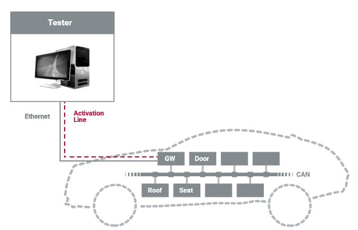

### DoIP

Schon seit einigen Jahren wird Ethernet für die Diagnose und hier im Speziellen für das Flashen von Steuergeräten verwendet. Dieses Einsatzgebiet ist für Fahrzeughersteller und -zulieferer schon allein deshalb sehr attraktiv, da beispielsweise Flash-Zyklen in der Produktion oder in Werkstätten dadurch erheblich reduziert werden können.

**ISO 13400**
Diagnose wird mittlerweile gerne über DoIP (Diagnostics over IP) verfügbar gemacht, welches in der ISO 13400 spezifiziert ist. Dabei spielt die verwendete physikalische Schicht keine Rolle, solange diese die Übertragung von IP-Paketen unterstützt. Neben Ethernet wären also beim Einsatz von DoIP zum Beispiel auch WLAN oder UMTS als physikalische Medien denkbar.

**Transportprotokoll**
Wichtig ist, dass DoIP laut ISO 13400 kein Diagnoseprotokoll ist sondern ein erweitertes Transportprotokoll darstellt. Das bedeutet, dass in DoIP zwar die Übertragung von Diagnosepaketen definiert ist. Die enthaltenen Diagnose-Services werden allerdings weiterhin durch Diagnoseprotokolle wie KWP2000 oder UDS festgelegt und beschrieben.

**Technische Voraussetzung**
Eine Voraussetzung für DoIP ist die Unterstützung von UDP und TCP. UDP wird für die Übertragung von Status- und Konfigurationsinformationen verwendet. Eine TCP-Verbindung ermöglicht stattdessen die Übertragung der eigentlichen Diagnosepakete über einen festen Kommunikationskanal. Dies gewährleistet eine höhere Zuverlässigkeit bei der Datenübertragung und ermöglicht das automatische Segmentieren von großen Datenpaketen. TCP und UDP müssen sowohl im Diagnosetester, als auch in jedem per DoIP diagnostizierbaren Steuergerät (DoIP Node) sowie in jedem Diagnosegateway (DoIP Gateway oder DoIP Edge Node) implementiert sein.

**Diagnosetester**
Wie bei der Diagnose mit klassischen Bussystemen, ermöglicht ein Diagnosetester das Versenden von Diagnoseanfragen (Diagnostic Requests). Hierzu können Tester als externe Geräte, wie beispielsweise in Werkstätten, oder als On-Board-Tester im Fahrzeug vorhanden sein. Das empfangende Steuergerät muss die Diagnoseanfragen wiederum bearbeiten und eine zugehörige Diagnoseantwort (Diagnostic Response) an den Tester zurücksenden. Es wird allerdings vorausgesetzt, dass in jedem direkt diagnostizierbaren Steuergerät hierzu DoIP sowie darunterliegende Schichten implementiert sind.

**Diagnosegateway**
Damit nicht jedes Steuergerät eine eigene Implementierung benötigt, erlaubt DoIP die Verwendung von Diagnosegateways. So können prinzipiell alle Steuergeräte eines Fahrzeugs verfügbar gemacht werden, die über ein klassisches Bussystem oder Netzwerk angeschlossen sind. Das Gateway übernimmt hierbei die Rolle des Vermittlers. Anfragen des Testers werden auf die internen Netzwerke weitergeleitet, sodass ein gewünschtes Steuergerät diese empfangen und verarbeiten kann. Sobald wiederum eine Antwort vom angefragten Steuergerät verfügbar ist, leitet das Gateway diese zurück an den Tester.

**Logische Adressen**
Um Diagnoseanfragen und -antworten weiterleiten zu können, benötigt ein Diagnosegateway immer zwei Informationen. Zum einen benötigt es eine logische Adresse, die das zu diagnostizierende Steuergerät eindeutig im Fahrzeug identifiziert. Zum anderen muss das Gateway wissen, welche Botschaften auf dem jeweiligen Bussystem oder Netzwerk verwendet werden, um Diagnoseanfragen zu senden und Diagnoseantworten zu empfangen. Nur wenn beide Informationen für ein Steuergerät verfügbar sind, ist dieses über das Gateway erreichbar.

**Diagnosevorgang**
Während des Diagnosevorgangs empfängt das Diagnosegateway zunächst die Anfrage vom Tester. Diese enthält das Diagnosepaket mit dem gewünschten Diagnoseservice sowie die logische Adresse des zu diagnostizierenden Steuergeräts. Das Gateway entnimmt dann das Diagnosepaket und verpackt es in eine Botschaft, die auf dem verwendeten Bussystem oder Netzwerk versendet werden kann. Soll beispielsweise ein Steuergerät mit Hilfe von CAN angesprochen werden, so sendet das Gateway eine Nachricht mit dem zugehörigen Identifier (z.B. 0x600) auf diesen Bus aus. Daraufhin wartet es auf eine Antwort vom Steuergerät. Sobald diese vom zugehörigen Bussystem oder Netzwerk empfangen wird (z.B. CAN mit Identifier 0x700), leitet das Gateway die Antwort für den ursprünglichen Diagnoseservice an den Tester zurück. Hierzu ergänzt es wiederum die logische Adresse des Steuergeräts, sodass der Tester die Antwort eindeutig zuweisen kann. Dies erlaubt, dass ein Tester auch Anfragen für mehrere Steuergeräte an unterschiedliche Bussysteme und Netzwerke versendet, ohne dass eine sequenzielle Beantwortung erwartet wird.
