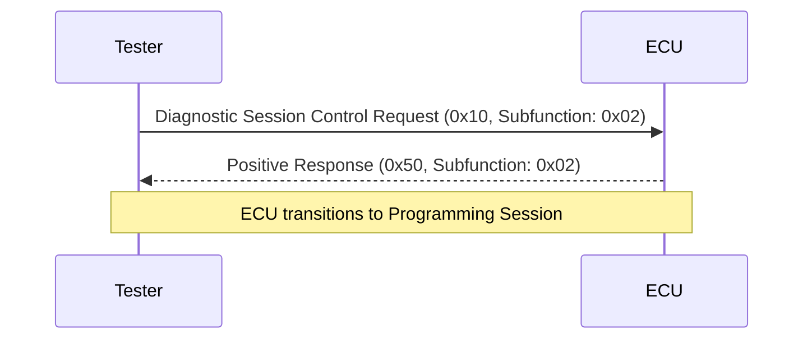

# Programming Session - 0x10

---

## Introduction

The Programming Session Control service (0x10) is a part of the UDS (Unified Diagnostic Services) protocol. It is used to transition the ECU (Electronic Control Unit) to a specific diagnostic session, such as a programming session. This is essential for enabling tasks like writing to memory or flashing firmware.

---

## Key Features
- Service ID: `0x10`
- Purpose: Switches the ECU to a specified diagnostic session.
- Subfunctions:
  - `0x01`: Default Session
  - `0x02`: Programming Session
  - `0x03`: Extended Diagnostic Session

---

## Sequence of Communication

Below is a sequence diagram to illustrate the flow of a Programming Session Control request and response:



---

## CAPL Implementation

Initialization

```capl
variables {
  message programmingSessionMessage; // Message for Programming Session Control
}
```

Request Trigger

```capl
on key 'P' {
  // Prepare the Programming Session Control message
  programmingSessionMessage.id = 0x1E0; // Replace with the correct ID for the ECU
  programmingSessionMessage.dlc = 8;    // Data Length Code
  programmingSessionMessage.byte(0) = 0x02; // Message length
  programmingSessionMessage.byte(1) = 0x10; // Service ID
  programmingSessionMessage.byte(2) = 0x02; // Subfunction: Programming Session

  // Send the message to the ECU
  output(programmingSessionMessage);
  write("Programming Session Control message sent.");
}
```

Response Handling

```capl
on message 0x1E8 { // Replace with ECU response ID
  if (this.byte(1) == 0x50 && this.byte(2) == 0x02) {
    write("Positive Response: ECU is now in Programming Session.");
  } else if (this.byte(1) == 0x7F) {
    int nrc = this.byte(2); // Negative Response Code
    switch (nrc) {
      case 0x12:
        write("NRC 0x12: Subfunction not supported.");
        break;
      case 0x13:
        write("NRC 0x13: Incorrect message length or invalid format.");
        break;
      default:
        writef("Unknown NRC: 0x%X", nrc);
    }
  }
}
```

---

## Response Codes

| Response Type | Description                                         |
|--------------------|---------------------------------------------------------|
| `0x50`            | Positive response: ECU has switched to the requested session. |
| `0x7F 0x12`       | Negative response: Subfunction not supported.           |
| `0x7F 0x13`       | Negative response: Incorrect message length or format.  |

---

## Example Scenarios

1. Switching to Programming Session:
   - Send `0x10 0x02`.
   - Receive `0x50 0x02` as confirmation.

2. Error Handling:
   - If the ECU responds with `0x7F 0x12`, ensure the subfunction is supported in the current session.
   - For `0x7F 0x13`, verify the message format and length.

---

## Logging
CAPL provides the ability to log actions for traceability:

```capl
writeToLog("session_log.txt", "Programming Session Request Sent");
writeToLog("session_log.txt", "ECU Response: 0x50 0x02 - Programming Session Enabled");
```

---

## Key Points
- Ensure the ECU supports the requested session.
- Always handle both positive and negative responses.
- Logging and debugging are crucial for verifying correct behavior during session transitions.
