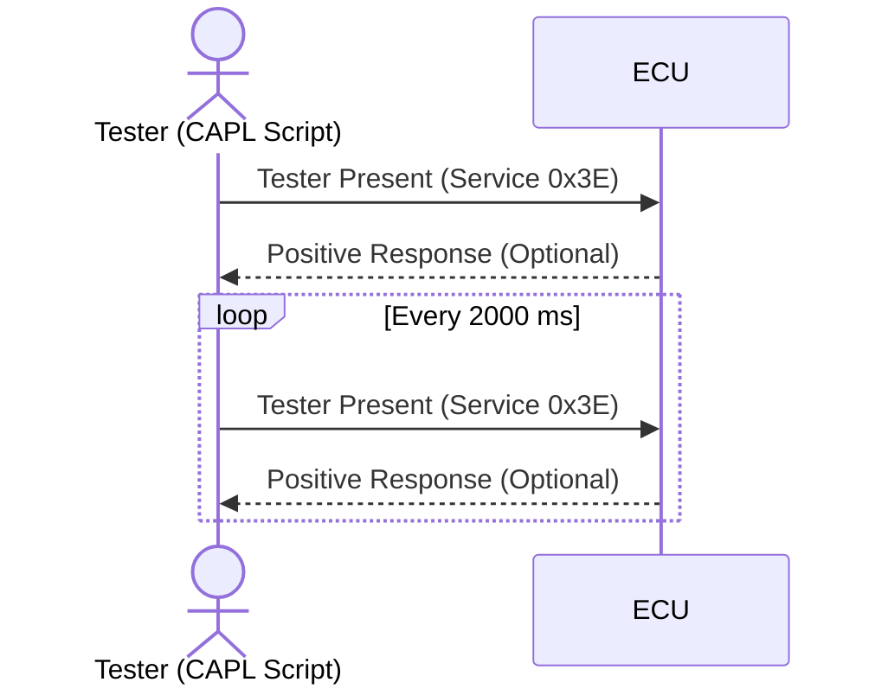

# Tester Present - 0x3E

---

## Introduction
The Tester Present (Service 0x3E) is a Universal Diagnostic Services (UDS) request used to keep the Electronic Control Unit (ECU) communication session active. Without this service, the ECU may time out and revert to its default state. The service is commonly used during diagnostic operations to prevent session termination.

---

## Purpose
The purpose of the Tester Present service is to:
1. Inform the ECU that the diagnostic tool is still present.
2. Maintain the active diagnostic session (e.g., Default, Extended, or Programming sessions).
3. Prevent the ECU from timing out during diagnostic activities.

---

## Message Structure
The Tester Present message consists of the following components:

| Byte Index | Description                  | Example Value |
|------------|------------------------------|---------------|
| 0          | Message Length (2 bytes)    | `0x02`        |
| 1          | Service ID (0x3E)           | `0x3E`        |
| 2          | Subfunction (KeepAlive: 0x00) | `0x00`       |
| 3-7        | Padding (if necessary)      | `0x00`        |

---

## Behavior

- **Request:** 
   - Sent cyclically by the tester (diagnostic tool) to indicate its presence.

- **Response:**
  - Positive Response (0x7E): Indicates the ECU acknowledges the Tester Present request.
  - No Response: The ECU may not respond explicitly for this service (depends on configuration).

---

## CAPL Implementation

### Variables Declaration

```c
variables {
  message testerPresentMessage; // Defines the message to be sent
}
```

### Initialization

```c
on start {
  // Initialize the Tester Present message
  testerPresentMessage.id = 0x1E0; // Example ID for the ECU
  testerPresentMessage.dlc = 8;    // Data Length Code (8 bytes)
  testerPresentMessage.byte(0) = 0x02; // Length of the message
  testerPresentMessage.byte(1) = 0x3E; // Service ID: Tester Present
  testerPresentMessage.byte(2) = 0x00; // Subfunction: KeepAlive
  setTimerCyclic("testerPresentTimer", 2000); // Send message every 2000 ms
}
```

### Sending the Request

```c
on timer testerPresentTimer {
  output(testerPresentMessage); // Send the Tester Present request
  write("Tester Present message sent.");
}
```

### Stopping the Timer

```c
on stop {
  cancelTimer("testerPresentTimer"); // Stop the cyclic timer on script termination
  write("Tester Present timer stopped.");
}
```

---

### Tester Present Sequence Diagram




1. **Actors and Participants**:
   - The **Tester** represents the diagnostic tool running the CAPL script.
   - The **ECU** is the Electronic Control Unit being diagnosed.

2. **Initial Interaction**:
   - The tester sends a **Tester Present** request to the ECU.
   - The ECU may optionally respond with a positive response.

3. **Cyclic Behavior**:
   - The loop shows the cyclic transmission of **Tester Present** messages at intervals of 2000 milliseconds.

4. **Response**:
   - The response from the ECU is marked as optional (`Positive Response`) since not all implementations require an explicit acknowledgment.


---

## Key Considerations
1. Cyclic Behavior:
   - The Tester Present message should be sent at regular intervals.
   - The interval should match the ECU’s timeout requirements, typically 2 seconds.

2. Session Maintenance:
   - This service must be sent continuously during active diagnostic sessions.
   - Failure to send this service may result in the ECU exiting the session.

3. Response Handling:
   - While the ECU may not always send an explicit response, it is essential to monitor responses if required by the diagnostic specification.

4. Error Handling:
   - Ensure the cyclic timer is stopped properly using `cancelTimer` to avoid resource leaks.

---

## Example Trace Output
1. Positive Response:
   ```plaintext
   Tester Present message sent.
   ```
2. Timer Stopped:
   ```plaintext
   Tester Present timer stopped.
   ```

---

## Use Cases
1. During Flashing Operations:
   - Keep the ECU in a Programming Session while data is being written.
2. During Long Diagnostics:
   - Ensure the ECU does not time out while running extended diagnostic tests.
3. Preventing Session Termination:
   - Maintain communication when the diagnostic tool is idle for extended periods.

---

## Common Issues and Debugging
1. ECU Not Responding:
   - Verify the correct CAN ID is used for the ECU.
   - Ensure the Tester Present message is formatted correctly.
2. ECU Timing Out:
   - Check if the interval (`setTimerCyclic`) matches the ECU’s timeout requirements.
3. Timer Mismanagement:
   - Ensure all timers are properly canceled in the `on stop` event to prevent cyclic execution errors.

---

## Conclusion
The Tester Present service is an essential component of UDS diagnostics, ensuring session continuity during diagnostic operations. By implementing the CAPL example above, you can effectively manage ECU communication timeouts in a diagnostic environment.

