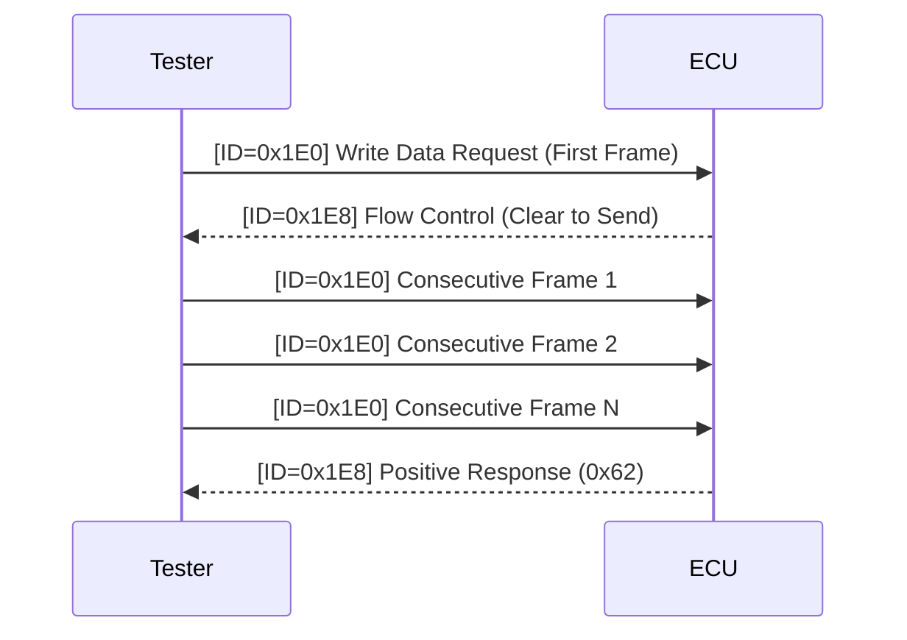

# Write Data by Identifier - 0x2E

---

## Overview
The Write Data by Identifier (Service 0x2E) is used to write data to a specific memory location in the ECU, typically identified by a 2-byte identifier (ID). This service supports single-frame and multi-frame data communication, depending on the payload size.

---

## Sequence Diagram
Below is a Mermaid sequence diagram illustrating the flow of the Write Data by Identifier service.



---

## Message Breakdown

1. Request Message (Tester to ECU):
    - PCI: Protocol Control Information (e.g., 0x10 for single frame, 0x21 for consecutive frames).
    - Service ID: 0x2E (Write Data by Identifier).
    - Identifier: 2 bytes specifying the memory address or parameter to write.
    - Data: Up to 8 bytes for single-frame; more for multi-frame.

    Example (Single Frame):
    ```
    ID: 0x1E0
    DLC: 8
    Bytes: [0x06, 0x2E, 0x01, 0x23, 0x45, 0x67, 0x89, 0xAB]
    ```

    - 0x06: Length (6 bytes of data).
    - 0x2E: Service ID.
    - 0x0123: Identifier (0x01 and 0x23).
    - 0x456789AB: Data payload.

2. Flow Control (ECU to Tester):
    - If the payload exceeds 8 bytes, the ECU responds with a flow control frame to allow consecutive frames.

    Example:
    ```
    ID: 0x1E8
    DLC: 8
    Bytes: [0x30, 0x00, 0x00, 0x00, 0x00, 0x00, 0x00, 0x00]
    ```

    - 0x30: Flow control.
    - 0x00: Block size.
    - 0x00: Separation time.

3. Consecutive Frames (Tester to ECU):
    - Following the flow control, the tester sends consecutive frames to complete the data transfer.

    Example:
    ```
    ID: 0x1E0
    DLC: 8
    Bytes: [0x21, 0xCD, 0xEF, 0x01, 0x02, 0x03, 0x04, 0x05]
    ```

4. Response Message (ECU to Tester):
    - The ECU acknowledges the request with a positive response or indicates an error.

    Positive Response:
    ```
    ID: 0x1E8
    DLC: 8
    Bytes: [0x02, 0x62, 0x01, 0x23, 0x00, 0x00, 0x00, 0x00]
    ```

    - 0x62: Positive response for service 0x2E.
    - 0x0123: Identifier.

---

## Implementation Steps

1. Initialize Variables:
    - Define the message structure for the request and response.

2. Send Request:
    - Construct and send the Write Data by Identifier request.

3. Handle Flow Control:
    - If the data exceeds 8 bytes, wait for the flow control frame and manage consecutive frames accordingly.

4. Send Consecutive Frames:
    - Transmit all remaining data frames based on flow control.

5. Parse Response:
    - Verify if the response indicates success (0x62) or an error (e.g., NRC 0x13 for invalid length).

---

## CAPL Implementation

```c
variables {
  message writeDataMessage;
  message responseMessage;
}

on key 'W' {
  // Initialize Write Data by Identifier (First Frame)
  writeDataMessage.id = 0x1E0;
  writeDataMessage.dlc = 8;
  writeDataMessage.byte(0) = 0x06; // PCI: Length
  writeDataMessage.byte(1) = 0x2E; // Service ID
  writeDataMessage.byte(2) = 0x01; // Identifier MSB
  writeDataMessage.byte(3) = 0x23; // Identifier LSB
  writeDataMessage.byte(4) = 0x45; // Data byte 1
  writeDataMessage.byte(5) = 0x67; // Data byte 2
  writeDataMessage.byte(6) = 0x89; // Data byte 3
  writeDataMessage.byte(7) = 0xAB; // Data byte 4

  output(writeDataMessage);
  write("Write Data by Identifier request sent.");
}

on message 0x1E8 {
  // Handle Flow Control or Positive Response
  if (this.byte(1) == 0x62) {
    write("Positive Response: Data written successfully.");
  } else if (this.byte(1) == 0x7F) {
    int nrc = this.byte(2); // Negative Response Code
    switch (nrc) {
      case 0x13:
        write("NRC: Invalid format or message length.");
        break;
      default:
        writef("NRC: 0x%X received.", nrc);
    }
  } else if (this.byte(0) == 0x30) {
    write("Flow Control received. Preparing consecutive frames.");
    startTimer("sendConsecutiveFrames", 100);
  }
}

on timer sendConsecutiveFrames {
  writeDataMessage.byte(0) = 0x21; // PCI: Consecutive Frame 1
  writeDataMessage.byte(1) = 0xCD; // Data byte 5
  writeDataMessage.byte(2) = 0xEF; // Data byte 6
  // Fill remaining bytes
  output(writeDataMessage);
  write("Consecutive Frame 1 sent.");
  cancelTimer("sendConsecutiveFrames");
}
```

---

## Use Cases
1. Programming ECUs to update calibration parameters.
2. Writing diagnostic configuration data to memory.
3. Modifying vehicle-specific data like VIN numbers.

---

## Common Issues
1. NRC 0x13: Invalid length or format—ensure correct identifier and payload.
2. Timeouts: Ensure the ECU sends a flow control frame within the timeout.
3. Multi-frame Errors: Verify PCI and data sequence in consecutive frames.
