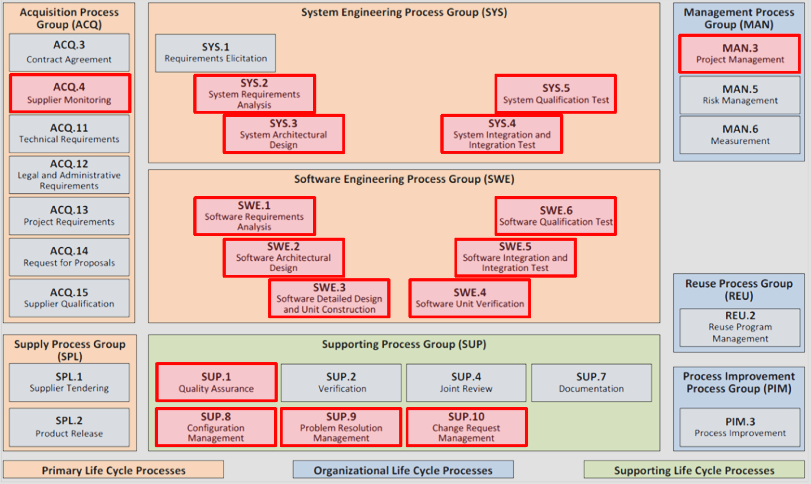

# Prozessdimensionierung in Automotive SPICE

**Dokumentation zu den Prozessfähigkeitsstufen der ISO/IEC 33020:2015**

Die ISO/IEC 33020:2015 definiert verschiedene Prozessfähigkeitsstufen, die dazu dienen, die Leistungsfähigkeit von Prozessen in Organisationen zu bewerten und zu verbessern. Diese Stufen bieten eine strukturierte Methode, um den Reifegrad eines Prozesses zu bestimmen und zu überwachen. In dieser Dokumentation werden die verschiedenen Prozessfähigkeitsstufen gemäß der Norm erläutert:

**Stufe 5: Innovativer Prozess**

- *5.2 Prozessinnovationsumsetzung*
- *5.1 Prozessinnovation*

Auf dieser Stufe ist der Prozess äußerst innovativ und reagiert kontinuierlich auf Veränderungen, die mit den Zielen der Organisation in Einklang stehen. Die Organisation verfolgt aktiv innovative Ansätze, um die Prozesse kontinuierlich zu verbessern und sich an neue Anforderungen anzupassen.

**Stufe 4: Vorhersagbarer Prozess**

- *4.2 Quantitative Steuerung*
- *4.1 Quantitative Analyse*

Auf Stufe 4 ist der Prozess bereits gut etabliert und operiert vorhersagbar innerhalb definierter Grenzen. Quantitative Methoden werden angewendet, um die Leistung des Prozesses zu überwachen und zu steuern, was zu einer stabilen und vorhersehbaren Ausführung führt.

**Stufe 3: Etablierter Prozess**

- *3.2 Prozessimplementierung*
- *3.1 Prozessdefinition*

Der Prozess ist auf dieser Stufe standardisiert, dokumentiert und wird aktiv gepflegt. Es gibt klare Richtlinien und Verfahren, wie der Prozess durchgeführt werden soll. Dies ermöglicht eine konsistente Umsetzung und Ausführung des Prozesses innerhalb der Organisation.

**Stufe 2: Gemanagter Prozess**

- *2.2 Verwaltung von Arbeitsprodukten*
- *2.1 Leistungsmanagement*

Auf dieser Stufe wird der Prozess aktiv gemanagt, sowohl in Bezug auf die durchgeführten Aktivitäten als auch auf die erzeugten Arbeitsprodukte. Es werden Maßnahmen ergriffen, um sicherzustellen, dass der Prozess effektiv und effizient ausgeführt wird und die gewünschten Ergebnisse erzielt werden.

**Stufe 1: Durchgeführter Prozess**

- *1.1 Prozessleistung*

Die Organisation führt den Prozess gemäß den Anforderungen durch und erzeugt die erforderlichen Ergebnisse. Auf dieser Stufe wird der Fokus darauf gelegt, dass der Prozess seine Ziele erreicht und die gewünschten Ergebnisse liefert.

**Stufe 0: Unvollständiger Prozess**

- *Kein Prozess nachweisbar oder Prozess erzeugt nicht die erforderlichen Ergebnisse*

Diese Stufe kennzeichnet einen unvollständigen oder nicht existierenden Prozess. Es gibt keine klaren Richtlinien oder Verfahren, wie der Prozess durchgeführt werden soll, und er erzeugt nicht die erforderlichen Ergebnisse.

Die Prozessfähigkeitsstufen gemäß ISO/IEC 33020:2015 bieten Organisationen eine Struktur, um ihre Prozesse zu bewerten und zu verbessern. Durch die Ermittlung des aktuellen Reifegrads eines Prozesses können gezielte Maßnahmen ergriffen werden, um die Effizienz, Qualität und Leistungsfähigkeit der Prozesse kontinuierlich zu steigern.

---

**Level 0: Unvollständiger Prozess**

*Automotive SPICE Einführungstraining | Thomas Kömmerling (MP/EC2) | März 2022*

Auf Stufe 0 von Automotive SPICE spiegelt der Prozess entweder eine nicht implementierte Methode oder unzureichende Beweise für das Erreichen der Prozessergebnisse wider. Diese Phase zeigt an, dass der Prozess noch nicht in seiner vollständigen Form existiert oder dass die Implementierung nicht ausreichend dokumentiert ist.

---

**Level 1: Durchgeführter Prozess**

*Automotive SPICE Einführungstraining | Thomas Kömmerling (MP/EC2) | März 2022*

Auf Stufe 1 erreicht der Prozess seine spezifischen definierten Ergebnisse. Die Grundpraktiken sind implementiert, was bedeutet, dass die Aktivitäten durchgeführt wurden und die Arbeitsprodukte sowie Nachweise verfügbar sind. Es wird darauf geachtet, dass die Prozessattribute erfüllt sind.

PA 1.1: Prozessleistung - Der Prozess erfüllt seine Ziele.

---

**Level 2: Gemanagter Prozess**

*Automotive SPICE Einführungstraining | Thomas Kömmerling (MP/EC2) | März 2022*

Auf Stufe 2 wird der Prozess aktiv gemanagt. Dies bedeutet, dass die Leistung des Prozesses kontrolliert wird, um Zeit, Kosten und Qualität zu gewährleisten. Ressourcen und Informationen werden identifiziert, zugewiesen und genutzt.

PA 2.1: Leistungsmanagement - Die Ziele des Prozesses werden identifiziert und überwacht.

PA 2.2: Arbeitsproduktmanagement - Die Funktionalität, Kosten und Zeitplanung werden überwacht und angepasst. Es wird darauf geachtet, dass Schnittstellen zwischen den beteiligten Parteien verwaltet werden und dass Rollen und Verantwortlichkeiten klar definiert sind.

---

**Level 3: Etablierter Prozess**

*Automotive SPICE Einführungstraining | Thomas Kömmerling (MP/EC2) | März 2022*

Auf Stufe 3 ist der Prozess vollständig etabliert und implementiert. Es gibt eine klare Prozessdefinition mit Tailoring-Richtlinien, die identifizieren, wie der Prozess an spezifische Bedürfnisse angepasst werden kann. Die Rollen, Zuständigkeiten und Kompetenzen sind klar festgelegt. Es wird darauf geachtet, dass die Infrastruktur und die Arbeitsumgebung für die Durchführung des Prozesses bereitgestellt werden. Es finden regelmäßige Messungen statt, um die Effektivität und Eignung des Prozesses zu überwachen und sicherzustellen, dass er kontinuierlich verbessert wird.

PA 3.1: Prozessdefinition - Ein standardisierter Prozess mit klaren Richtlinien für die Anpassung ist definiert.

PA 3.2: Prozessimplementierung - Der definierte Prozess wird implementiert, indem Rollen zugewiesen, Schulungen durchgeführt und Ressourcen bereitgestellt werden.

Einführung

Die folgende Dokumentation bietet eine eingehende Erklärung des Prozessanalogs "Kochen", der in der Einführungsschulung zu Automotive SPICE (Software Process Improvement and Capability Determination) verwendet wird, die im März 2022 von Thomas Kömmerling durchgeführt wurde.

### Überblick

Die Schulung nutzt das Kochen als Analogie, um die Konzepte der Prozessverbesserung und -fähigkeitsbestimmung in der Automobilindustrie zu erklären. Durch diese Analogie werden verschiedene Ebenen der Prozessreife und -qualität erkundet und Parallelen zwischen Kochprozessen und Softwareentwicklungspraktiken gezogen.

### Ebenen der Prozessreife

#### Stufe 0: Rohstoffe

Auf dieser Ebene befinden sich Prozesse in ihrem primitiven Zustand, ähnlich wie Rohstoffe. Genau wie Rohstoffe gekocht werden müssen, um ein köstliches Gericht zu werden, müssen Prozesse verfeinert und entwickelt werden, um qualitativ hochwertige Ergebnisse zu erzielen. Die Hauptfragen auf dieser Ebene drehen sich um die Rohheit des Prozesses: Ist er schmackhaft? Ist er gesund? Oder befindet er sich noch im rohen, unentwickelten Zustand?

#### Stufe 1: Grundlegendes Kochen

Auf Stufe 1 verschiebt sich der Fokus auf die Ergebnisqualität, die Termintreue und die Einhaltung der Budgetvorgaben. Prozesse werden mit grundlegenden Kochmethoden verglichen, wobei die Hauptfragen darum kreisen, ob das Ergebnis den gewünschten Qualitätsstandards entspricht, ob es rechtzeitig geliefert wird und ob es innerhalb des zugewiesenen Budgets bleibt.

#### Stufe 2: Fortgeschrittene Kochtechniken

Stufe 2 führt das Konzept der Anwendung unterschiedlicher Kochmethoden ein, um Qualität und Effizienz zu verbessern. Prozesse werden raffinierten Kochtechniken gleichgesetzt, wobei die Bedeutung der Einhaltung eines Plans und der Einsatz angemessener Methoden zur Erreichung der gewünschten Ergebnisse betont wird.

#### Stufe 3: Maßgeschneiderte Kochmethoden

Die höchste Reifestufe beinhaltet die Anpassung von Kochmethoden, um unterschiedlichen Situationen gerecht zu werden. Ebenso sind Prozesse auf dieser Ebene äußerst anpassungsfähig und anpassbar, um spezifische Projektanforderungen und -herausforderungen zu erfüllen. Flexibilität und Anpassungsfähigkeit werden zu wichtigen Aspekten der Prozessverbesserung.

### Schlüsselkonzepte

#### Qualitätsabhängigkeit von Kochmethoden

Analog zum Kochen hängt die Qualität der Ergebnisse in der Softwareentwicklung stark von den angewandten Methoden während des Prozesses ab. Genau wie unterschiedliche Kochtechniken zu verschiedenen kulinarischen Ergebnissen führen, können verschiedene Entwicklungsmethoden zu vielfältigen Projektergebnissen führen.

#### Rechtzeitige Lieferung und Einhaltung von Plänen

Die termingerechte Lieferung von Projekten und die Einhaltung vordefinierter Pläne sind grundlegende Aspekte der Prozessreife. Genau wie eine gut gekochte Mahlzeit zum richtigen Zeitpunkt serviert wird, sollten Projekte innerhalb festgelegter Fristen abgeschlossen und in Übereinstimmung mit festgelegten Plänen durchgeführt werden.

Die Analogie des "Kochens" dient als umfassender Rahmen, um die Komplexität der Prozessverbesserung und -fähigkeitsbestimmung in der Automobilindustrie zu verstehen. Durch die Gleichsetzung von Softwareentwicklungsprozessen mit Kochpraktiken gewinnen die Teilnehmer wertvolle Einblicke in die Bedeutung der Prozessreife, der Qualitätssicherung und der Anpassungsfähigkeit für den Projekterfolg.
