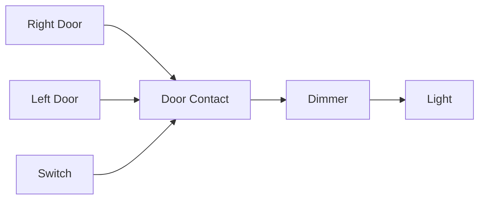

# Components View for Lighting Control

This documentation delves into the **Components View for Lighting Control** within an AUTOSAR-based application. It elucidates the interaction between various software components in an embedded system dedicated to vehicle lighting management. Each component fulfills a distinct role, and their interconnections collectively enable the comprehensive functionality of the lighting control system.

---

## 1. **Overview of the Components**

The lighting control system is modularized into distinct software components, each responsible for specific functionalities. This modular approach enhances scalability, maintainability, and reusability of the system.

### 1.1 **Right Door and Left Door**

- **Description:**
  - These components represent the software abstractions of the vehicle's right and left doors, respectively.
  - Their primary function is to monitor and detect the status of the doors—whether they are open or closed.
  
- **Key Responsibilities:**
  - **Status Detection:** Continuously monitors the physical state of the respective door.
  - **Signal Transmission:** Communicates the current door status to the **Door Contact** component.
  
- **Example Use Case:**
  - When a user opens the right door, the **Right Door** component detects this action and sends a signal to the **Door Contact** module. This signal triggers subsequent actions, such as activating the vehicle's interior lighting.

---

### 1.2 **Door Contact**

- **Description:**
  - The **Door Contact** component serves as an aggregator for signals received from both the **Right Door** and **Left Door** components.
  - It functions as a logical gateway to determine the overall status of the vehicle doors.

- **Key Responsibilities:**
  - **Signal Aggregation:** Collects and processes door status signals from both doors.
  - **Decision Making:** Determines whether any door is open and decides if lighting actions are necessary.
  - **Communication:** Sends commands to the **Dimmer** and **Light** components based on the evaluated door statuses.

- **Example Workflow:**
  1. Receives door status inputs from the **Right Door** and **Left Door** components.
  2. Processes these inputs to ascertain if lighting should be activated or deactivated.
  3. Forwards the decision to the **Dimmer** component for brightness adjustment.

- **Code Snippet:**
  
  ```c
  // DoorContact.c
  #include "DoorContact.h"
  #include "Dimmer.h"
  #include "Light.h"

  void DoorContact_Process(bool rightDoorStatus, bool leftDoorStatus) {
      if (rightDoorStatus || leftDoorStatus) {
          ActivateLighting();
      } else {
          DeactivateLighting();
      }
  }

  void ActivateLighting(void) {
      // Notify Dimmer to increase brightness
      Dimmer_SetBrightness(INCREASE);
      // Notify Light to turn on
      Light_TurnOn();
  }

  void DeactivateLighting(void) {
      // Notify Dimmer to decrease brightness
      Dimmer_SetBrightness(DECREASE);
      // Notify Light to turn off
      Light_TurnOff();
  }
  ```

---

### 1.3 **Switch**

- **Description:**
  - The **Switch** component acts as a manual control interface for the lighting system.
  - It allows users, typically the vehicle occupants, to override automatic lighting operations.

- **Key Responsibilities:**
  - **Manual Control:** Enables users to turn lights on or off irrespective of the door statuses.
  - **Override Mechanism:** Provides a means to prioritize user commands over automatic controls from the **Door Contact** component.

- **Use Case:**
  - A driver prefers to keep the headlights on while the doors are closed. By interacting with the **Switch**, the driver can manually activate the lights regardless of the door statuses detected by the system.

---

### 1.4 **Dimmer**

- **Description:**
  - The **Dimmer** component is responsible for controlling the brightness levels of the vehicle's lights.
  - It receives inputs from both the **Door Contact** and **Switch** components to adjust lighting intensity accordingly.

- **Key Responsibilities:**
  - **Brightness Adjustment:** Modulates light intensity based on signals received.
  - **Smooth Transitions:** Implements gradual changes in brightness to enhance user experience.
  - **Priority Handling:** Determines the source of input (automatic vs. manual) and adjusts brightness accordingly.

- **Key Functions:**
  - **Increase Brightness:** Gradually raises the light intensity when a door is opened.
  - **Decrease Brightness:** Gradually lowers the light intensity when transitioning to standby or off mode.

- **Code Snippet:**
  
  ```c
  // Dimmer.c
  #include "Dimmer.h"
  #include "Light.h"

  void Dimmer_AdjustBrightness(int targetBrightness) {
      int currentBrightness = GetCurrentBrightness();
      while (currentBrightness != targetBrightness) {
          if (currentBrightness < targetBrightness) {
              currentBrightness++;
          } else {
              currentBrightness--;
          }
          UpdateBrightness(currentBrightness);
          Delay(10); // Delay for smooth transition
      }
  }

  void Dimmer_SetBrightness(BrightnessCommand cmd) {
      switch(cmd) {
          case INCREASE:
              Dimmer_AdjustBrightness(MAX_BRIGHTNESS);
              break;
          case DECREASE:
              Dimmer_AdjustBrightness(MIN_BRIGHTNESS);
              break;
          default:
              break;
      }
  }
  ```

---

### 1.5 **Light**

- **Description:**
  - The **Light** component interfaces directly with the vehicle's lighting hardware, such as LEDs or bulbs.
  - It executes commands from the **Dimmer** or **Switch** components to modify the lighting state.

- **Key Responsibilities:**
  - **Hardware Control:** Turns lights on or off based on received commands.
  - **Brightness Implementation:** Adjusts the hardware settings to achieve the desired brightness levels as dictated by the **Dimmer** component.

- **Example:**
  - When the **Dimmer** component sends a command to increase brightness, the **Light** component adjusts the PWM (Pulse Width Modulation) signals to the LEDs to achieve the higher intensity.

---

## 2. **Component Interactions**

Understanding how these components interact is crucial for comprehending the overall functionality of the lighting control system. The interactions are primarily based on signal flow and command execution between components.

### 2.1 **Signal Flow**

- **Right Door/Left Door → Door Contact:**
  - The **Right Door** and **Left Door** components continuously monitor and send their respective door statuses to the **Door Contact** component.

- **Door Contact → Dimmer:**
  - Based on the aggregated door statuses, the **Door Contact** determines if lighting should be activated or deactivated and communicates this decision to the **Dimmer** component.

- **Switch → Dimmer:**
  - The **Switch** component can send manual override commands to the **Dimmer**, allowing users to control the lighting irrespective of the door statuses.

- **Dimmer → Light:**
  - The **Dimmer** sends specific brightness levels to the **Light** component, which then adjusts the actual lighting hardware accordingly.

### 2.2 **Interaction Diagram**



---

## 3. **Functional Overview**

This section provides a detailed explanation of the primary functionalities facilitated by the components and their interactions.

### 3.1 **Door-Based Lighting**

The system autonomously manages the vehicle's lighting based on the status of its doors. When any door is opened, the lights are activated, and when all doors are closed, the lights are dimmed or turned off.

#### Workflow:

1. **Door Status Detection:**
   - The **Right Door** and **Left Door** components detect the opening or closing of their respective doors and send the status to the **Door Contact** component.

2. **Decision Making:**
   - The **Door Contact** component evaluates the received door statuses.
   - If any door is open, it decides to activate the lighting system.

3. **Brightness Adjustment:**
   - The **Door Contact** sends a command to the **Dimmer** to increase brightness.
   - The **Dimmer** adjusts the brightness smoothly and instructs the **Light** component to apply the new brightness level.

4. **Lighting Activation:**
   - The **Light** component turns on the lights with the specified brightness.

5. **Deactivation:**
   - When all doors are closed, the **Door Contact** sends a command to the **Dimmer** to decrease brightness, leading to the lights being dimmed or turned off.

### 3.2 **Manual Lighting Control**

In addition to automatic door-based control, the system provides users with the ability to manually control the lighting through the **Switch** component. This feature allows for greater flexibility and user preference management.

#### Workflow:

1. **User Interaction:**
   - The user interacts with the **Switch** to turn the lights on or off manually.

2. **Command Transmission:**
   - The **Switch** sends the user's command to the **Dimmer** component, overriding any automatic inputs from the **Door Contact**.

3. **Brightness Adjustment:**
   - The **Dimmer** adjusts the brightness level based on the user's input and sends the updated command to the **Light** component.

4. **Lighting Update:**
   - The **Light** component implements the new brightness settings, reflecting the user's manual control.

---

## 4. **Advanced Considerations**

Designing a robust lighting control system involves addressing potential challenges and incorporating advanced features to enhance system reliability and user experience.

### 4.1 **Fault Tolerance**

Ensuring the system remains operational despite inconsistencies or faults in sensor inputs is critical for safety and reliability.

- **Inconsistent Door Signals:**
  - Sensors may occasionally send erroneous signals due to hardware malfunctions or environmental factors.
  
- **Redundancy Checks:**
  - Implement validation mechanisms within the **Door Contact** component to verify the integrity of received door statuses.

- **Code Snippet:**
  
  ```c
  // DoorContact.c
  #include "DoorContact.h"

  bool ValidateDoorInput(bool doorStatus) {
      // Simple validation logic
      // In a real-world scenario, more complex checks like signal consistency over time can be implemented
      return (doorStatus == true || doorStatus == false);
  }

  void DoorContact_Process(bool rightDoorStatus, bool leftDoorStatus) {
      bool validRight = ValidateDoorInput(rightDoorStatus);
      bool validLeft = ValidateDoorInput(leftDoorStatus);
      
      if (validRight && validLeft) {
          if (rightDoorStatus || leftDoorStatus) {
              ActivateLighting();
          } else {
              DeactivateLighting();
          }
      } else {
          // Handle invalid input, possibly default to safe state
          DeactivateLighting();
      }
  }
  ```

### 4.2 **Timing and Delays**

Smooth transitions in lighting enhance user experience by preventing abrupt changes in brightness, which can be jarring.

- **Implementation of Delays:**
  - Utilize timers or PWM (Pulse Width Modulation) techniques within the **Dimmer** component to manage gradual brightness adjustments.

- **Example:**
  - When increasing brightness, the **Dimmer** gradually increments the brightness level in small steps with short delays between each step to create a smooth transition effect.

- **Code Snippet:**
  
  ```c
  // Dimmer.c
  #include "Dimmer.h"
  #include "Timer.h"

  void Dimmer_AdjustBrightness(int targetBrightness) {
      int currentBrightness = GetCurrentBrightness();
      int step = (currentBrightness < targetBrightness) ? 1 : -1;
      
      while (currentBrightness != targetBrightness) {
          currentBrightness += step;
          UpdateBrightness(currentBrightness);
          Timer_Delay(10); // Delay in milliseconds for smooth transition
      }
  }
  ```

---

## 5. **Benefits of the Component Design**

The modular design of the lighting control system offers several advantages that contribute to its effectiveness and longevity.

1. **Scalability:**
   - The separation of functionalities into distinct components allows for easy integration of additional features. For instance, ambient lighting or advanced dimming controls can be incorporated without overhauling the entire system.

2. **Maintainability:**
   - Independent modules simplify the process of debugging and testing. If an issue arises within the **Door Contact** component, it can be addressed in isolation without affecting other components.

3. **Reusability:**
   - Standardized interfaces between components enable the reuse of modules across different vehicle models or projects. This reduces development time and costs, as proven components can be leveraged in new applications.

4. **Flexibility:**
   - The ability to override automatic controls with manual inputs via the **Switch** component provides users with greater control and adaptability based on their preferences.

5. **Reliability:**
   - Incorporating fault tolerance and validation mechanisms ensures the system remains dependable even in the face of sensor inconsistencies or hardware malfunctions.

6. **Enhanced User Experience:**
   - Smooth transitions and responsive manual controls contribute to a seamless and intuitive user interaction with the vehicle's lighting system.

