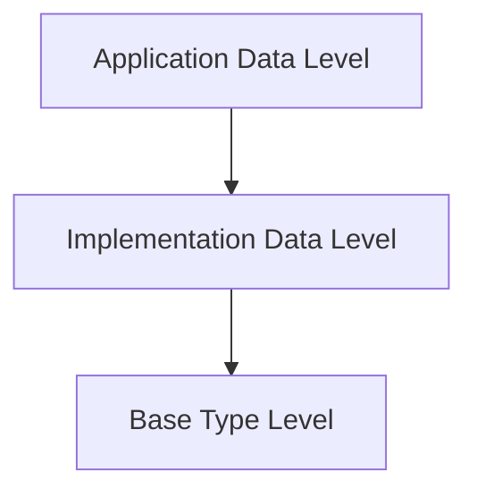

# Data Types

In AUTOSAR (AUTomotive Open System ARchitecture), **data types** play a crucial role in defining and facilitating the exchange of information between **Software Components (SWCs)**. AUTOSAR establishes a hierarchical structure of data types to ensure compatibility, scalability, and platform independence across various automotive applications. This documentation provides an in-depth exploration of the **three levels of AUTOSAR data types**: **Application Data Level**, **Implementation Data Level**, and **Base Type Level**. Each level is examined in terms of its roles, features, and perspectives, offering a comprehensive understanding of how data is managed and utilized within the AUTOSAR framework.

---
  
## 1. **Application Data Level**

The **Application Data Level** operates at the **Virtual Functional Bus (VFB)** level, focusing on defining data in a platform-independent and application-centric manner. This level abstracts away hardware and ECU-specific details, enabling seamless communication between SWCs across different platforms and vehicle models.

### **1.1 Key Features**

- **Application Point of View:**
  - **Contextual Representation:** Data is defined in the context of application functionalities, aligning with the operational needs of the software components.
  - **OEM Definitions:** Typically defined by **Original Equipment Manufacturers (OEMs)**, ensuring that data types reflect the specific requirements of the application domain.
  - **Platform Independence:** Data definitions are abstracted from hardware constraints such as **endianness**, data size, and platform-specific optimizations.

- **Purpose:**
  - **Seamless Communication:** Facilitates the exchange of data between SWCs via the VFB without exposing underlying hardware or implementation details.
  - **Abstraction Layer:** Hides the complexities associated with hardware and ECU-specific implementations, promoting a modular and reusable software architecture.

### **1.2 Example**

A temperature signal used within an HVAC (Heating, Ventilation, and Air Conditioning) system can be defined at the Application Data Level as follows:

```xml
<DATA-TYPE>
    <SHORT-NAME>Temperature_Signal</SHORT-NAME>
    <CATEGORY>APPLICATION</CATEGORY>
    <BASE-TYPE>FLOAT</BASE-TYPE>
</DATA-TYPE>
```

**Explanation:**

- **SHORT-NAME:** Identifies the data type (`Temperature_Signal`).
- **CATEGORY:** Specifies the level of the data type (`APPLICATION`), indicating its role within the application layer.
- **BASE-TYPE:** Defines the fundamental data type (`FLOAT`), serving as the foundation for further implementation.

---
  
## 2. **Implementation Data Level**

The **Implementation Data Level** bridges the gap between abstract application data types and their concrete representations in software. Operating at the **Runtime Environment (RTE)** level, this layer maps application-level data types to hardware-compatible representations, ensuring that data is correctly interpreted and utilized by the underlying hardware.

### **2.1 Key Features**

- **Implementation Point of View:**
  - **RTE Focused:** Targets the implementation specifics within the RTE, addressing how data is handled at the ECU (Electronic Control Unit) level.
  - **C Programming Language:** Data types are typically defined using the **C programming language**, aligning with embedded systems development practices.
  - **Integrator Definitions:** Developed by **integrators** (often Tier 1 suppliers), ensuring that data types are tailored to the target ECU's hardware and software environment.

- **Purpose:**
  - **Hardware Mapping:** Specifies how application data types are translated into hardware-representable formats, considering factors like memory alignment, data size, and processor architecture.
  - **Compatibility Assurance:** Ensures that data exchanged between SWCs is compatible with the physical hardware and adheres to compiler and platform constraints.

### **2.2 Example**

Mapping the abstract temperature signal to an implementation-specific data type in C:

```c
typedef float Temperature_Signal_t;
```

**Explanation:**

- **typedef:** Creates a new data type alias (`Temperature_Signal_t`) based on the fundamental `float` type.
- **Temperature_Signal_t:** Serves as the concrete representation of the `Temperature_Signal` defined at the Application Data Level, ensuring compatibility with the ECU's hardware and software environment.

---
  
## 3. **Base Type Level**

The **Base Type Level** defines data in terms of its fundamental representation at the **CPU level**. This level is concerned with the physical aspects of data storage and manipulation, ensuring that data types are accurately handled by the microcontroller's architecture.

### **3.1 Key Features**

- **Platform Point of View:**
  - **CPU-Level Representation:** Focuses on how data is represented in bits and bytes, aligning with the microcontroller's architecture and capabilities.
  - **Hardware Constraints:** Addresses hardware-related aspects such as **endianness** (byte order), **alignment**, and **bit-width**, ensuring that data is correctly processed by the CPU.

- **Purpose:**
  - **Foundational Building Blocks:** Provides the essential data types that form the basis for higher-level data representations in the Implementation and Application Data Levels.
  - **Portability:** Ensures that data types are portable across different microcontroller platforms by adhering to standardized representations.

### **3.2 Example**

Defining a 32-bit floating-point base type to match the CPU architecture:

```c
typedef float float32;
```

**Explanation:**

- **typedef:** Creates a new data type alias (`float32`) based on the fundamental `float` type.
- **float32:** Represents a 32-bit floating-point number, aligning with the CPU's native handling of floating-point data.

---
  
## 4. **Hierarchical Relationships Between Data Types**

Understanding the hierarchical structure of AUTOSAR data types is essential for comprehending how data flows and transforms across different levels of the architecture. Each level builds upon the previous one, ensuring a seamless transition from abstract definitions to concrete implementations.

### **4.1 Application Data Level**

- **Abstract Definitions:** Data types are defined abstractly, focusing on application-specific functionalities without considering hardware constraints.
- **Platform Independence:** Ensures that data definitions are reusable across various platforms and ECU configurations.

### **4.2 Implementation Data Level**

- **Mapping to Hardware:** Translates abstract application data types into concrete representations suitable for the target ECU.
- **Software-Centric:** Focuses on how data is handled within the software environment, considering compiler and platform-specific factors.

### **4.3 Base Type Level**

- **Physical Representation:** Defines how data is stored and processed at the CPU level, addressing hardware-related constraints.
- **Fundamental Building Blocks:** Serves as the foundation for both Implementation and Application Data Levels, ensuring accurate data handling across the system.

**Illustrative Hierarchy:**



---

## 5. **Integration Example**

To illustrate the practical application of AUTOSAR data types, consider an HVAC system that exchanges temperature data across various SWCs. This example demonstrates how data types are defined and utilized across the three levels.

### **5.1 Workflow**

1. **Application Data Level:**
   - **Definition:** Temperature is defined as an abstract signal, `Temperature_Signal`.
   - **Representation:**
     ```xml
     <DATA-TYPE>
         <SHORT-NAME>Temperature_Signal</SHORT-NAME>
         <CATEGORY>APPLICATION</CATEGORY>
         <BASE-TYPE>FLOAT</BASE-TYPE>
     </DATA-TYPE>
     ```

2. **Implementation Data Level:**
   - **Mapping:** `Temperature_Signal` is implemented as a `float` in C.
   - **Representation:**
     ```c
     typedef float Temperature_Signal_t;
     ```

3. **Base Type Level:**
   - **Definition:** The floating-point type is defined as `float32` to match the CPU architecture.
   - **Representation:**
     ```c
     typedef float float32;
     ```

### **5.2 Data Flow**

- **Sensor SWC:**
  - **Reads:** Acquires raw temperature data from the sensor hardware.
  - **Processes:** Converts raw voltage to a temperature value using the base type `float32`.
  - **Sends:** Transmits the processed temperature value as `Temperature_Signal_t` via the VFB.

- **Application SWC:**
  - **Receives:** Gets the temperature data from the Sensor SWC.
  - **Processes:** Uses the temperature value to control the HVAC system (e.g., activating cooling if temperature exceeds a threshold).

### **5.3 Code Example**

```c
// Base Type Level: Define float32
typedef float float32;

// Implementation Data Level: Define Temperature_Signal_t
typedef float32 Temperature_Signal_t;

// Application Data Level: Use Temperature_Signal_t in Application SWC
#include "Temperature_Signal.h"
#include "VFB_Interface.h"

void ProcessTemperature(Temperature_Signal_t temperature) {
    if (temperature > 25.0f) {
        ActivateCoolingSystem();
    } else {
        DeactivateCoolingSystem();
    }
}

void ActivateCoolingSystem(void) {
    // Logic to activate the cooling system
    SetCoolingActuator(true);
}

void DeactivateCoolingSystem(void) {
    // Logic to deactivate the cooling system
    SetCoolingActuator(false);
}
```

**Explanation:**

- **Base Type (`float32`):** Ensures that temperature values are accurately represented at the CPU level.
- **Implementation Type (`Temperature_Signal_t`):** Maps the abstract `Temperature_Signal` to a concrete data type suitable for software processing.
- **Application SWC:** Utilizes the defined data type to implement functionality based on temperature data, interacting with actuators to control the HVAC system.

---

## 6. **Benefits of AUTOSAR Data Typing**

AUTOSAR's hierarchical data type structure offers numerous advantages that enhance the development, integration, and maintenance of automotive embedded systems. These benefits contribute to the overall efficiency, reliability, and scalability of automotive software solutions.

### **6.1 Scalability**

- **Seamless Integration:** Supports the addition of new data types and functionalities without disrupting existing system components.
- **Modular Expansion:** Facilitates the expansion of system capabilities by enabling the integration of new SWCs that utilize existing or new data types.

### **6.2 Platform Independence**

- **Hardware-Agnostic Definitions:** Application Data Level definitions are abstracted from hardware specifics, allowing SWCs to be reused across different ECUs and platforms.
- **Portability:** Ensures that data types are consistent and portable, reducing the need for platform-specific modifications.

### **6.3 Interoperability**

- **Consistent Data Exchange:** Standardized data types ensure that SWCs from different suppliers or teams can communicate effectively.
- **Supplier Compatibility:** Promotes interoperability between components developed by different suppliers, fostering a collaborative development environment.

### **6.4 Reusability**

- **Component Reuse:** Well-defined data types enable the reuse of SWCs across various projects, reducing development time and costs.
- **Library Utilization:** Facilitates the creation and utilization of standardized data type libraries, promoting consistency and efficiency.

### **6.5 Standardization**

- **Uniform Definitions:** Promotes uniformity in defining and using data types, ensuring that all SWCs adhere to a consistent framework.
- **Compliance:** Enhances compliance with industry standards, ensuring that automotive software systems meet necessary regulatory and quality requirements.

---
  
## 7. **Summary**

AUTOSAR's structured approach to **data typing** plays a pivotal role in the design and implementation of robust automotive embedded systems. By delineating data types across three hierarchical levels—**Application Data Level**, **Implementation Data Level**, and **Base Type Level**—AUTOSAR ensures that data is consistently defined, accurately represented, and seamlessly exchanged across diverse components and platforms.

**Key Highlights:**

- **Hierarchical Structure:** Establishes a clear separation between abstract data definitions and their concrete implementations, facilitating scalability and platform independence.
  
- **Modular Design:** Enhances modularity by enabling SWCs to communicate through well-defined data types, promoting reusability and maintainability.
  
- **Platform Agnosticism:** Abstracts data definitions from hardware specifics, allowing for the development of flexible and portable software components.
  
- **Standardized Communication:** Ensures consistent and reliable data exchange between SWCs, supporting interoperability and collaborative development efforts.
  
- **Enhanced Efficiency:** Streamlines the development process by promoting the reuse of standardized data types and reducing the complexity associated with hardware-specific implementations.

By adhering to AUTOSAR's data type hierarchies and best practices, developers and engineers can design sophisticated, scalable, and maintainable automotive software systems that meet the dynamic demands of modern vehicles. This structured approach not only simplifies development and integration but also ensures that automotive applications are resilient, efficient, and future-proof.
