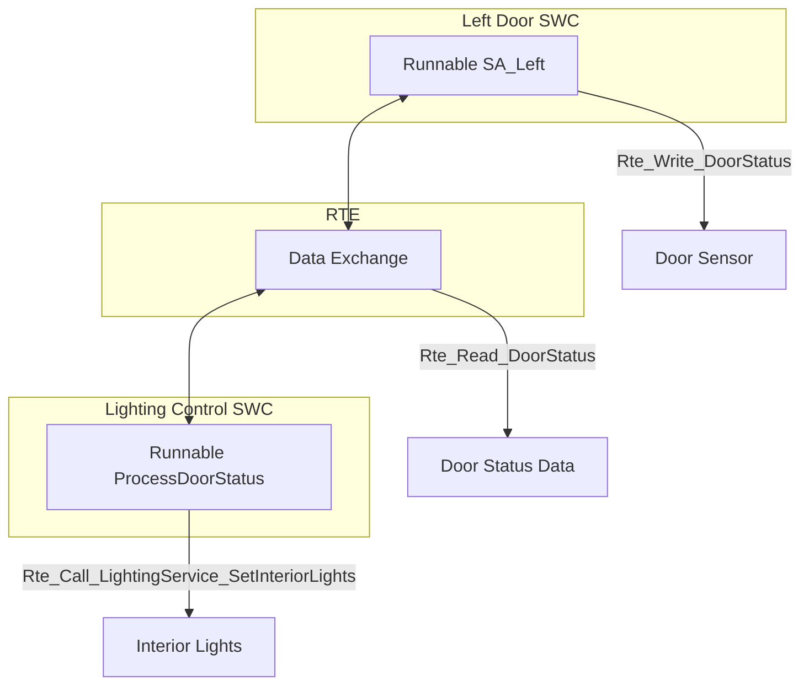

# Runnables

In the AUTOSAR (AUTomotive Open System ARchitecture) framework, **Runnables** are the fundamental executable units within **Atomic Software Components (SWCs)**. They encapsulate the core functional logic of an SWC and are invoked by the **Runtime Environment (RTE)** based on specific triggers, such as timer events, data reception, or operation calls. This documentation provides an in-depth exploration of Runnables in the AUTOSAR Classic Platform, detailing their concepts, structure, implementation mechanisms, and practical applications.

---
  
## 1. **What are Runnables?**

Runnables are pivotal elements in the AUTOSAR architecture, serving as the smallest schedulable units within Atomic SWCs. They define the behavior and functionality of SWCs, enabling precise and organized execution of tasks within an automotive system.

### 1.1 **Definition**

- **Runnable:** A function within an Atomic SWC that implements a specific part of the component’s behavior. It is the smallest executable entity in AUTOSAR, representing discrete operations or tasks that the SWC performs.
  
- **Schedulable Unit:** As the most granular executable unit, Runnables are managed by the AUTOSAR RTE and are scheduled for execution based on predefined triggers and priorities.

### 1.2 **Key Features**

1. **Internal Behavior:**
   - **Encapsulation of Logic:** Runnables encapsulate the functional logic of an SWC, ensuring that each Runnable performs a well-defined task.
   - **Isolation:** Each Runnable operates independently, promoting modularity and ease of maintenance.

2. **Trigger Mechanism:**
   - **Event-Driven Invocation:** Runnables are invoked by the RTE in response to specific triggers, such as:
     - **Timer Expiration:** Periodic execution based on configured timers.
     - **Data Reception:** Triggered when new data is received via ports.
     - **Operation Calls:** Activated upon invocation of services or operations by other SWCs.

3. **Flexibility:**
   - **Multiple Runnables per SWC:** An Atomic SWC can contain multiple Runnables, each responsible for different functionalities, enabling complex behavior through simple, focused units.
   - **Configurable Execution Modes:** Runnables can be configured for synchronous or asynchronous execution, providing adaptability to varying system requirements.

4. **Integration with RTE:**
   - **Seamless Interaction:** Runnables interact with the RTE for data exchange, operation invocation, and synchronization, abstracting away hardware-specific details.

### 1.3 **Importance in AUTOSAR**

Runnables are essential for:
- **Modular Design:** Facilitating the decomposition of complex functionalities into manageable, reusable units.
- **Real-Time Performance:** Ensuring deterministic execution of critical tasks through precise scheduling and trigger mechanisms.
- **Maintainability:** Simplifying updates and debugging by isolating functionality within individual Runnables.

---
  
## 2. **Runnable Structure**

Runnables are integral components of Atomic SWCs, each structured to perform specific tasks when invoked. Understanding their structure is crucial for effective implementation and integration within the AUTOSAR framework.

### 2.1 **Atomic Software Component Example**

Consider the **Left Door SWC** in an automotive system, which contains a Runnable named `SA_Left`. This Runnable is responsible for monitoring the state of the left door and communicating its status to other components.

### 2.2 **Implementation Details**

- **Trigger Configuration:**
  - **Periodic Trigger:** The Runnable `SA_Left` is configured to be triggered every 200 milliseconds.
  
- **Functional Responsibilities:**
  - **Reading Sensor Data:** It reads the door status (open or closed) from a sensor.
  - **Data Transmission:** Sends the door status to the RTE for further processing by other SWCs, such as lighting control systems.

### 2.3 **Runnable Example Code**

```c
// Runnable: SA_Left - Monitors Left Door Status
#include "Rte_LeftDoor.h"

void SA_Left(void) {
    /* Example implementation start */
    Std_ReturnType status;
    boolean DoorOpen;

    // Read the door state from the sensor (e.g., using a GPIO input)
    DoorOpen = ReadDoorSensor(); // Function to read sensor data

    // Write the door state to the RTE for other components to use
    status = Rte_Write_LeftDoor_DoorStatus(DoorOpen);

    if (status != RTE_E_OK) {
        // Handle write error (e.g., log error, attempt retry)
        HandleRteWriteError(status);
    }
    /* Example implementation end */
}

boolean ReadDoorSensor(void) {
    // Implementation to read door sensor (hardware-specific)
    // For example, reading a digital input pin
    return (GPIO_ReadPin(DOOR_SENSOR_PIN) == GPIO_PIN_SET);
}

void HandleRteWriteError(Std_ReturnType errorCode) {
    // Implementation for error handling
    // Could involve logging, alerting, or retry mechanisms
}
```

**Explanation:**

- **Function:** `SA_Left`
  - **Purpose:** Monitors the left door's status and communicates it to other components via the RTE.
  
- **Operations:**
  - **ReadDoorSensor():** Reads the current state of the door from a hardware sensor.
  - **Rte_Write_LeftDoor_DoorStatus():** Sends the door status to the RTE, making it available to other SWCs.
  - **Error Handling:** Checks the return status of the RTE write operation and handles any errors appropriately.

---
  
## 3. **Trigger Mechanisms**

Runnables are executed based on specific triggers, which determine when and how often a Runnable is invoked. Understanding these triggers is essential for designing responsive and efficient SWCs.

### 3.1 **Timer Triggers**

- **Description:** Runnables are invoked periodically based on configured timer events.
  
- **Use Case:** Periodic monitoring of sensor data or executing routine maintenance tasks.
  
- **Example:**
  
  The Runnable `SA_Left` in the Left Door SWC is triggered every 200 milliseconds to check the door's status.

### 3.2 **Data Reception**

- **Description:** Runnables are triggered when new data is received through a Require Port (R-Port).
  
- **Use Case:** Processing incoming data from other SWCs or external sources.
  
- **Example:**
  
  A Runnable that processes updated temperature data received from a Sensor SWC.

### 3.3 **Operation Calls**

- **Description:** Runnables are invoked when a service or operation is called by another SWC or the RTE.
  
- **Use Case:** Handling requests for specific operations, such as retrieving diagnostic information.
  
- **Example:**
  
  A Runnable that executes diagnostic procedures when a diagnostic request operation is invoked.

### 3.4 **Combination Triggers**

- **Description:** Runnables can be triggered by multiple sources, such as a combination of a timer event and data reception.
  
- **Use Case:** Complex scenarios where a Runnable needs to perform actions based on multiple conditions or events.
  
- **Example:**
  
  A Runnable that adjusts lighting only if both the ambient light level changes and a timer event occurs.

---
  
## 4. **Communication with RTE**

Runnables interact with the RTE to facilitate data exchange and service invocation. This interaction is fundamental to maintaining the decoupled and modular architecture promoted by AUTOSAR.

### 4.1 **Reading Inputs from RTE**

Runnables can access data from other SWCs or system components by reading inputs provided through Require Ports (R-Ports). This is typically done using the `Rte_Read` function.

#### **Code Example:**

```c
// Runnable: Read and Process Temperature Data
#include "Rte_Temperature.h"

void TemperatureProcessor(void) {
    float temperature;
    Std_ReturnType status;

    // Read temperature data from the RTE
    status = Rte_Read_TemperatureSensor_Temperature(&temperature);

    if (status == RTE_E_OK) {
        // Process the temperature data
        ProcessTemperature(temperature);
    } else {
        // Handle read error
        HandleRteReadError(status);
    }
}

void ProcessTemperature(float temp) {
    if (temp > THRESHOLD_HIGH) {
        ActivateCoolingSystem();
    } else if (temp < THRESHOLD_LOW) {
        ActivateHeatingSystem();
    } else {
        MaintainCurrentState();
    }
}

void HandleRteReadError(Std_ReturnType errorCode) {
    // Implementation for error handling
}
```

**Explanation:**

- **Function:** `TemperatureProcessor`
  - **Purpose:** Reads temperature data from the RTE and processes it based on defined thresholds.
  
- **Operations:**
  - **Rte_Read_TemperatureSensor_Temperature():** Retrieves temperature data from the Temperature Sensor SWC via the RTE.
  - **ProcessTemperature():** Decides whether to activate cooling or heating systems based on the received temperature.
  - **Error Handling:** Manages any errors encountered during the data reading process.

### 4.2 **Writing Outputs to RTE**

Runnables send data to other SWCs or system components by writing outputs through Provide Ports (P-Ports). This is typically achieved using the `Rte_Write` function.

#### **Code Example:**

```c
// Runnable: Update Door Status
#include "Rte_DoorStatus.h"

void UpdateDoorStatus(void) {
    boolean isDoorOpen;
    Std_ReturnType status;

    // Determine the current door status
    isDoorOpen = CheckDoorStatus();

    // Write the door status to the RTE
    status = Rte_Write_DoorStatus_SWC_DoorOpen(isDoorOpen);

    if (status != RTE_E_OK) {
        // Handle write error
        HandleRteWriteError(status);
    }
}

boolean CheckDoorStatus(void) {
    // Implementation to check door sensor
    return (ReadDoorSensor() == DOOR_OPEN);
}

void HandleRteWriteError(Std_ReturnType errorCode) {
    // Implementation for error handling
}
```

**Explanation:**

- **Function:** `UpdateDoorStatus`
  - **Purpose:** Updates the door status and communicates it to other SWCs via the RTE.
  
- **Operations:**
  - **CheckDoorStatus():** Determines if the door is open by reading sensor data.
  - **Rte_Write_DoorStatus_SWC_DoorOpen():** Sends the door status to the RTE, making it available to other components.
  - **Error Handling:** Manages any errors encountered during the data writing process.

### 4.3 **Calling Services**

Runnables can invoke services or operations provided by other SWCs or system components using the `Rte_Call` function. This facilitates interaction between clients and servers within the C/S communication model.

#### **Code Example:**

```c
// Runnable: Request Diagnostic Information
#include "Rte_DiagnosticService.h"

void RequestDiagnostics(void) {
    DiagnosticData diagData;
    Std_ReturnType status;

    // Invoke the GetVehicleHealth operation synchronously
    status = Rte_Call_DiagnosticService_GetVehicleHealth(&diagData);

    if (status == RTE_E_OK) {
        // Process the received diagnostic data
        AnalyzeDiagnosticData(diagData);
    } else {
        // Handle invocation error
        HandleDiagnosticError(status);
    }
}

void AnalyzeDiagnosticData(DiagnosticData data) {
    // Implementation for analyzing diagnostic data
}

void HandleDiagnosticError(Std_ReturnType errorCode) {
    // Implementation for error handling
}
```

**Explanation:**

- **Function:** `RequestDiagnostics`
  - **Purpose:** Requests diagnostic information from the Diagnostic Service SWC via the RTE.
  
- **Operations:**
  - **Rte_Call_DiagnosticService_GetVehicleHealth():** Invokes the `GetVehicleHealth` operation on the Diagnostic Service SWC.
  - **AnalyzeDiagnosticData():** Processes the received diagnostic data.
  - **Error Handling:** Manages any errors encountered during the service invocation.

---
  
## 5. **Runnable Timing and Scheduling**

Effective timing and scheduling of Runnables are critical to ensuring that SWCs perform their tasks reliably and within required time constraints, especially in real-time automotive systems.

### 5.1 **Timing**

- **Configuration-Based Execution:**
  - The timing for Runnable execution is defined within the RTE configuration files, allowing precise control over when Runnables are invoked.
  
- **Deterministic Behavior:**
  - Timers are configured to trigger Runnables at exact intervals, ensuring predictable and repeatable behavior, which is essential for safety-critical applications.

- **Example:**
  
  The `SA_Left` Runnable is configured to execute every 200 milliseconds, ensuring regular monitoring of the door status.

### 5.2 **Scheduling**

- **Task Mapping:**
  - Runnables are mapped to specific tasks, and their execution order is managed by the underlying operating system (OS) scheduler.
  
- **Priority Management:**
  - Runnables can be assigned priorities to determine their execution order, ensuring that critical tasks are handled promptly.
  
- **Real-Time Constraints:**
  - Scheduling ensures that Runnables meet real-time requirements, maintaining system responsiveness and reliability.

- **Example:**
  
  Runnables responsible for safety-critical functions, such as airbag deployment, are assigned higher priorities to ensure immediate execution upon triggering.

### 5.3 **Scheduling Strategies**

- **Static Scheduling:**
  - Runnables have fixed execution times and order, facilitating predictability.
  
- **Dynamic Scheduling:**
  - Runnables are scheduled based on real-time system conditions, allowing flexibility in execution.

- **Mixed Scheduling:**
  - Combines static and dynamic approaches to balance predictability and flexibility.

---
  
## 6. **Advantages of Runnables**

Runnables offer numerous benefits that enhance the development, performance, and maintainability of AUTOSAR-based automotive systems.

### 6.1 **Modularity**

- **Encapsulation:** Runnables encapsulate specific functionalities within SWCs, promoting a modular architecture where each Runnable can be developed and tested independently.
  
- **Simplified Maintenance:** Isolated functionalities make it easier to identify and fix issues without affecting other parts of the system.

### 6.2 **Reusability**

- **Component Reuse:** Atomic SWCs containing Runnables can be reused across multiple projects or vehicle models, reducing development time and costs.
  
- **Standardized Interfaces:** Consistent interaction with the RTE allows Runnables to be easily integrated into different system configurations.

### 6.3 **Scalability**

- **Flexible Addition of Runnables:** Multiple Runnables can be added to a single SWC to implement additional features, enabling the system to scale with evolving requirements.
  
- **Support for Complex Systems:** The ability to manage numerous Runnables across various SWCs supports the development of intricate automotive functionalities.

### 6.4 **Determinism**

- **Predictable Execution:** Timers and trigger-based invocation ensure that Runnables execute at precise times, which is critical for real-time applications.
  
- **Reliable Performance:** Deterministic behavior enhances system reliability, especially for safety-critical functions.

### 6.5 **Enhanced Real-Time Performance**

- **Optimized Scheduling:** Runnables are scheduled to meet real-time constraints, ensuring timely execution of tasks.
  
- **Efficient Resource Utilization:** Precise timing and scheduling optimize the use of system resources, enhancing overall performance.

---
  
## 7. **Use Case: Door Monitoring System**

To illustrate the practical application of Runnables within an AUTOSAR-based system, consider a **Door Monitoring System** that oversees the status of vehicle doors and communicates this information to other components, such as the lighting and security systems.

### 7.1 **System Components**

- **Left Door SWC:**
  - Contains the Runnable `SA_Left` responsible for monitoring the left door's status.

- **Right Door SWC:**
  - Contains the Runnable `SA_Right` responsible for monitoring the right door's status.

- **RTE:**
  - Manages the invocation of Runnables and facilitates data exchange between SWCs.

- **Lighting Control SWC:**
  - Receives door status data to adjust interior lighting accordingly.

### 7.2 **Workflow**

1. **Periodic Monitoring:**
   - **Runnable `SA_Left`** in the Left Door SWC is triggered every 200 milliseconds.
   - **Runnable `SA_Right`** in the Right Door SWC is triggered every 200 milliseconds.

2. **Data Acquisition:**
   - Each Runnable reads the status of its respective door using sensor inputs.
   - Determines whether the door is `OPEN` or `CLOSED`.

3. **Data Transmission:**
   - Each Runnable sends the door status to the RTE using `Rte_Write` functions.

4. **Data Processing:**
   - The **Lighting Control SWC** has Runnables that are triggered upon receiving door status updates.
   - Adjusts the interior lighting based on the door statuses (e.g., turning lights on when a door is opened).

### 7.3 **Code Example**

#### **Left Door SWC Runnable: `SA_Left`**

```c
// Runnable: SA_Left - Monitors Left Door Status
#include "Rte_LeftDoor.h"

void SA_Left(void) {
    /* Example implementation start */
    Std_ReturnType status;
    boolean DoorOpen;

    // Read the door state from the sensor
    DoorOpen = ReadDoorSensor(DOOR_LEFT_SENSOR_PIN);

    // Write the door state to the RTE for other components to use
    status = Rte_Write_LeftDoor_DoorStatus(DoorOpen);

    if (status != RTE_E_OK) {
        // Handle write error (e.g., log error, attempt retry)
        HandleRteWriteError(status);
    }
    /* Example implementation end */
}

boolean ReadDoorSensor(uint8_t sensorPin) {
    // Implementation to read door sensor (hardware-specific)
    return (GPIO_ReadPin(sensorPin) == GPIO_PIN_SET);
}

void HandleRteWriteError(Std_ReturnType errorCode) {
    // Implementation for error handling
    // Could involve logging, alerting, or retry mechanisms
}
```

#### **Lighting Control SWC Runnable: `ProcessDoorStatus`**

```c
// Runnable: ProcessDoorStatus - Adjusts Lighting Based on Door Status
#include "Rte_LightingControl.h"

void ProcessDoorStatus(void) {
    boolean LeftDoorOpen;
    boolean RightDoorOpen;
    Std_ReturnType status;

    // Read door status from the RTE
    status = Rte_Read_LightingControl_LeftDoorStatus(&LeftDoorOpen);
    if (status != RTE_E_OK) {
        // Handle read error
        HandleRteReadError(status);
        return;
    }

    status = Rte_Read_LightingControl_RightDoorStatus(&RightDoorOpen);
    if (status != RTE_E_OK) {
        // Handle read error
        HandleRteReadError(status);
        return;
    }

    // Determine lighting state based on door statuses
    if (LeftDoorOpen || RightDoorOpen) {
        // Turn on interior lights
        Rte_Call_LightingService_SetInteriorLights(true);
    } else {
        // Turn off interior lights
        Rte_Call_LightingService_SetInteriorLights(false);
    }
}

void HandleRteReadError(Std_ReturnType errorCode) {
    // Implementation for error handling
}
```

**Explanation:**

- **Runnable `SA_Left`:**
  - **Functionality:** Monitors the left door's status and communicates it to the RTE.
  - **Operations:**
    - Reads the door status using a sensor.
    - Writes the status to the RTE for other components to access.
    - Handles any errors encountered during the write operation.

- **Runnable `ProcessDoorStatus`:**
  - **Functionality:** Processes the received door status data to control interior lighting.
  - **Operations:**
    - Reads the status of both left and right doors from the RTE.
    - Determines whether to turn interior lights on or off based on door statuses.
    - Invokes a lighting service to adjust the lights accordingly.
    - Handles any errors encountered during the read operations.

---
  
## 8. **Runnable Timing and Scheduling**

Effective timing and scheduling are critical to ensuring that Runnables execute predictably and meet real-time requirements, especially in safety-critical automotive applications.

### 8.1 **Timing**

- **Configuration in RTE:**
  - The timing for Runnable execution is defined within the RTE's configuration, allowing precise control over when each Runnable is invoked.
  
- **Deterministic Execution:**
  - Timers are configured to trigger Runnables at exact intervals, ensuring deterministic behavior essential for real-time applications.
  
- **Example:**
  - Runnable `SA_Left` is set to execute every 200 milliseconds to continuously monitor door status.

### 8.2 **Scheduling**

- **Task Mapping:**
  - Runnables are mapped to specific tasks within the AUTOSAR operating system (OS), which manages their execution order based on priority and timing.
  
- **Priority Management:**
  - Runnables can be assigned priorities to ensure that critical tasks are executed promptly, preventing delays in essential operations.
  
- **Real-Time Constraints:**
  - Scheduling strategies are employed to meet real-time constraints, ensuring that Runnables execute within their required time frames.

- **Example:**
  - Safety-critical Runnables, such as those handling door status, are assigned higher priorities to ensure immediate execution upon triggering.

### 8.3 **Scheduling Strategies**

- **Static Scheduling:**
  - Runnables have fixed execution times and order, promoting predictability and simplifying analysis.
  
- **Dynamic Scheduling:**
  - Runnables are scheduled based on runtime conditions, offering flexibility to adapt to varying system demands.
  
- **Mixed Scheduling:**
  - Combines static and dynamic scheduling approaches to balance predictability with adaptability.

- **Example:**
  - Periodic monitoring Runnables use static scheduling, while event-driven Runnables employ dynamic scheduling based on incoming data.

---
  
## 9. **Advantages of Runnables**

Runnables provide several benefits that contribute to the efficiency, scalability, and maintainability of AUTOSAR-based automotive systems.

### 9.1 **Modularity**

- **Encapsulation of Functionality:**
  - Each Runnable encapsulates a specific functionality, promoting a modular design where individual components can be developed, tested, and maintained independently.
  
- **Simplified Integration:**
  - Modular Runnables facilitate the integration of new features without impacting existing system components.

### 9.2 **Reusability**

- **Component Reuse Across Projects:**
  - Atomic SWCs containing Runnables can be reused across different projects or vehicle models, reducing development time and effort.
  
- **Standardized Interfaces:**
  - Consistent interaction with the RTE through standardized interfaces enhances the reusability of Runnables.

### 9.3 **Scalability**

- **Adding New Functionalities:**
  - Multiple Runnables can be added to an SWC to implement additional functionalities, allowing the system to scale with evolving requirements.
  
- **Support for Complex Systems:**
  - The ability to manage numerous Runnables across various SWCs supports the development of intricate automotive systems.

### 9.4 **Determinism**

- **Predictable Execution:**
  - Trigger-based invocation ensures that Runnables execute at precise times, maintaining system predictability and reliability.
  
- **Real-Time Performance:**
  - Deterministic behavior is crucial for real-time applications, ensuring timely execution of critical tasks.

### 9.5 **Enhanced Real-Time Performance**

- **Optimized Scheduling:**
  - Efficient scheduling strategies ensure that Runnables meet their execution deadlines, enhancing overall system performance.
  
- **Resource Management:**
  - Precise timing and scheduling optimize the use of system resources, preventing bottlenecks and ensuring smooth operation.

### 9.6 **Maintainability**

- **Ease of Updates:**
  - Isolated Runnables simplify the process of updating or modifying specific functionalities without affecting the entire system.
  
- **Simplified Debugging:**
  - Encapsulated logic within Runnables makes it easier to identify and resolve issues, improving system reliability.

---
  
## 10. **Use Case: Door Monitoring System**

To demonstrate the practical application of Runnables within an AUTOSAR-based system, consider a **Door Monitoring System** designed to oversee the status of vehicle doors and communicate this information to other components such as lighting and security systems.

### 10.1 **System Components**

- **Left Door SWC:**
  - Contains Runnable `SA_Left` to monitor the left door's status.
  
- **Right Door SWC:**
  - Contains Runnable `SA_Right` to monitor the right door's status.
  
- **RTE:**
  - Manages the invocation of Runnables and facilitates data exchange between SWCs.
  
- **Lighting Control SWC:**
  - Contains Runnables to adjust interior lighting based on door statuses.

### 10.2 **Workflow**

1. **Periodic Monitoring:**
   - **Runnable `SA_Left`** in the Left Door SWC is triggered every 200 milliseconds.
   - **Runnable `SA_Right`** in the Right Door SWC is triggered every 200 milliseconds.

2. **Data Acquisition:**
   - Each Runnable reads the status of its respective door using sensor inputs.
   - Determines whether the door is `OPEN` or `CLOSED`.

3. **Data Transmission:**
   - Each Runnable sends the door status to the RTE using `Rte_Write` functions.

4. **Data Processing:**
   - The **Lighting Control SWC** has Runnables that are triggered upon receiving door status updates.
   - Adjusts the interior lighting based on the door statuses (e.g., turning lights on when a door is opened).

### 10.3 **Code Example**

#### **Left Door SWC Runnable: `SA_Left`**

```c
// Runnable: SA_Left - Monitors Left Door Status
#include "Rte_LeftDoor.h"

void SA_Left(void) {
    /* Example implementation start */
    Std_ReturnType status;
    boolean DoorOpen;

    // Read the door state from the left door sensor
    DoorOpen = ReadDoorSensor(DOOR_LEFT_SENSOR_PIN);

    // Write the door state to the RTE for other components to use
    status = Rte_Write_LeftDoor_DoorStatus(DoorOpen);

    if (status != RTE_E_OK) {
        // Handle write error (e.g., log error, attempt retry)
        HandleRteWriteError(status);
    }
    /* Example implementation end */
}

boolean ReadDoorSensor(uint8_t sensorPin) {
    // Implementation to read door sensor (hardware-specific)
    return (GPIO_ReadPin(sensorPin) == GPIO_PIN_SET);
}

void HandleRteWriteError(Std_ReturnType errorCode) {
    // Implementation for error handling
    // Could involve logging, alerting, or retry mechanisms
}
```

#### **Right Door SWC Runnable: `SA_Right`**

```c
// Runnable: SA_Right - Monitors Right Door Status
#include "Rte_RightDoor.h"

void SA_Right(void) {
    /* Example implementation start */
    Std_ReturnType status;
    boolean DoorOpen;

    // Read the door state from the right door sensor
    DoorOpen = ReadDoorSensor(DOOR_RIGHT_SENSOR_PIN);

    // Write the door state to the RTE for other components to use
    status = Rte_Write_RightDoor_DoorStatus(DoorOpen);

    if (status != RTE_E_OK) {
        // Handle write error (e.g., log error, attempt retry)
        HandleRteWriteError(status);
    }
    /* Example implementation end */
}

boolean ReadDoorSensor(uint8_t sensorPin) {
    // Implementation to read door sensor (hardware-specific)
    return (GPIO_ReadPin(sensorPin) == GPIO_PIN_SET);
}

void HandleRteWriteError(Std_ReturnType errorCode) {
    // Implementation for error handling
}
```

#### **Lighting Control SWC Runnable: `ProcessDoorStatus`**

```c
// Runnable: ProcessDoorStatus - Adjusts Lighting Based on Door Status
#include "Rte_LightingControl.h"

void ProcessDoorStatus(void) {
    boolean LeftDoorOpen;
    boolean RightDoorOpen;
    Std_ReturnType status;

    // Read door status from the RTE
    status = Rte_Read_LightingControl_LeftDoorStatus(&LeftDoorOpen);
    if (status != RTE_E_OK) {
        // Handle read error
        HandleRteReadError(status);
        return;
    }

    status = Rte_Read_LightingControl_RightDoorStatus(&RightDoorOpen);
    if (status != RTE_E_OK) {
        // Handle read error
        HandleRteReadError(status);
        return;
    }

    // Determine lighting state based on door statuses
    if (LeftDoorOpen || RightDoorOpen) {
        // Turn on interior lights
        Rte_Call_LightingService_SetInteriorLights(true);
    } else {
        // Turn off interior lights
        Rte_Call_LightingService_SetInteriorLights(false);
    }
}

void HandleRteReadError(Std_ReturnType errorCode) {
    // Implementation for error handling
    // Could involve logging, alerting, or fallback mechanisms
}
```

**Explanation:**

- **Runnable `SA_Left` and `SA_Right`:**
  - **Functionality:** Monitor the status of the left and right doors, respectively, and communicate this status to other SWCs via the RTE.
  
- **Runnable `ProcessDoorStatus`:**
  - **Functionality:** Reads the statuses of both doors from the RTE and adjusts the interior lighting accordingly by invoking a lighting service.

- **Error Handling:** Each Runnable includes mechanisms to handle potential errors during data reading or writing, ensuring system robustness.

---
  
## 11. **Best Practices for Runnables**

Adhering to best practices ensures that Runnables are implemented effectively, contributing to the overall quality and reliability of the automotive software system.

### 11.1 **Clear and Descriptive Naming**

- **Descriptive Names:** Use meaningful names for Runnables that reflect their functionality, enhancing readability and maintainability.
  
- **Consistency:** Maintain consistent naming conventions across all Runnables to facilitate understanding and collaboration among development teams.

### 11.2 **Single Responsibility Principle**

- **Focused Functionality:** Each Runnable should encapsulate a single, well-defined task, promoting simplicity and ease of testing.
  
- **Avoid Overloading:** Prevent Runnables from handling multiple unrelated tasks, which can lead to complexity and difficulties in debugging.

### 11.3 **Efficient Error Handling**

- **Robust Mechanisms:** Implement comprehensive error handling within Runnables to manage unexpected conditions gracefully.
  
- **Logging and Alerts:** Incorporate logging and alerting mechanisms to notify developers of issues, facilitating prompt resolution.

### 11.4 **Optimized Execution Time**

- **Minimize Latency:** Ensure that Runnables execute efficiently to meet real-time requirements and prevent bottlenecks.
  
- **Resource Management:** Optimize the use of system resources within Runnables to enhance performance and reduce overhead.

### 11.5 **Documentation and Comments**

- **Comprehensive Documentation:** Provide detailed documentation for each Runnable, outlining its purpose, functionality, and interaction with other components.
  
- **In-Code Comments:** Use comments within the code to explain complex logic, facilitating easier understanding and maintenance.

### 11.6 **Adherence to AUTOSAR Standards**

- **Standard Compliance:** Ensure that Runnables comply with AUTOSAR standards and guidelines, promoting interoperability and consistency.
  
- **Configuration Alignment:** Align Runnable implementations with RTE configurations to ensure seamless integration and communication.

---
  
## 12. **Integration Example: Door Monitoring System**

To consolidate the understanding of Runnables within an AUTOSAR-based system, consider the following integration example involving a **Door Monitoring System**.

### 12.1 **System Components**

- **Left Door SWC:**
  - Contains Runnable `SA_Left` to monitor the left door's status.

- **Right Door SWC:**
  - Contains Runnable `SA_Right` to monitor the right door's status.

- **RTE:**
  - Manages Runnable invocations and data exchange between SWCs.

- **Lighting Control SWC:**
  - Contains Runnable `ProcessDoorStatus` to adjust interior lighting based on door statuses.

### 12.2 **Workflow**

1. **Initialization:**
   - System initializes all SWCs and configures Runnables with their respective triggers and priorities.

2. **Periodic Monitoring:**
   - Every 200 milliseconds, Runnables `SA_Left` and `SA_Right` are triggered to read door statuses.

3. **Data Transmission:**
   - Each Runnable writes the door status (`OPEN` or `CLOSED`) to the RTE using `Rte_Write` functions.

4. **Data Processing:**
   - Runnable `ProcessDoorStatus` in the Lighting Control SWC is triggered upon receiving new door status data.
   - It reads the latest door statuses using `Rte_Read` functions.
   - Based on the door statuses, it invokes lighting adjustments through `Rte_Call` functions.

5. **Lighting Adjustment:**
   - If either door is open, interior lights are turned on.
   - If both doors are closed, interior lights are turned off.

6. **Error Handling:**
   - Any errors encountered during reading or writing operations are handled gracefully, ensuring system reliability.

### 12.3 **Diagrammatic Representation**



**Explanation:**

- **Left Door SWC:** Periodically triggers `SA_Left` to monitor the left door's status and sends it to the RTE.
  
- **RTE:** Facilitates data exchange between the Left Door SWC and the Lighting Control SWC, ensuring that the latest door statuses are available for processing.
  
- **Lighting Control SWC:** Triggers `ProcessDoorStatus` to adjust interior lighting based on the received door statuses.

### 12.4 **Code Snippet Integration**

**Left Door SWC Runnable: `SA_Left`**

```c
// Runnable: SA_Left - Monitors Left Door Status
#include "Rte_LeftDoor.h"

void SA_Left(void) {
    Std_ReturnType status;
    boolean DoorOpen;

    // Read the left door sensor
    DoorOpen = ReadDoorSensor(DOOR_LEFT_SENSOR_PIN);

    // Write door status to RTE
    status = Rte_Write_LeftDoor_DoorStatus(DoorOpen);

    if (status != RTE_E_OK) {
        HandleRteWriteError(status);
    }
}
```

**Lighting Control SWC Runnable: `ProcessDoorStatus`**

```c
// Runnable: ProcessDoorStatus - Adjusts Lighting Based on Door Status
#include "Rte_LightingControl.h"

void ProcessDoorStatus(void) {
    boolean LeftDoorOpen;
    boolean RightDoorOpen;
    Std_ReturnType status;

    // Read door statuses from RTE
    status = Rte_Read_LightingControl_LeftDoorStatus(&LeftDoorOpen);
    if (status != RTE_E_OK) {
        HandleRteReadError(status);
        return;
    }

    status = Rte_Read_LightingControl_RightDoorStatus(&RightDoorOpen);
    if (status != RTE_E_OK) {
        HandleRteReadError(status);
        return;
    }

    // Determine lighting state
    if (LeftDoorOpen || RightDoorOpen) {
        // Turn on interior lights
        Rte_Call_LightingService_SetInteriorLights(true);
    } else {
        // Turn off interior lights
        Rte_Call_LightingService_SetInteriorLights(false);
    }
}

void HandleRteReadError(Std_ReturnType errorCode) {
    // Implementation for error handling
}
```

**Explanation:**

- **Runnable `SA_Left`:** Monitors the left door's status and sends it to the RTE.
  
- **Runnable `ProcessDoorStatus`:** Reads both door statuses from the RTE and adjusts interior lighting accordingly by invoking a lighting service.
  
- **Error Handling:** Both Runnables include error handling mechanisms to manage potential issues during data transmission and reception.

---
  
## 13. **Best Practices for Runnables**

Implementing Runnables effectively is crucial for ensuring the reliability, efficiency, and maintainability of AUTOSAR-based automotive systems. Adhering to best practices facilitates the development of robust and scalable SWCs.

### 13.1 **Clear and Descriptive Naming**

- **Descriptive Names:** Assign meaningful and descriptive names to Runnables that reflect their functionality, enhancing code readability and maintainability.
  
- **Consistent Naming Conventions:** Maintain consistent naming patterns across all Runnables to streamline understanding and collaboration among development teams.

### 13.2 **Single Responsibility Principle**

- **Focused Functionality:** Design each Runnable to perform a single, well-defined task, promoting simplicity and ease of testing.
  
- **Avoid Overloading:** Prevent Runnables from handling multiple unrelated tasks, which can lead to complexity and hinder debugging efforts.

### 13.3 **Efficient Error Handling**

- **Robust Mechanisms:** Implement comprehensive error handling within Runnables to manage unexpected conditions gracefully.
  
- **Logging and Alerts:** Incorporate logging and alerting mechanisms to notify developers of issues, facilitating prompt resolution and system reliability.

### 13.4 **Optimized Execution Time**

- **Minimize Latency:** Ensure that Runnables execute efficiently to meet real-time requirements and prevent bottlenecks in the system.
  
- **Resource Management:** Optimize the use of system resources within Runnables to enhance performance and reduce overhead.

### 13.5 **Documentation and Comments**

- **Comprehensive Documentation:** Provide detailed documentation for each Runnable, outlining its purpose, functionality, and interactions with other components.
  
- **In-Code Comments:** Use comments within the code to explain complex logic, facilitating easier understanding and maintenance by other developers.

### 13.6 **Adherence to AUTOSAR Standards**

- **Standard Compliance:** Ensure that Runnables comply with AUTOSAR standards and guidelines, promoting interoperability and consistency across the system.
  
- **Configuration Alignment:** Align Runnable implementations with RTE configurations to ensure seamless integration and communication between components.

### 13.7 **Testing and Validation**

- **Unit Testing:** Develop unit tests for each Runnable to verify its functionality in isolation, ensuring that it behaves as expected under various conditions.
  
- **Integration Testing:** Conduct integration tests to validate interactions between Runnables and other SWCs, ensuring that data flows and operations execute correctly within the system.

---
  
## 14. **Summary**

Runnables are the cornerstone of the AUTOSAR architecture, serving as the executable units that embody the functional logic of Software Components (SWCs). By leveraging specific trigger mechanisms and interacting seamlessly with the Runtime Environment (RTE), Runnables enable modular, reusable, and scalable development of automotive software systems. Their structured design promotes predictability, real-time performance, and maintainability, which are essential for the demanding requirements of modern vehicles.

**Key Takeaways:**

- **Foundational Executable Units:** Runnables are the smallest schedulable entities in AUTOSAR, encapsulating specific functionalities within Atomic SWCs.
  
- **Trigger-Based Invocation:** Runnables are invoked by the RTE based on predefined triggers, ensuring timely and predictable execution.
  
- **Interaction with RTE:** Through `Rte_Read`, `Rte_Write`, and `Rte_Call` functions, Runnables facilitate data exchange and service invocation, maintaining system decoupling and modularity.
  
- **Timing and Scheduling:** Precise configuration of timing and scheduling ensures that Runnables meet real-time constraints, contributing to system reliability and performance.
  
- **Advantages:** Runnables enhance modularity, reusability, scalability, determinism, and maintainability, making them indispensable for robust automotive software development.

By mastering the concept and implementation of Runnables, developers and engineers can design sophisticated, efficient, and maintainable automotive embedded systems that align with industry best practices and standards. This structured approach not only simplifies development and integration but also ensures that automotive applications are resilient, efficient, and adaptable to future advancements.

---
  
This documentation provides a comprehensive understanding of **Runnables** within the AUTOSAR Classic Platform, highlighting their structure, functionality, interaction mechanisms, and best practices. Mastery of Runnables is essential for developing effective, scalable, and reliable automotive software systems that meet the stringent demands of the modern automotive industry.