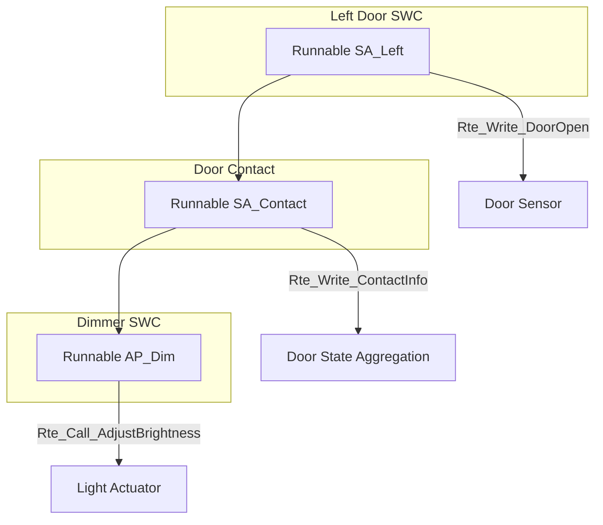

# Runnable Scheduling and Exercises

This document delves into **AUTOSAR Runnable Scheduling** within the context of a door and dimming system, complemented by practical exercises to reinforce the understanding of software design using AUTOSAR modeling concepts. The examples encompass **task prioritization**, **data exchange**, and **inter-ECU communication**, providing a comprehensive guide for developers and engineers working with AUTOSAR-based systems.

---

## 1. **Runnable Scheduling**

Effective scheduling of Runnables is paramount in AUTOSAR to ensure that critical functionalities are executed in a timely and deterministic manner. This section explores the fundamentals of Runnable scheduling, the roles of various components and tasks, task prioritization strategies, and the data flow mechanisms that underpin robust automotive software systems.

### 1.1 **Overview**

In AUTOSAR, **Runnables** are the executable entities within **Atomic Software Components (SWCs)**. The **Runtime Environment (RTE)** orchestrates their execution based on predefined triggers, ensuring that each Runnable operates within its designated timing and priority constraints. Proper scheduling guarantees that essential tasks, such as monitoring door states and controlling dimming systems, are performed reliably and efficiently.

### 1.2 **Components and Tasks**

Understanding the interaction between different SWCs and their associated Runnables is crucial for designing a cohesive system. Below is an overview of the primary components involved in a door and dimming system, along with their respective tasks.

#### **Left Door SWC**

- **Runnable Name:** `SA_Left`
- **Trigger:** Periodic, every **20 ms**
- **Task:**
  - Monitors the state of the left door (`DoorOpen`).
  - Sends the door state to the **Door Contact** SWC via the RTE.

#### **Door Contact SWC**

- **Runnable Name:** `SA_Contact`
- **Trigger:** Event-based, triggered by the `DoorOpen` input.
- **Task:**
  - Aggregates door states from multiple sources.
  - Sends aggregated contact information to the **Dimmer** SWC via the RTE.

#### **Dimmer SWC**

- **Runnables:**
  1. **`AP_Init`**
     - **Trigger:** Initialization phase.
     - **Task:** Configures the dimmer settings during system startup.
  
  2. **`AP_Dim`**
     - **Trigger:** Triggered by the `Contact` signal from the **Door Contact** SWC.
     - **Task:** Adjusts light dimming based on door state and elapsed time.

### 1.3 **Task Prioritization**

Assigning appropriate priorities to tasks is essential to ensure that critical functionalities are addressed promptly. In AUTOSAR, tasks are mapped to Runnables with specific priorities to manage execution order effectively.

- **Task A:** **Priority 1**
  - **Description:** Higher priority, ensures faster response.
  - **Example:** `SA_Left` Runnable monitoring the left door.
  
- **Task B:** **Priority 2**
  - **Description:** Lower priority, executed after higher priority tasks.
  - **Example:** `SA_Contact` Runnable aggregating door states.

**Priority Assignment Rationale:**

- **Criticality:** Tasks that monitor safety-critical components (e.g., door status) are assigned higher priorities to ensure immediate response.
- **Determinism:** Assigning fixed priorities facilitates predictable behavior, essential for real-time systems.

### 1.4 **Data Flow**

Efficient data flow between Runnables and SWCs is fundamental to the system's responsiveness and reliability. The following outlines the data exchange sequence within the door and dimming system.

1. **Left Door SWC:**
   - **Runnable `SA_Left`** executes every 20 ms.
   - Reads the left door's status (`DoorOpen`) using a sensor.
   - Sends the `DoorOpen` state to the **Door Contact** SWC via the RTE.

2. **Door Contact SWC:**
   - **Runnable `SA_Contact`** is triggered upon receiving the `DoorOpen` signal.
   - Aggregates door states (e.g., left and right doors).
   - Sends the aggregated contact information to the **Dimmer** SWC via the RTE.

3. **Dimmer SWC:**
   - **Runnable `AP_Dim`** is triggered by the `Contact` signal.
   - Adjusts the light intensity based on door states and configured dimming logic.

**Data Flow Diagram:**



---

## 2. **Exercises**

Engaging in practical exercises is an effective way to solidify understanding of AUTOSAR Runnable Scheduling and software design principles. The following exercises are designed to reinforce concepts related to Runnable implementation, task prioritization, and inter-ECU communication.

### **Exercise 1: Interior Light Functionality**

#### **Objective:**

Design a system for **interior lighting** using AUTOSAR modeling objects. This involves creating separate SWCs for sensors and actuators, implementing an application SWC to interpret sensor data, and adding functionality for shutoff delays and dimming behavior.

#### **Requirements:**

1. **Model Separate SWCs:**
   - **Sensors SWC:**
     - Monitors door and switch states.
     - Provides sensor data to other SWCs.
   - **Actuators SWC:**
     - Controls interior lights based on received commands.
     - Adjusts brightness levels as required.

2. **Implement an Application SWC:**
   - **Functionality:**
     - Interprets the states of doors and switches.
     - Determines lighting actions based on sensor inputs.
     - Communicates with the Actuators SWC to execute lighting commands.

3. **Add Functionality for:**
   - **Shutoff Delay:**
     - Implements a delay mechanism to turn off lights after a certain period of inactivity.
   - **Dimming Behavior:**
     - Gradually adjusts light brightness based on environmental conditions or user preferences.

#### **Steps to Complete Exercise 1:**

1. **Define SWCs:**
   - Create SWCs for Sensors, Actuators, and Application functionalities.
  
2. **Define Runnables:**
   - **Sensors SWC:** `MonitorSensors`
   - **Actuators SWC:** `ControlLights`
   - **Application SWC:** `ProcessLightingCommands`

3. **Configure Triggers:**
   - **MonitorSensors:** Periodic trigger every 50 ms.
   - **ControlLights:** Event-based trigger upon receiving lighting commands.
   - **ProcessLightingCommands:** Event-based trigger upon receiving sensor data.

4. **Implement Runnables:**
   - Write code for each Runnable to perform designated tasks.
  
5. **Incorporate Shutoff Delay and Dimming:**
   - Implement timers and logic within the Application SWC to manage delays and dimming.

#### **Expected Outcome:**

A modular and scalable interior lighting system where sensor data is effectively interpreted and acted upon to control light functionalities, including automatic shutoff and dimming.

### **Exercise 2: Mapping SWCs Across ECUs**

#### **Objective:**

Map the SWCs designed in Exercise 1 to three different **Electronic Control Units (ECUs)**: Rear, Front, and Roof. Identify and document the information exchanged between the ECUs to facilitate inter-ECU communication.

#### **Requirements:**

1. **Assign Each SWC to an ECU:**
   - **Rear ECU:** Hosts the Sensors SWC.
   - **Front ECU:** Hosts the Application SWC.
   - **Roof ECU:** Hosts the Actuators SWC.

2. **Identify and Document Information Exchange:**
   - Define the data transmitted between ECUs, such as door states from Rear ECU to Front ECU and lighting commands from Front ECU to Roof ECU.

3. **Configure Communication Interfaces:**
   - Set up appropriate ports and interfaces for inter-ECU communication.
  
4. **Ensure Data Integrity and Synchronization:**
   - Implement mechanisms to maintain data consistency across ECUs.

#### **Steps to Complete Exercise 2:**

1. **ECU Assignment:**
   - Allocate SWCs to the designated ECUs based on their functionalities.

2. **Define Inter-ECU Communication:**
   - **Rear ECU to Front ECU:**
     - **Data:** Door states (`DoorOpen`).
     - **Communication Method:** Sender-Receiver (S/R) communication via RTE.
  
   - **Front ECU to Roof ECU:**
     - **Data:** Lighting commands (`LightOn`, `LightOff`, `DimLevel`).
     - **Communication Method:** Client-Server (C/S) communication via RTE.

3. **Configure Ports and Interfaces:**
   - Set up Provide Ports (P-Ports) and Require Ports (R-Ports) for data exchange.
  
4. **Implement Data Exchange Mechanisms:**
   - Use `Rte_Write` and `Rte_Read` for S/R communication.
   - Use `Rte_Call` and `Rte_Write` for C/S communication.

5. **Document Data Flow:**
   - Create detailed documentation outlining the data flow between ECUs, including data types and communication patterns.

#### **Expected Outcome:**

A well-structured inter-ECU communication setup where sensor data from the Rear ECU is effectively utilized by the Application SWC in the Front ECU to control lighting via the Actuators SWC in the Roof ECU.

---

## 3. **AUTOSAR Design Insights**

Designing effective AUTOSAR-based systems requires a deep understanding of key architectural principles. This section highlights critical design insights that contribute to the development of robust, scalable, and maintainable automotive software systems.

### 3.1 **Modularity**

- **Definition:** Modularity refers to the division of a system into distinct, interchangeable components, each encapsulating specific functionalities.
  
- **Benefits:**
  - **Reusability:** Modular SWCs can be reused across different projects and vehicle models, reducing development time and costs.
  - **Maintainability:** Isolated modules simplify updates and debugging, as changes in one module have minimal impact on others.
  - **Scalability:** Facilitates the addition of new features without disrupting existing system components.

- **Application in Example:**
  - Separating Sensors, Application Logic, and Actuators into distinct SWCs enhances the system's modularity, allowing each component to evolve independently.

### 3.2 **Prioritization**

- **Definition:** Prioritization involves assigning execution priorities to tasks or Runnables to manage their execution order effectively.
  
- **Benefits:**
  - **Deterministic Behavior:** Ensures that critical tasks are executed promptly, meeting real-time constraints.
  - **Resource Optimization:** Allocates system resources efficiently by prioritizing essential functionalities.
  
- **Application in Example:**
  - Assigning higher priority to the `SA_Left` Runnable ensures that door monitoring occurs promptly, which is critical for safety-related functionalities.

### 3.3 **Inter-ECU Communication**

- **Definition:** Inter-ECU communication refers to the exchange of data and control messages between different ECUs within a vehicle.
  
- **Benefits:**
  - **Distributed Processing:** Allows for the distribution of computational tasks across multiple ECUs, enhancing system performance and reliability.
  - **Flexibility:** Supports diverse system topologies and functionalities by enabling ECUs to interact seamlessly.
  
- **Application in Example:**
  - Mapping SWCs across Rear, Front, and Roof ECUs demonstrates effective inter-ECU communication, facilitating coordinated control of sensors and actuators.

---

## 4. **Implementation Example**

To illustrate the practical application of Runnable Scheduling and AUTOSAR principles, consider the following implementation example of a **Door Monitoring and Light Control System**. This example demonstrates how Runnables are scheduled, how data flows between SWCs, and how inter-ECU communication is managed.

### 4.1 **Door Monitoring and Light Control Workflow**

1. **Periodic Monitoring:**
   - **Runnable `SA_Left`** in the Left Door SWC is triggered every 20 ms to monitor the left door's status.
   - **Runnable `SA_Right`** in the Right Door SWC is triggered every 20 ms to monitor the right door's status.

2. **Data Transmission:**
   - Each Runnable sends the respective door status (`DoorOpen`) to the **Door Contact** SWC via the RTE using `Rte_Write` functions.

3. **Data Aggregation:**
   - **Runnable `SA_Contact`** in the Door Contact SWC is triggered upon receiving door status updates.
   - It aggregates the door states and sends contact information to the **Dimmer** SWC via the RTE.

4. **Light Adjustment:**
   - **Runnable `AP_Dim`** in the Dimmer SWC is triggered by the contact signal.
   - Adjusts the light intensity based on the aggregated door states and predefined dimming logic.

### 4.2 **Runnable Implementations**

#### **Left Door SWC Runnable: `SA_Left`**

```c
// Runnable: SA_Left - Monitors Left Door Status
#include "Rte_LeftDoor.h"

void SA_Left(void) {
    Std_ReturnType status;
    boolean DoorOpen;

    // Read the left door sensor
    DoorOpen = ReadDoorSensor(DOOR_LEFT_SENSOR_PIN);

    // Write door status to RTE
    status = Rte_Write_LeftDoor_DoorOpen(DoorOpen);

    if (status != RTE_E_OK) {
        // Handle write error (e.g., log error, attempt retry)
        HandleRteWriteError(status);
    }
}

boolean ReadDoorSensor(uint8_t sensorPin) {
    // Implementation to read door sensor (hardware-specific)
    return (GPIO_ReadPin(sensorPin) == GPIO_PIN_SET);
}

void HandleRteWriteError(Std_ReturnType errorCode) {
    // Implementation for error handling
    // Could involve logging, alerting, or retry mechanisms
}
```

**Explanation:**

- **Function:** `SA_Left`
  - **Purpose:** Monitors the left door's status and communicates it to the RTE.
  
- **Operations:**
  - **ReadDoorSensor():** Reads the current state of the left door using a sensor connected to a specific GPIO pin.
  - **Rte_Write_LeftDoor_DoorOpen():** Sends the door status (`true` for open, `false` for closed) to the RTE, making it available to other SWCs.
  - **Error Handling:** Checks the return status of the RTE write operation and handles any errors appropriately.

#### **Door Contact SWC Runnable: `SA_Contact`**

```c
// Runnable: SA_Contact - Aggregates Door States
#include "Rte_DoorContact.h"

void SA_Contact(void) {
    Std_ReturnType status;
    boolean LeftDoorOpen;
    boolean RightDoorOpen;

    // Read left door status from RTE
    status = Rte_Read_DoorContact_LeftDoorOpen(&LeftDoorOpen);
    if (status != RTE_E_OK) {
        // Handle read error
        HandleRteReadError(status);
        return;
    }

    // Read right door status from RTE
    status = Rte_Read_DoorContact_RightDoorOpen(&RightDoorOpen);
    if (status != RTE_E_OK) {
        // Handle read error
        HandleRteReadError(status);
        return;
    }

    // Aggregate door states
    boolean AnyDoorOpen = LeftDoorOpen || RightDoorOpen;

    // Send aggregated contact information to Dimmer SWC
    status = Rte_Write_DoorContact_AnyDoorOpen(AnyDoorOpen);

    if (status != RTE_E_OK) {
        // Handle write error
        HandleRteWriteError(status);
    }
}

void HandleRteReadError(Std_ReturnType errorCode) {
    // Implementation for error handling
}

void HandleRteWriteError(Std_ReturnType errorCode) {
    // Implementation for error handling
}
```

**Explanation:**

- **Function:** `SA_Contact`
  - **Purpose:** Aggregates the statuses of both doors and communicates the combined state to the Dimmer SWC.
  
- **Operations:**
  - **Rte_Read_DoorContact_LeftDoorOpen():** Retrieves the left door's status from the RTE.
  - **Rte_Read_DoorContact_RightDoorOpen():** Retrieves the right door's status from the RTE.
  - **Aggregation Logic:** Combines the two door statuses to determine if any door is open.
  - **Rte_Write_DoorContact_AnyDoorOpen():** Sends the aggregated door status to the RTE for use by the Dimmer SWC.
  - **Error Handling:** Manages any errors encountered during data reading or writing.

#### **Dimmer SWC Runnable: `AP_Dim`**

```c
// Runnable: AP_Dim - Adjusts Light Dimming Based on Door Status
#include "Rte_Dimmer.h"

void AP_Dim(void) {
    Std_ReturnType status;
    boolean AnyDoorOpen;
    uint8_t CurrentDimLevel;

    // Read aggregated door status from RTE
    status = Rte_Read_Dimmer_AnyDoorOpen(&AnyDoorOpen);
    if (status != RTE_E_OK) {
        // Handle read error
        HandleRteReadError(status);
        return;
    }

    // Determine new dim level based on door status
    if (AnyDoorOpen) {
        // Increase brightness
        CurrentDimLevel = GetCurrentDimLevel() + DIM_STEP;
        if (CurrentDimLevel > MAX_DIM_LEVEL) {
            CurrentDimLevel = MAX_DIM_LEVEL;
        }
    } else {
        // Decrease brightness after shutoff delay
        if (IsShutoffDelayElapsed()) {
            CurrentDimLevel = GetCurrentDimLevel() - DIM_STEP;
            if (CurrentDimLevel < MIN_DIM_LEVEL) {
                CurrentDimLevel = MIN_DIM_LEVEL;
            }
        }
    }

    // Update dim level
    SetDimLevel(CurrentDimLevel);

    // Write updated dim level to RTE
    status = Rte_Write_Dimmer_CurrentDimLevel(CurrentDimLevel);
    if (status != RTE_E_OK) {
        // Handle write error
        HandleRteWriteError(status);
    }
}

uint8_t GetCurrentDimLevel(void) {
    // Implementation to retrieve current dim level
    return CurrentDimLevel;
}

void SetDimLevel(uint8_t dimLevel) {
    // Implementation to adjust light brightness (e.g., PWM control)
    PWM_SetBrightness(dimLevel);
}

boolean IsShutoffDelayElapsed(void) {
    // Implementation to check if shutoff delay has elapsed
    return (SystemTickCount >= ShutoffDelayTicks);
}

void HandleRteReadError(Std_ReturnType errorCode) {
    // Implementation for error handling
}

void HandleRteWriteError(Std_ReturnType errorCode) {
    // Implementation for error handling
}
```

**Explanation:**

- **Function:** `AP_Dim`
  - **Purpose:** Adjusts the light dimming level based on the aggregated door statuses.
  
- **Operations:**
  - **Rte_Read_Dimmer_AnyDoorOpen():** Retrieves the aggregated door status from the RTE.
  - **Dimming Logic:**
    - **If Any Door is Open:** Increases brightness incrementally, ensuring it does not exceed the maximum level.
    - **If No Doors are Open:** Decreases brightness after a specified shutoff delay, ensuring it does not fall below the minimum level.
  - **SetDimLevel():** Adjusts the light brightness using PWM control based on the determined dim level.
  - **Rte_Write_Dimmer_CurrentDimLevel():** Sends the updated dim level to the RTE for consistency and potential use by other SWCs.
  - **Error Handling:** Manages any errors encountered during data reading or writing.

### 4.3 **Inter-ECU Communication Setup**

In a distributed automotive system, different ECUs host various SWCs. Proper configuration ensures seamless communication and data exchange across these ECUs.

#### **ECU Assignments:**

- **Rear ECU:**
  - **SWC:** Sensors SWC
  - **Runnables:** `MonitorSensors`
  
- **Front ECU:**
  - **SWC:** Application SWC
  - **Runnables:** `ProcessLightingCommands`
  
- **Roof ECU:**
  - **SWC:** Actuators SWC
  - **Runnables:** `ControlLights`

#### **Information Exchange:**

1. **Rear ECU to Front ECU:**
   - **Data:** Door states (`DoorOpen`)
   - **Communication Pattern:** Sender-Receiver (S/R)
   - **Method:** `Rte_Write` and `Rte_Read` via the RTE

2. **Front ECU to Roof ECU:**
   - **Data:** Lighting commands (`LightOn`, `LightOff`, `DimLevel`)
   - **Communication Pattern:** Client-Server (C/S)
   - **Method:** `Rte_Call` for operation invocation

#### **Configuration Steps:**

1. **Define Communication Interfaces:**
   - **Provide Ports (P-Ports):** For sending data from Sensors to RTE.
   - **Require Ports (R-Ports):** For receiving data from RTE to Application SWC.

2. **Map Data Elements:**
   - Ensure that data elements like `DoorOpen` and `LightCommand` are correctly mapped to corresponding signals and services.

3. **Configure Runnables and Triggers:**
   - Assign appropriate triggers to Runnables based on communication requirements and execution priorities.

4. **Ensure Data Consistency:**
   - Implement synchronization mechanisms to maintain data integrity across ECUs.

---

## 5. **AUTOSAR Design Insights**

Developing AUTOSAR-based systems involves adhering to architectural principles that promote robustness, scalability, and maintainability. This section highlights essential design insights that facilitate effective software development within the AUTOSAR framework.

### 5.1 **Modularity**

- **Definition:** Modularity involves decomposing the system into distinct, interchangeable components, each responsible for specific functionalities.
  
- **Benefits:**
  - **Reusability:** Modular SWCs can be reused across various projects, reducing duplication of effort.
  - **Maintainability:** Isolated modules simplify troubleshooting and updates, as changes in one module have minimal impact on others.
  - **Scalability:** Facilitates the addition of new features by integrating new modules without overhauling existing ones.

- **Application in Example:**
  - Separating sensor monitoring, data aggregation, and light control into individual SWCs enhances the system's modularity, allowing each component to evolve independently.

### 5.2 **Prioritization**

- **Definition:** Prioritization entails assigning execution priorities to Runnables or tasks to manage their execution order effectively.
  
- **Benefits:**
  - **Deterministic Execution:** Ensures that high-priority tasks are executed promptly, meeting real-time constraints.
  - **Resource Allocation:** Optimizes system resource usage by prioritizing critical functionalities.
  
- **Application in Example:**
  - Assigning higher priority to door monitoring Runnables (`SA_Left`, `SA_Right`) ensures immediate response to door state changes, which is critical for safety-related operations.

### 5.3 **Inter-ECU Communication**

- **Definition:** Inter-ECU communication refers to the exchange of data and control messages between different Electronic Control Units (ECUs) within a vehicle.
  
- **Benefits:**
  - **Distributed Processing:** Allows computational tasks to be spread across multiple ECUs, enhancing system performance and reliability.
  - **Flexibility:** Supports diverse system architectures and functionalities by enabling seamless communication between ECUs.
  
- **Application in Example:**
  - Mapping SWCs across Rear, Front, and Roof ECUs demonstrates effective inter-ECU communication, facilitating coordinated control of sensors and actuators.

---

## 6. **Implementation Example**

To further elucidate the concepts of Runnable Scheduling and inter-ECU communication, consider the following detailed implementation example of a **Door Monitoring and Light Control System**.

### 6.1 **System Components and Runnables**

- **Left Door SWC:**
  - **Runnable:** `SA_Left`
  - **Function:** Monitors the left door's status and communicates it to the RTE.
  
- **Right Door SWC:**
  - **Runnable:** `SA_Right`
  - **Function:** Monitors the right door's status and communicates it to the RTE.
  
- **Door Contact SWC:**
  - **Runnable:** `SA_Contact`
  - **Function:** Aggregates door statuses and sends aggregated information to the RTE.
  
- **Dimmer SWC:**
  - **Runnables:** `AP_Init`, `AP_Dim`
  - **Functions:**
    - `AP_Init`: Initializes dimmer settings during system startup.
    - `AP_Dim`: Adjusts light intensity based on door states and dimming logic.

### 6.2 **Code Implementations**

#### **Left Door SWC Runnable: `SA_Left`**

```c
// Runnable: SA_Left - Monitors Left Door Status
#include "Rte_LeftDoor.h"

void SA_Left(void) {
    Std_ReturnType status;
    boolean DoorOpen;

    // Read the left door sensor
    DoorOpen = ReadDoorSensor(DOOR_LEFT_SENSOR_PIN);

    // Write door status to RTE
    status = Rte_Write_LeftDoor_DoorOpen(DoorOpen);

    if (status != RTE_E_OK) {
        // Handle write error (e.g., log error, attempt retry)
        HandleRteWriteError(status);
    }
}

boolean ReadDoorSensor(uint8_t sensorPin) {
    // Implementation to read door sensor (hardware-specific)
    return (GPIO_ReadPin(sensorPin) == GPIO_PIN_SET);
}

void HandleRteWriteError(Std_ReturnType errorCode) {
    // Implementation for error handling
    // Could involve logging, alerting, or retry mechanisms
}
```

**Explanation:**

- **Functionality:** `SA_Left` periodically reads the left door's status and sends it to the RTE.
  
- **Operations:**
  - **ReadDoorSensor():** Interfaces with hardware to determine if the left door is open.
  - **Rte_Write_LeftDoor_DoorOpen():** Transmits the door status to the RTE for aggregation.

#### **Right Door SWC Runnable: `SA_Right`**

```c
// Runnable: SA_Right - Monitors Right Door Status
#include "Rte_RightDoor.h"

void SA_Right(void) {
    Std_ReturnType status;
    boolean DoorOpen;

    // Read the right door sensor
    DoorOpen = ReadDoorSensor(DOOR_RIGHT_SENSOR_PIN);

    // Write door status to RTE
    status = Rte_Write_RightDoor_DoorOpen(DoorOpen);

    if (status != RTE_E_OK) {
        // Handle write error (e.g., log error, attempt retry)
        HandleRteWriteError(status);
    }
}

boolean ReadDoorSensor(uint8_t sensorPin) {
    // Implementation to read door sensor (hardware-specific)
    return (GPIO_ReadPin(sensorPin) == GPIO_PIN_SET);
}

void HandleRteWriteError(Std_ReturnType errorCode) {
    // Implementation for error handling
    // Could involve logging, alerting, or retry mechanisms
}
```

**Explanation:**

- **Functionality:** `SA_Right` periodically reads the right door's status and sends it to the RTE.
  
- **Operations:**
  - **ReadDoorSensor():** Interfaces with hardware to determine if the right door is open.
  - **Rte_Write_RightDoor_DoorOpen():** Transmits the door status to the RTE for aggregation.

#### **Door Contact SWC Runnable: `SA_Contact`**

```c
// Runnable: SA_Contact - Aggregates Door States
#include "Rte_DoorContact.h"

void SA_Contact(void) {
    Std_ReturnType status;
    boolean LeftDoorOpen;
    boolean RightDoorOpen;

    // Read left door status from RTE
    status = Rte_Read_DoorContact_LeftDoorOpen(&LeftDoorOpen);
    if (status != RTE_E_OK) {
        // Handle read error
        HandleRteReadError(status);
        return;
    }

    // Read right door status from RTE
    status = Rte_Read_DoorContact_RightDoorOpen(&RightDoorOpen);
    if (status != RTE_E_OK) {
        // Handle read error
        HandleRteReadError(status);
        return;
    }

    // Aggregate door states
    boolean AnyDoorOpen = LeftDoorOpen || RightDoorOpen;

    // Send aggregated contact information to Dimmer SWC
    status = Rte_Write_DoorContact_AnyDoorOpen(AnyDoorOpen);

    if (status != RTE_E_OK) {
        // Handle write error
        HandleRteWriteError(status);
    }
}

void HandleRteReadError(Std_ReturnType errorCode) {
    // Implementation for error handling
    // Could involve logging, alerting, or fallback mechanisms
}

void HandleRteWriteError(Std_ReturnType errorCode) {
    // Implementation for error handling
    // Could involve logging, alerting, or retry mechanisms
}
```

**Explanation:**

- **Functionality:** `SA_Contact` aggregates the door statuses from both left and right doors and communicates the combined state to the RTE.
  
- **Operations:**
  - **Rte_Read_DoorContact_LeftDoorOpen():** Retrieves the left door's status from the RTE.
  - **Rte_Read_DoorContact_RightDoorOpen():** Retrieves the right door's status from the RTE.
  - **Aggregation Logic:** Determines if any door is open.
  - **Rte_Write_DoorContact_AnyDoorOpen():** Sends the aggregated door status to the RTE for use by the Dimmer SWC.

#### **Dimmer SWC Runnables: `AP_Init` and `AP_Dim`**

```c
// Runnable: AP_Init - Initializes Dimmer Settings
#include "Rte_Dimmer.h"

void AP_Init(void) {
    Std_ReturnType status;

    // Initialize dimmer hardware
    InitializeDimmerHardware();

    // Set initial dim level to minimum
    uint8_t initialDimLevel = MIN_DIM_LEVEL;
    status = Rte_Write_Dimmer_CurrentDimLevel(initialDimLevel);

    if (status != RTE_E_OK) {
        // Handle initialization error
        HandleRteWriteError(status);
    }
}

void InitializeDimmerHardware(void) {
    // Implementation to initialize dimmer hardware (e.g., PWM setup)
    PWM_Init();
}

void HandleRteWriteError(Std_ReturnType errorCode) {
    // Implementation for error handling
}

// Runnable: AP_Dim - Adjusts Light Dimming Based on Door Status
#include "Rte_Dimmer.h"

void AP_Dim(void) {
    Std_ReturnType status;
    boolean AnyDoorOpen;
    uint8_t CurrentDimLevel;

    // Read aggregated door status from RTE
    status = Rte_Read_Dimmer_AnyDoorOpen(&AnyDoorOpen);
    if (status != RTE_E_OK) {
        // Handle read error
        HandleRteReadError(status);
        return;
    }

    // Determine new dim level based on door status
    if (AnyDoorOpen) {
        // Increase brightness
        CurrentDimLevel = GetCurrentDimLevel() + DIM_STEP;
        if (CurrentDimLevel > MAX_DIM_LEVEL) {
            CurrentDimLevel = MAX_DIM_LEVEL;
        }
    } else {
        // Decrease brightness after shutoff delay
        if (IsShutoffDelayElapsed()) {
            CurrentDimLevel = GetCurrentDimLevel() - DIM_STEP;
            if (CurrentDimLevel < MIN_DIM_LEVEL) {
                CurrentDimLevel = MIN_DIM_LEVEL;
            }
        }
    }

    // Update dim level
    SetDimLevel(CurrentDimLevel);

    // Write updated dim level to RTE
    status = Rte_Write_Dimmer_CurrentDimLevel(CurrentDimLevel);
    if (status != RTE_E_OK) {
        // Handle write error
        HandleRteWriteError(status);
    }
}

uint8_t GetCurrentDimLevel(void) {
    // Implementation to retrieve current dim level from RTE or internal state
    uint8_t dimLevel;
    Rte_Read_Dimmer_CurrentDimLevel(&dimLevel);
    return dimLevel;
}

void SetDimLevel(uint8_t dimLevel) {
    // Implementation to adjust light brightness (e.g., PWM control)
    PWM_SetBrightness(dimLevel);
}

boolean IsShutoffDelayElapsed(void) {
    // Implementation to check if shutoff delay has elapsed
    // This could involve checking a timer or system tick count
    return (SystemTickCount >= ShutoffDelayTicks);
}

void HandleRteReadError(Std_ReturnType errorCode) {
    // Implementation for error handling
    // Could involve logging, alerting, or fallback mechanisms
}

void HandleRteWriteError(Std_ReturnType errorCode) {
    // Implementation for error handling
    // Could involve logging, alerting, or retry mechanisms
}
```

**Explanation:**

- **Runnable `AP_Init`:**
  - **Purpose:** Initializes dimmer settings during system startup.
  - **Operations:**
    - Initializes the dimmer hardware (e.g., sets up PWM channels).
    - Sets the initial dim level to the minimum value.
    - Sends the initial dim level to the RTE.

- **Runnable `AP_Dim`:**
  - **Purpose:** Adjusts light dimming based on aggregated door statuses.
  - **Operations:**
    - **Rte_Read_Dimmer_AnyDoorOpen():** Retrieves the aggregated door status from the RTE.
    - **Dimming Logic:**
      - **If Any Door is Open:** Increases brightness incrementally, ensuring it does not exceed the maximum level.
      - **If No Doors are Open:** Decreases brightness after a specified shutoff delay, ensuring it does not fall below the minimum level.
    - **SetDimLevel():** Adjusts the light brightness using PWM control based on the determined dim level.
    - **Rte_Write_Dimmer_CurrentDimLevel():** Sends the updated dim level to the RTE for consistency and potential use by other SWCs.
    - **Error Handling:** Manages any errors encountered during data reading or writing.

### 6.3 **Inter-ECU Communication Configuration**

In this example, the system is distributed across three ECUs: Rear, Front, and Roof. Proper configuration ensures that data flows seamlessly between these ECUs, enabling coordinated control of sensors and actuators.

#### **ECU Assignments:**

- **Rear ECU:**
  - **SWC:** Sensors SWC (contains `SA_Left` and `SA_Right` Runnables)
  
- **Front ECU:**
  - **SWC:** Door Contact SWC (contains `SA_Contact` Runnable)
  
- **Roof ECU:**
  - **SWC:** Dimmer SWC (contains `AP_Init` and `AP_Dim` Runnables)

#### **Communication Interfaces:**

1. **Rear ECU to Front ECU:**
   - **Data:** Door states (`DoorOpen`)
   - **Communication Pattern:** Sender-Receiver (S/R)
   - **Method:** `Rte_Write` (Rear ECU) and `Rte_Read` (Front ECU)
  
2. **Front ECU to Roof ECU:**
   - **Data:** Aggregated door state (`AnyDoorOpen`)
   - **Communication Pattern:** Client-Server (C/S)
   - **Method:** `Rte_Write` (Front ECU) and `Rte_Read`/`Rte_Call` (Roof ECU)

#### **Configuration Steps:**

1. **Define Communication Ports:**
   - **Provide Ports (P-Ports):** For sending data from Sensors and Door Contact SWCs.
   - **Require Ports (R-Ports):** For receiving data in Door Contact and Dimmer SWCs.

2. **Map Data Elements:**
   - Ensure that data elements like `DoorOpen` and `AnyDoorOpen` are correctly mapped to their respective signals and services.

3. **Configure Runnables and Triggers:**
   - Assign appropriate triggers and priorities to Runnables based on their roles and criticality.

4. **Implement Data Exchange Mechanisms:**
   - Use `Rte_Write` and `Rte_Read` functions for S/R communication.
   - Use `Rte_Call` functions for C/S communication where operation invocations are required.

5. **Ensure Synchronization and Data Integrity:**
   - Implement mechanisms such as mutexes or semaphores if shared resources are accessed by multiple Runnables to maintain data integrity.

#### **Example Communication Flow:**

1. **Left Door SWC (Rear ECU):**
   - `SA_Left` writes `DoorOpen` status to RTE.
  
2. **Door Contact SWC (Front ECU):**
   - `SA_Contact` reads `DoorOpen` status from RTE.
   - Aggregates door states and writes `AnyDoorOpen` status to RTE.

3. **Dimmer SWC (Roof ECU):**
   - `AP_Dim` reads `AnyDoorOpen` status from RTE.
   - Adjusts lighting based on the received data.

---

## 7. **AUTOSAR Design Insights**

Building upon the foundational concepts, this section emphasizes essential design insights that underpin effective AUTOSAR-based system development.

### 7.1 **Modularity**

- **Encapsulation of Functionality:**
  - Each Runnable encapsulates a specific functionality, promoting a modular architecture where individual components can be developed, tested, and maintained independently.
  
- **Simplified Integration:**
  - Modular Runnables facilitate the integration of new features without impacting existing system components, enhancing overall system flexibility.

### 7.2 **Prioritization**

- **Critical Task Management:**
  - Assigning higher priorities to safety-critical Runnables ensures that essential tasks are executed promptly, maintaining system reliability and safety.
  
- **Resource Optimization:**
  - Effective prioritization optimizes the allocation of system resources, preventing resource contention and ensuring that high-priority tasks receive necessary computational power.

### 7.3 **Inter-ECU Communication**

- **Distributed System Design:**
  - Facilitates the distribution of computational tasks across multiple ECUs, enhancing system performance and fault tolerance.
  
- **Data Consistency:**
  - Ensures consistent data exchange between ECUs through standardized communication interfaces and protocols, maintaining system integrity.

- **Scalability and Flexibility:**
  - Supports scalable system architectures that can adapt to increasing complexity by adding or modifying ECUs without disrupting existing functionalities.

---

## 8. **Implementation Example**

This section presents a detailed implementation example of a **Door Monitoring and Light Control System** using Runnables within the AUTOSAR framework. The example illustrates how Runnables are scheduled, how data flows between SWCs, and how inter-ECU communication is configured and managed.

### 8.1 **System Components and Architecture**

- **Rear ECU:**
  - **SWC:** Sensors SWC
  - **Runnables:** `SA_Left`, `SA_Right`
  
- **Front ECU:**
  - **SWC:** Door Contact SWC
  - **Runnable:** `SA_Contact`
  
- **Roof ECU:**
  - **SWC:** Dimmer SWC
  - **Runnables:** `AP_Init`, `AP_Dim`

### 8.2 **Runnable Implementations**

#### **Left Door SWC Runnable: `SA_Left`**

```c
// Runnable: SA_Left - Monitors Left Door Status
#include "Rte_LeftDoor.h"

void SA_Left(void) {
    Std_ReturnType status;
    boolean DoorOpen;

    // Read the left door sensor
    DoorOpen = ReadDoorSensor(DOOR_LEFT_SENSOR_PIN);

    // Write door status to RTE
    status = Rte_Write_LeftDoor_DoorOpen(DoorOpen);

    if (status != RTE_E_OK) {
        // Handle write error (e.g., log error, attempt retry)
        HandleRteWriteError(status);
    }
}

boolean ReadDoorSensor(uint8_t sensorPin) {
    // Implementation to read door sensor (hardware-specific)
    // Example: Read GPIO pin status
    return (GPIO_ReadPin(sensorPin) == GPIO_PIN_SET);
}

void HandleRteWriteError(Std_ReturnType errorCode) {
    // Implementation for error handling
    // Example: Log error and attempt retry
    LogError("SA_Left: Failed to write DoorOpen status");
    // Optionally, retry writing after a delay
}
```

**Explanation:**

- **Functionality:** `SA_Left` periodically checks the left door's status and communicates it to the RTE.
  
- **Operations:**
  - **ReadDoorSensor():** Interfaces with hardware to determine if the left door is open.
  - **Rte_Write_LeftDoor_DoorOpen():** Sends the door status to the RTE.
  - **Error Handling:** Logs errors and can implement retry mechanisms if writing to RTE fails.

#### **Right Door SWC Runnable: `SA_Right`**

```c
// Runnable: SA_Right - Monitors Right Door Status
#include "Rte_RightDoor.h"

void SA_Right(void) {
    Std_ReturnType status;
    boolean DoorOpen;

    // Read the right door sensor
    DoorOpen = ReadDoorSensor(DOOR_RIGHT_SENSOR_PIN);

    // Write door status to RTE
    status = Rte_Write_RightDoor_DoorOpen(DoorOpen);

    if (status != RTE_E_OK) {
        // Handle write error (e.g., log error, attempt retry)
        HandleRteWriteError(status);
    }
}

boolean ReadDoorSensor(uint8_t sensorPin) {
    // Implementation to read door sensor (hardware-specific)
    // Example: Read GPIO pin status
    return (GPIO_ReadPin(sensorPin) == GPIO_PIN_SET);
}

void HandleRteWriteError(Std_ReturnType errorCode) {
    // Implementation for error handling
    // Example: Log error and attempt retry
    LogError("SA_Right: Failed to write DoorOpen status");
    // Optionally, retry writing after a delay
}
```

**Explanation:**

- **Functionality:** `SA_Right` periodically checks the right door's status and communicates it to the RTE.
  
- **Operations:**
  - **ReadDoorSensor():** Interfaces with hardware to determine if the right door is open.
  - **Rte_Write_RightDoor_DoorOpen():** Sends the door status to the RTE.
  - **Error Handling:** Logs errors and can implement retry mechanisms if writing to RTE fails.

#### **Door Contact SWC Runnable: `SA_Contact`**

```c
// Runnable: SA_Contact - Aggregates Door States
#include "Rte_DoorContact.h"

void SA_Contact(void) {
    Std_ReturnType status;
    boolean LeftDoorOpen;
    boolean RightDoorOpen;

    // Read left door status from RTE
    status = Rte_Read_DoorContact_LeftDoorOpen(&LeftDoorOpen);
    if (status != RTE_E_OK) {
        // Handle read error
        HandleRteReadError(status);
        return;
    }

    // Read right door status from RTE
    status = Rte_Read_DoorContact_RightDoorOpen(&RightDoorOpen);
    if (status != RTE_E_OK) {
        // Handle read error
        HandleRteReadError(status);
        return;
    }

    // Aggregate door states
    boolean AnyDoorOpen = LeftDoorOpen || RightDoorOpen;

    // Send aggregated contact information to Dimmer SWC
    status = Rte_Write_DoorContact_AnyDoorOpen(AnyDoorOpen);

    if (status != RTE_E_OK) {
        // Handle write error
        HandleRteWriteError(status);
    }
}

void HandleRteReadError(Std_ReturnType errorCode) {
    // Implementation for error handling
    // Example: Log error and set default state
    LogError("SA_Contact: Failed to read DoorOpen status");
    // Set default or safe state if necessary
}

void HandleRteWriteError(Std_ReturnType errorCode) {
    // Implementation for error handling
    // Example: Log error and attempt retry
    LogError("SA_Contact: Failed to write AnyDoorOpen status");
    // Optionally, retry writing after a delay
}
```

**Explanation:**

- **Functionality:** `SA_Contact` aggregates the statuses of both doors and communicates the combined state to the Dimmer SWC.
  
- **Operations:**
  - **Rte_Read_DoorContact_LeftDoorOpen():** Retrieves the left door's status from the RTE.
  - **Rte_Read_DoorContact_RightDoorOpen():** Retrieves the right door's status from the RTE.
  - **Aggregation Logic:** Determines if any door is open.
  - **Rte_Write_DoorContact_AnyDoorOpen():** Sends the aggregated door status to the RTE for use by the Dimmer SWC.
  - **Error Handling:** Logs errors and can implement fallback mechanisms if reading or writing fails.

#### **Dimmer SWC Runnables: `AP_Init` and `AP_Dim`**

```c
// Runnable: AP_Init - Initializes Dimmer Settings
#include "Rte_Dimmer.h"

void AP_Init(void) {
    Std_ReturnType status;

    // Initialize dimmer hardware
    InitializeDimmerHardware();

    // Set initial dim level to minimum
    uint8_t initialDimLevel = MIN_DIM_LEVEL;
    status = Rte_Write_Dimmer_CurrentDimLevel(initialDimLevel);

    if (status != RTE_E_OK) {
        // Handle initialization error
        HandleRteWriteError(status);
    }
}

void InitializeDimmerHardware(void) {
    // Implementation to initialize dimmer hardware (e.g., PWM setup)
    PWM_Init();
}

void HandleRteWriteError(Std_ReturnType errorCode) {
    // Implementation for error handling
    // Example: Log error and set default dim level
    LogError("AP_Init: Failed to write initial DimLevel");
    // Set default dim level if necessary
}

// Runnable: AP_Dim - Adjusts Light Dimming Based on Door Status
#include "Rte_Dimmer.h"

void AP_Dim(void) {
    Std_ReturnType status;
    boolean AnyDoorOpen;
    uint8_t CurrentDimLevel;

    // Read aggregated door status from RTE
    status = Rte_Read_Dimmer_AnyDoorOpen(&AnyDoorOpen);
    if (status != RTE_E_OK) {
        // Handle read error
        HandleRteReadError(status);
        return;
    }

    // Determine new dim level based on door status
    if (AnyDoorOpen) {
        // Increase brightness incrementally
        CurrentDimLevel = GetCurrentDimLevel() + DIM_STEP;
        if (CurrentDimLevel > MAX_DIM_LEVEL) {
            CurrentDimLevel = MAX_DIM_LEVEL;
        }
    } else {
        // Decrease brightness after shutoff delay
        if (IsShutoffDelayElapsed()) {
            CurrentDimLevel = GetCurrentDimLevel() - DIM_STEP;
            if (CurrentDimLevel < MIN_DIM_LEVEL) {
                CurrentDimLevel = MIN_DIM_LEVEL;
            }
        } else {
            // Maintain current dim level if delay not elapsed
            CurrentDimLevel = GetCurrentDimLevel();
        }
    }

    // Update dim level
    SetDimLevel(CurrentDimLevel);

    // Write updated dim level to RTE
    status = Rte_Write_Dimmer_CurrentDimLevel(CurrentDimLevel);
    if (status != RTE_E_OK) {
        // Handle write error
        HandleRteWriteError(status);
    }
}

uint8_t GetCurrentDimLevel(void) {
    // Implementation to retrieve current dim level from RTE or internal state
    uint8_t dimLevel;
    Std_ReturnType status = Rte_Read_Dimmer_CurrentDimLevel(&dimLevel);
    if (status != RTE_E_OK) {
        // Handle read error
        HandleRteReadError(status);
        return DEFAULT_DIM_LEVEL;
    }
    return dimLevel;
}

void SetDimLevel(uint8_t dimLevel) {
    // Implementation to adjust light brightness (e.g., PWM control)
    PWM_SetBrightness(dimLevel);
}

boolean IsShutoffDelayElapsed(void) {
    // Implementation to check if shutoff delay has elapsed
    // This could involve checking a timer or system tick count
    return (SystemTickCount >= ShutoffDelayTicks);
}

void HandleRteReadError(Std_ReturnType errorCode) {
    // Implementation for error handling
    // Example: Log error and set default dim level
    LogError("AP_Dim: Failed to read CurrentDimLevel");
}

void HandleRteWriteError(Std_ReturnType errorCode) {
    // Implementation for error handling
    // Example: Log error and attempt retry
    LogError("AP_Dim: Failed to write CurrentDimLevel");
    // Optionally, retry writing after a delay
}
```

**Explanation:**

- **Runnable `AP_Init`:**
  - **Purpose:** Initializes dimmer settings during system startup.
  
- **Runnable `AP_Dim`:**
  - **Purpose:** Adjusts light dimming based on aggregated door statuses and dimming logic.
  
- **Operations:**
  - **InitializeDimmerHardware():** Sets up PWM channels for dimming control.
  - **GetCurrentDimLevel():** Retrieves the current dim level from the RTE.
  - **SetDimLevel():** Adjusts the light brightness using PWM control based on the determined dim level.
  - **IsShutoffDelayElapsed():** Checks if the shutoff delay period has elapsed to decide on dimming adjustments.
  - **Error Handling:** Logs errors and can implement fallback or retry mechanisms to maintain system reliability.

### 8.3 **Inter-ECU Communication Configuration**

To facilitate communication across different ECUs, the following configuration ensures that data flows seamlessly between the Rear, Front, and Roof ECUs.

#### **ECU Assignments:**

- **Rear ECU:**
  - **SWC:** Sensors SWC
  - **Runnables:** `SA_Left`, `SA_Right`
  
- **Front ECU:**
  - **SWC:** Door Contact SWC
  - **Runnable:** `SA_Contact`
  
- **Roof ECU:**
  - **SWC:** Dimmer SWC
  - **Runnables:** `AP_Init`, `AP_Dim`

#### **Communication Interfaces and Patterns:**

1. **Rear ECU to Front ECU:**
   - **Data:** `DoorOpen` status from `SA_Left` and `SA_Right`
   - **Communication Pattern:** Sender-Receiver (S/R)
   - **Method:** `Rte_Write` in Sensors SWC (Rear ECU) and `Rte_Read` in Door Contact SWC (Front ECU)

2. **Front ECU to Roof ECU:**
   - **Data:** Aggregated `AnyDoorOpen` status from `SA_Contact`
   - **Communication Pattern:** Client-Server (C/S)
   - **Method:** `Rte_Write` in Door Contact SWC (Front ECU) and `Rte_Read` in Dimmer SWC (Roof ECU)

#### **Data Flow Configuration:**

1. **Sensors SWC (Rear ECU):**
   - **Runnables:** `SA_Left`, `SA_Right` write `DoorOpen` status to RTE.

2. **Door Contact SWC (Front ECU):**
   - **Runnable:** `SA_Contact` reads `DoorOpen` statuses, aggregates them, and writes `AnyDoorOpen` status to RTE.

3. **Dimmer SWC (Roof ECU):**
   - **Runnables:** `AP_Init` initializes dimmer settings.
   - **Runnable:** `AP_Dim` reads `AnyDoorOpen` status and adjusts light dimming accordingly.

#### **Code Snippets for Inter-ECU Communication:**

**Sensors SWC (Rear ECU) - Writing Door Status:**

```c
// Within Runnable SA_Left and SA_Right
status = Rte_Write_LeftDoor_DoorOpen(DoorOpen); // From Left Door
status = Rte_Write_RightDoor_DoorOpen(DoorOpen); // From Right Door
```

**Door Contact SWC (Front ECU) - Reading and Aggregating Door Status:**

```c
// Within Runnable SA_Contact
status = Rte_Read_DoorContact_LeftDoorOpen(&LeftDoorOpen);
status = Rte_Read_DoorContact_RightDoorOpen(&RightDoorOpen);
boolean AnyDoorOpen = LeftDoorOpen || RightDoorOpen;
status = Rte_Write_DoorContact_AnyDoorOpen(AnyDoorOpen);
```

**Dimmer SWC (Roof ECU) - Reading Aggregated Status:**

```c
// Within Runnable AP_Dim
status = Rte_Read_Dimmer_AnyDoorOpen(&AnyDoorOpen);
```

**Explanation:**

- **Sensors SWC:** Continuously monitors door statuses and communicates them to the RTE.
  
- **Door Contact SWC:** Aggregates the individual door statuses and communicates the combined state to the RTE.
  
- **Dimmer SWC:** Adjusts lighting based on the aggregated door statuses, ensuring coordinated control across the system.

---

## 9. **Summary**

**Runnable Scheduling** in AUTOSAR is a critical aspect that ensures the timely and deterministic execution of software functionalities within automotive systems. By meticulously scheduling Runnables based on their priorities and triggers, developers can create robust, scalable, and maintainable systems that meet stringent real-time and safety requirements.

**Key Highlights:**

- **Role Clarity:** Distinct roles for each SWC and Runnable facilitate organized and efficient data exchange and task execution.
  
- **Task Prioritization:** Assigning appropriate priorities to Runnables ensures that critical tasks are executed promptly, maintaining system reliability and safety.
  
- **Modularity and Reusability:** Designing SWCs with discrete Runnables promotes modularity, enabling components to be reused across different projects and vehicle models.
  
- **Inter-ECU Communication:** Effective configuration of communication interfaces and patterns ensures seamless data flow across distributed ECUs, enhancing system performance and flexibility.
  
- **Real-Time Performance:** Precise timing and scheduling mechanisms ensure that Runnables meet real-time constraints, essential for safety-critical automotive applications.
  
- **Error Handling:** Implementing robust error handling within Runnables enhances system resilience and reliability, allowing for graceful recovery from unexpected conditions.

By mastering Runnable Scheduling and adhering to AUTOSAR's architectural principles, developers and engineers can design sophisticated automotive software systems that are both efficient and resilient, capable of meeting the evolving demands of modern vehicles.
