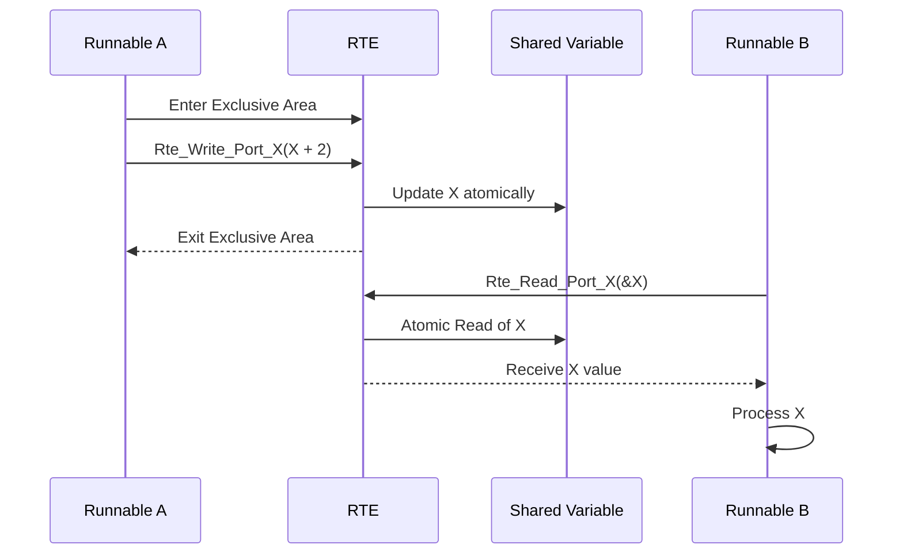

# Intra-SWC Communication

In the **AUTOSAR (AUTomotive Open System ARchitecture)** framework, **Intra-SWC (Software Component) Communication** refers to the interaction between Runnables within the same Software Component (SWC). These Runnables may execute on different tasks, potentially with varying priorities, leading to concurrency challenges. Effective intra-SWC communication ensures **data consistency** and **synchronization**, which are critical for maintaining the reliability and integrity of automotive systems.

---
    
## 1. Overview

### **Definition and Problem Context**

**Intra-SWC Communication** involves the exchange of data and coordination between multiple Runnables within a single SWC. Unlike Inter-ECU communication, which deals with data exchange between different Electronic Control Units (ECUs), Intra-SWC communication focuses on the internal interactions within a single SWC. This internal communication is essential for complex SWCs that perform multiple functions requiring coordinated operations.

**Key Problem**:
- **Data Consistency**: Ensuring that shared data remains consistent when accessed and modified by multiple Runnables executing on different tasks with varying priorities.
- **Concurrency Challenges**: Preventing issues such as race conditions, priority inversion, and deadlocks that can arise from unsynchronized access to shared resources.

### **Key Characteristics**

- **n:1 Relationship**: Multiple Runnables (clients) interact with shared data within the same SWC (server).
- **Concurrency Management**: Handles simultaneous access and modifications to shared data by Runnables with different priorities.
- **Synchronization Mechanisms**: Utilizes AUTOSAR-provided tools and APIs to manage access to shared resources safely.

---
    
## 2. Challenges in Intra-SWC Communication

Effective intra-SWC communication must address several concurrency challenges to maintain data integrity and system reliability.

### **2.1 Race Conditions**

**Definition**:
- Occur when multiple Runnables access and modify shared data concurrently without proper synchronization, leading to unpredictable and inconsistent data states.

**Impact**:
- Can cause incorrect data processing, system malfunctions, and unpredictable behavior of automotive functions.

### **2.2 Priority Inversion**

**Definition**:
- Happens when a high-priority Runnable is waiting for a resource held by a low-priority Runnable, allowing a medium-priority Runnable to preempt the low-priority one and block the high-priority Runnable indirectly.

**Impact**:
- Can lead to delays in critical operations, compromising system responsiveness and safety.

### **2.3 Deadlocks**

**Definition**:
- Occur when two or more Runnables are waiting indefinitely for resources held by each other, creating a circular dependency with no resolution.

**Impact**:
- Results in system freezes or halts, severely affecting vehicle operations and safety.

---
    
## 3. AUTOSAR Mechanisms for Data Consistency

AUTOSAR provides specific mechanisms to ensure atomicity and synchronization in Intra-SWC Communication, thereby maintaining data consistency and preventing concurrency issues.

### **3.1 Atomic Access to Variables**

**Description**:
- Ensures that shared variables are updated atomically, meaning that read-modify-write operations are executed as indivisible operations without interference from other Runnables.

**Implementation**:
- The AUTOSAR Runtime Environment (RTE) manages atomic access, preventing simultaneous modifications that could lead to inconsistent data states.

### **3.2 RTE APIs**

**Description**:
- AUTOSAR RTE generates standardized APIs for Runnables to read from and write to shared variables safely.

**Common APIs**:
- **Rte_Read**: Allows a Runnable to read the value of a shared variable.
  
  ```c
  Std_ReturnType Rte_Read_<Port>_<Data>(<DataType> *data);
  ```
  
- **Rte_Write**: Enables a Runnable to write a value to a shared variable.
  
  ```c
  Std_ReturnType Rte_Write_<Port>_<Data>(<DataType> data);
  ```

**Usage**:
- These APIs handle the necessary synchronization to ensure that access to shared variables does not result in race conditions or data inconsistencies.

### **3.3 Inter-Runnable Variables (IRVs)**

**Description**:
- IRVs are specialized variables used for data exchange between Runnables within the same SWC. They provide a structured and safe means of sharing data without direct access to global shared memory.

**Advantages**:
- **Encapsulation**: Promotes data encapsulation by restricting direct access to shared data.
- **Type Safety**: Ensures that only valid data types are exchanged between Runnables.
- **Synchronization**: Manages synchronization internally, reducing the risk of concurrency issues.

### **3.4 Exclusive Areas**

**Description**:
- Exclusive Areas are critical sections of code where access to shared resources is protected to ensure atomic operations. When a Runnable enters an Exclusive Area, it gains exclusive access to the protected resource, preventing other Runnables from accessing it simultaneously.

**Implementation**:
- **Entering Exclusive Area**:
  
  ```c
  SchM_Enter_<ModuleName>_<ExclusiveAreaName>();
  ```
  
- **Exiting Exclusive Area**:
  
  ```c
  SchM_Exit_<ModuleName>_<ExclusiveAreaName>();
  ```
  
**Usage**:
- Enclose critical code sections that access or modify shared variables within Exclusive Areas to prevent race conditions and ensure data consistency.

**Example**:

```c
void RunnableA(void) {
    SchM_Enter_ModuleA_ExclusiveArea1();
    X = X + 2;  // Atomic operation
    SchM_Exit_ModuleA_ExclusiveArea1();
}
```

---
    
## 4. Communication Workflow

Understanding the communication workflow is essential for implementing Intra-SWC Communication effectively. The workflow delineates how Runnables interact with shared data, ensuring synchronization and data consistency.

### **4.1 Read Operation**

**Process Flow**:
1. **Runnable Invocation**:
   - A Runnable (e.g., Runnable B) initiates a read operation to access shared data.
2. **RTE Read API**:
   - The Runnable calls the `Rte_Read` API to retrieve the current value of the shared variable.
3. **Atomic Retrieval**:
   - The RTE ensures that the read operation is atomic, preventing interference from other Runnables.
4. **Data Availability**:
   - The shared data is made available to the Runnable for processing.

**Code Example**:

```c
void RunnableB(void) {
    int32_t X_value;
    Std_ReturnType status = Rte_Read_Port_X(&X_value);
    
    if (status == E_OK) {
        // Process the retrieved value
        ProcessX(X_value);
    } else {
        // Handle read failure
        HandleError();
    }
}
```

### **4.2 Write Operation**

**Process Flow**:
1. **Runnable Invocation**:
   - A Runnable (e.g., Runnable A) initiates a write operation to modify shared data.
2. **Entering Exclusive Area**:
   - The Runnable enters an Exclusive Area to ensure atomic access to the shared variable.
3. **RTE Write API**:
   - The Runnable calls the `Rte_Write` API to update the value of the shared variable.
4. **Exiting Exclusive Area**:
   - The Runnable exits the Exclusive Area, allowing other Runnables to access the shared data.

**Code Example**:

```c
void RunnableA(void) {
    SchM_Enter_ModuleA_ExclusiveArea1();
    int32_t new_X = X + 2;
    Std_ReturnType status = Rte_Write_Port_X(new_X);
    SchM_Exit_ModuleA_ExclusiveArea1();
    
    if (status != E_OK) {
        // Handle write failure
        HandleError();
    }
}
```

### **4.3 Sequence Diagram**



**Explanation**:
1. **Runnable A** enters an Exclusive Area to ensure atomic access.
2. **Runnable A** writes a new value to the shared variable `X` using `Rte_Write`.
3. The RTE updates `X` atomically, preventing interference.
4. **Runnable A** exits the Exclusive Area.
5. **Runnable B** reads the value of `X` using `Rte_Read`, which is guaranteed to be consistent and free from race conditions.
6. **Runnable B** processes the retrieved value of `X`.

---
    
## 5. Best Practices for Intra-SWC Communication

Implementing effective Intra-SWC Communication requires adherence to best practices that promote data consistency, system reliability, and maintainability.

### **5.1 Design for Minimal Shared Data**

- **Strategy**:
  - Limit the number of shared variables to reduce synchronization overhead and potential concurrency issues.
  
- **Benefit**:
  - Simplifies synchronization mechanisms and minimizes the risk of race conditions.

### **5.2 Use Inter-Runnable Variables (IRVs)**

- **Strategy**:
  - Utilize IRVs for structured and localized data sharing between Runnables.
  
- **Benefit**:
  - Promotes encapsulation and type safety, reducing direct dependencies on global shared memory.

### **5.3 Define Exclusive Areas**

- **Strategy**:
  - Clearly define critical sections of code that access or modify shared data and protect them using Exclusive Areas.
  
- **Benefit**:
  - Ensures atomic execution of critical operations, preventing data inconsistencies and race conditions.

### **5.4 Prioritize Task Design**

- **Strategy**:
  - Assign appropriate priorities to tasks to prevent high-priority Runnables from being blocked by lower-priority ones.
  
- **Benefit**:
  - Mitigates priority inversion and ensures timely execution of critical operations.

### **5.5 Implement Robust Error Handling**

- **Strategy**:
  - Incorporate comprehensive error handling within Runnables to manage scenarios where read/write operations fail.
  
- **Benefit**:
  - Enhances system resilience and prevents the propagation of errors across SWCs.

### **5.6 Maintain Clear Documentation**

- **Strategy**:
  - Document shared variables, Exclusive Areas, and communication interfaces thoroughly.
  
- **Benefit**:
  - Facilitates easier maintenance, debugging, and onboarding of new developers.

---
    
## 6. Practical Example

To illustrate the importance of synchronization in Intra-SWC Communication, consider the following scenario involving two Runnables accessing a shared variable `X`.

### **6.1 Scenario Without Synchronization**

**Execution Steps**:
1. **Runnable A** (Task A with priority 100) executes and reads `X = 5`.
2. **Runnable A** calculates `X' = X + 2 = 7`.
3. **Runnable B** (Task B with priority 50) preempts Task A during its execution.
4. **Runnable B** reads `X = 5` and increments it: `X = 6`.
5. **Runnable A** resumes and writes back `X = 7`.

**Outcome**:
- **X** ends up being `7`, overwriting **Runnable B's** increment to `6`. The intended increment by **Runnable B** is lost, leading to data inconsistency.

### **6.2 Solution with Exclusive Areas**

By implementing Exclusive Areas, we ensure that access to `X` is atomic, preventing concurrent modifications.

**Runnable A Implementation**:

```c
void RunnableA(void) {
    SchM_Enter_ModuleA_ExclusiveArea1();
    X = X + 2;  // Atomic operation
    SchM_Exit_ModuleA_ExclusiveArea1();
}
```

**Runnable B Implementation**:

```c
void RunnableB(void) {
    SchM_Enter_ModuleA_ExclusiveArea1();
    X = X + 1;  // Atomic operation
    SchM_Exit_ModuleA_ExclusiveArea1();
}
```

**Execution Steps**:
1. **Runnable A** enters Exclusive Area 1 and increments `X` to `7`.
2. **Runnable B** attempts to enter Exclusive Area 1 but is blocked until **Runnable A** exits.
3. After **Runnable A** completes, **Runnable B** enters Exclusive Area 1 and increments `X` to `8`.

**Outcome**:
- **X** correctly reflects both increments, resulting in `8`, ensuring data consistency.

### **6.3 Sequence Diagram with Exclusive Areas**

```plaintext
Runnable A                      RTE                       Shared Variable
    |                              |                            |
    |--- Enter Exclusive Area 1 -->|                            |
    |                              |                            |
    |--- Read X (5) ---------------->|                            |
    |                              |                            |
    |--- Write X = 7 --------------->|                            |
    |                              |--- Update X atomically -->|
    |                              |                            |
    |<--- Exit Exclusive Area 1 ----|                            |
    |                              |                            |
Runnable B                      RTE                       Shared Variable
    |                              |                            |
    |--- Attempt to Enter Exclusive Area 1 -->|                |
    |                              |--- Wait until free ------->|
    |<--- Blocked Until Exclusive Area Free --|                |
    |                              |                            |
    |--- Enter Exclusive Area 1 ------>|                            |
    |                              |                            |
    |--- Read X (7) ------------------>|                            |
    |                              |                            |
    |--- Write X = 8 ----------------->|                            |
    |                              |--- Update X atomically -->|
    |                              |                            |
    |<--- Exit Exclusive Area 1 --------|                            |
    |                              |                            |
```

**Explanation**:
1. **Runnable A** enters Exclusive Area 1, reads `X = 5`, and writes `X = 7`.
2. **Runnable B** attempts to enter Exclusive Area 1 but is blocked until **Runnable A** exits.
3. After **Runnable A** exits, **Runnable B** enters Exclusive Area 1, reads `X = 7`, and writes `X = 8`.
4. The final value of `X` is `8`, accurately reflecting both increments.

---
    
## 7. Benefits of Intra-SWC Communication Mechanisms

Implementing effective Intra-SWC Communication mechanisms within AUTOSAR offers numerous benefits that enhance system performance, reliability, and maintainability.

1. **Data Consistency**
   - **Explanation**: Ensures that shared data remains accurate and reliable across multiple Runnables.
   - **Benefit**: Prevents data corruption and maintains the integrity of system operations.

2. **System Reliability**
   - **Explanation**: Robust synchronization mechanisms reduce the likelihood of concurrency-related issues.
   - **Benefit**: Enhances overall system stability and prevents unexpected behaviors.

3. **Concurrency Control**
   - **Explanation**: Manages simultaneous access to shared resources, preventing race conditions and ensuring orderly execution.
   - **Benefit**: Facilitates predictable and deterministic system behavior.

4. **Enhanced Performance**
   - **Explanation**: Efficient synchronization reduces the overhead associated with managing shared data.
   - **Benefit**: Optimizes system performance by minimizing delays and ensuring timely execution of critical tasks.

5. **Modularity and Maintainability**
   - **Explanation**: Structured communication mechanisms promote a clean separation of concerns within SWCs.
   - **Benefit**: Simplifies maintenance, debugging, and future enhancements.

6. **Priority Management**
   - **Explanation**: Proper synchronization respects task priorities, preventing high-priority tasks from being unduly blocked.
   - **Benefit**: Maintains responsiveness of critical system functions.

7. **Scalability**
   - **Explanation**: Facilitates the addition of new Runnables and shared data elements without compromising system integrity.
   - **Benefit**: Supports the evolution and expansion of automotive systems to accommodate new features and functionalities.

---
    
## 8. Limitations

While AUTOSAR provides robust mechanisms for managing Intra-SWC Communication, certain limitations and challenges must be acknowledged and addressed during system design and implementation.

1. **Synchronization Overhead**
   - **Explanation**: Implementing synchronization mechanisms like Exclusive Areas introduces additional processing steps.
   - **Impact**: Can lead to increased CPU usage and potential delays, especially in high-frequency data exchange scenarios.

2. **Complexity in Design**
   - **Explanation**: Managing multiple Runnables with varying priorities requires careful planning and design to prevent concurrency issues.
   - **Impact**: Increases the complexity of system architecture and demands thorough testing and validation.

3. **Resource Consumption**
   - **Explanation**: Exclusive Areas and synchronization mechanisms consume system resources, including memory and processing power.
   - **Impact**: May strain resource-constrained environments, necessitating efficient resource management strategies.

4. **Potential for Deadlocks**
   - **Explanation**: Improper implementation of synchronization can lead to deadlocks, where Runnables wait indefinitely for resources.
   - **Impact**: Results in system freezes and requires robust error-handling mechanisms to resolve.

5. **Scalability Constraints**
   - **Explanation**: As the number of Runnables and shared variables increases, managing synchronization becomes more challenging.
   - **Impact**: Can lead to increased design complexity and potential performance bottlenecks.

6. **Limited Granularity**
   - **Explanation**: Exclusive Areas protect entire code sections, which may be too broad or too narrow, affecting performance and safety.
   - **Impact**: Requires precise definition of critical sections to balance protection and efficiency.

7. **Dependence on RTE Implementation**
   - **Explanation**: The effectiveness of synchronization mechanisms relies heavily on the RTE's implementation.
   - **Impact**: Variations in RTE implementations across different platforms can affect consistency and reliability.

---
    
## 9. Implementation Guidelines

To effectively implement Intra-SWC Communication within AUTOSAR, adhere to the following guidelines and best practices that promote data consistency, system reliability, and maintainability.

### **9.1 Defining Shared Variables**

- **Strategy**:
  - Clearly identify and document all shared variables within the SWC that require synchronized access.
  
- **Considerations**:
  - Minimize the number of shared variables to reduce synchronization overhead.
  - Ensure that shared variables are appropriately typed and sized to prevent data corruption.

### **9.2 Configuring Exclusive Areas**

- **Strategy**:
  - Define Exclusive Areas around critical code sections that access or modify shared variables.
  
- **Best Practices**:
  - Keep critical sections as short as possible to minimize blocking time.
  - Avoid nested Exclusive Areas to prevent deadlocks.
  - Use meaningful names for Exclusive Areas to reflect their purpose.

### **9.3 Utilizing RTE APIs Correctly**

- **Strategy**:
  - Consistently use `Rte_Read` and `Rte_Write` APIs for accessing shared variables to ensure synchronization.
  
- **Best Practices**:
  - Check the return status of RTE APIs to handle read/write failures gracefully.
  - Avoid direct manipulation of shared variables outside of RTE APIs to maintain data integrity.

### **9.4 Leveraging Inter-Runnable Variables (IRVs)**

- **Strategy**:
  - Use IRVs for structured data exchange between Runnables, reducing reliance on global shared variables.
  
- **Best Practices**:
  - Define IRVs in the SWC's software component description (SWC-SD) to ensure proper configuration.
  - Encapsulate IRV access within well-defined interfaces to promote modularity.

### **9.5 Implementing Robust Error Handling**

- **Strategy**:
  - Incorporate error-handling mechanisms to manage scenarios where RTE APIs fail or synchronization issues arise.
  
- **Best Practices**:
  - Use fallback values or default behaviors when read/write operations fail.
  - Log errors for diagnostic purposes and facilitate debugging.

### **9.6 Prioritizing Task Design**

- **Strategy**:
  - Assign appropriate priorities to tasks to ensure that high-priority Runnables are not unduly blocked by lower-priority ones.
  
- **Best Practices**:
  - Avoid assigning lower priorities to Runnables that hold critical Exclusive Areas required by higher-priority Runnables.
  - Use priority inheritance protocols if supported by the AUTOSAR OS to mitigate priority inversion.

### **9.7 Testing and Validation**

- **Strategy**:
  - Perform comprehensive testing to validate the correctness and reliability of Intra-SWC Communication mechanisms.
  
- **Best Practices**:
  - **Unit Testing**: Test individual Runnables and their interactions with shared variables.
  - **Integration Testing**: Verify the seamless interaction between multiple Runnables within the SWC.
  - **Stress Testing**: Simulate high-load scenarios to assess the system's behavior under peak conditions.
  - **Fault Injection**: Introduce faults to test the robustness of error-handling mechanisms.

### **9.8 Documentation and Maintenance**

- **Strategy**:
  - Maintain thorough documentation of shared variables, Exclusive Areas, and communication interfaces.
  
- **Best Practices**:
  - Update documentation regularly to reflect changes in SWC design and communication patterns.
  - Use version control to manage changes and facilitate collaboration among development teams.

---
    
## 10. Best Practices

Adhering to best practices ensures that Intra-SWC Communication is implemented effectively, promoting data consistency, system reliability, and maintainability.

1. **Design for Minimal Shared Data**
   - **Practice**: Limit the number of shared variables to reduce synchronization complexity and overhead.
   - **Benefit**: Simplifies synchronization mechanisms and minimizes the risk of concurrency issues.

2. **Use Inter-Runnable Variables (IRVs)**
   - **Practice**: Employ IRVs for structured and localized data sharing between Runnables.
   - **Benefit**: Enhances data encapsulation, type safety, and reduces direct dependencies on global shared memory.

3. **Define Exclusive Areas Appropriately**
   - **Practice**: Enclose only critical sections that require synchronized access within Exclusive Areas.
   - **Benefit**: Prevents unnecessary blocking of Runnables, optimizing system performance.

4. **Prioritize Task Design Effectively**
   - **Practice**: Assign higher priorities to Runnables that perform critical operations and ensure they are not blocked by lower-priority tasks.
   - **Benefit**: Maintains system responsiveness and prevents priority inversion.

5. **Implement Robust Error Handling**
   - **Practice**: Check the return status of RTE APIs and implement fallback mechanisms to handle read/write failures.
   - **Benefit**: Enhances system resilience and prevents the propagation of errors.

6. **Maintain Clear Documentation**
   - **Practice**: Document shared variables, Exclusive Areas, and communication interfaces thoroughly.
   - **Benefit**: Facilitates easier maintenance, debugging, and onboarding of new developers.

7. **Optimize Exclusive Area Usage**
   - **Practice**: Keep Exclusive Areas as short and efficient as possible to minimize blocking time.
   - **Benefit**: Reduces the impact on system performance and prevents potential deadlocks.

8. **Conduct Comprehensive Testing**
   - **Practice**: Perform unit, integration, stress, and fault injection testing to validate Intra-SWC Communication mechanisms.
   - **Benefit**: Identifies and resolves issues early in the development cycle, ensuring reliable system behavior.

9. **Leverage AUTOSAR Tools and Specifications**
   - **Practice**: Utilize AUTOSAR-compliant tools for configuring and generating RTE APIs, Exclusive Areas, and IRVs.
   - **Benefit**: Ensures adherence to AUTOSAR standards and promotes consistency across SWCs.

10. **Implement Priority Inheritance Protocols**
    - **Practice**: Use priority inheritance mechanisms provided by the AUTOSAR OS to mitigate priority inversion.
    - **Benefit**: Enhances system responsiveness and ensures that high-priority Runnables are not unduly blocked.

---
    
## 11. Practical Example

To demonstrate the importance of synchronization in Intra-SWC Communication, consider the following scenario involving two Runnables accessing a shared variable `X`.

### **11.1 Scenario Without Synchronization**

**Execution Steps**:
1. **Runnable A** (Task A with priority 100) executes and reads `X = 5`.
2. **Runnable A** calculates `X' = X + 2 = 7`.
3. **Runnable B** (Task B with priority 50) preempts Task A during its execution.
4. **Runnable B** reads `X = 5` and increments it: `X = 6`.
5. **Runnable A** resumes and writes back `X = 7`.

**Outcome**:
- **X** ends up being `7`, overwriting **Runnable B's** increment to `6`. The intended increment by **Runnable B** is lost, leading to data inconsistency.

### **11.2 Solution with Exclusive Areas**

By implementing Exclusive Areas, we ensure that access to `X` is atomic, preventing concurrent modifications.

**Runnable A Implementation**:

```c
void RunnableA(void) {
    SchM_Enter_ModuleA_ExclusiveArea1();
    X = X + 2;  // Atomic operation
    SchM_Exit_ModuleA_ExclusiveArea1();
}
```

**Runnable B Implementation**:

```c
void RunnableB(void) {
    SchM_Enter_ModuleA_ExclusiveArea1();
    X = X + 1;  // Atomic operation
    SchM_Exit_ModuleA_ExclusiveArea1();
}
```

**Execution Steps**:
1. **Runnable A** enters Exclusive Area 1 and increments `X` to `7`.
2. **Runnable B** attempts to enter Exclusive Area 1 but is blocked until **Runnable A** exits.
3. After **Runnable A** completes, **Runnable B** enters Exclusive Area 1 and increments `X` to `8`.

**Outcome**:
- **X** correctly reflects both increments, resulting in `8`, ensuring data consistency.

### **11.3 Code Examples**

**Runnable A (Task A - High Priority)**:

```c
void RunnableA(void) {
    SchM_Enter_ModuleA_ExclusiveArea1();
    X = X + 2;  // Atomic operation
    SchM_Exit_ModuleA_ExclusiveArea1();
}
```

**Runnable B (Task B - Lower Priority)**:

```c
void RunnableB(void) {
    SchM_Enter_ModuleA_ExclusiveArea1();
    X = X + 1;  // Atomic operation
    SchM_Exit_ModuleA_ExclusiveArea1();
}
```

**Runnable A Execution**:
1. Enters Exclusive Area 1.
2. Reads `X = 5`.
3. Calculates `X = 5 + 2 = 7`.
4. Writes `X = 7`.
5. Exits Exclusive Area 1.

**Runnable B Execution**:
1. Attempts to enter Exclusive Area 1 but is blocked until Runnable A exits.
2. Enters Exclusive Area 1.
3. Reads `X = 7`.
4. Calculates `X = 7 + 1 = 8`.
5. Writes `X = 8`.
6. Exits Exclusive Area 1.

### **11.4 Sequence Diagram with Exclusive Areas**

```plaintext
Runnable A                      RTE                       Shared Variable
    |                              |                            |
    |--- Enter Exclusive Area 1 -->|                            |
    |                              |                            |
    |--- Read X (5) ---------------->|                            |
    |                              |                            |
    |--- Write X = 7 --------------->|                            |
    |                              |--- Update X atomically -->|
    |                              |                            |
    |<--- Exit Exclusive Area 1 ----|                            |
    |                              |                            |
Runnable B                      RTE                       Shared Variable
    |                              |                            |
    |--- Attempt to Enter Exclusive Area 1 -->|                |
    |                              |--- Wait until free ------->|
    |<--- Blocked Until Exclusive Area Free --|                |
    |                              |                            |
    |--- Enter Exclusive Area 1 ------>|                            |
    |                              |                            |
    |--- Read X (7) ------------------>|                            |
    |                              |                            |
    |--- Write X = 8 ----------------->|                            |
    |                              |--- Update X atomically -->|
    |                              |                            |
    |<--- Exit Exclusive Area 1 --------|                            |
    |                              |                            |
```

**Explanation**:
1. **Runnable A** enters Exclusive Area 1, reads `X = 5`, and writes `X = 7`.
2. **Runnable B** attempts to enter Exclusive Area 1 but is blocked until **Runnable A** exits.
3. **Runnable B** enters Exclusive Area 1, reads `X = 7`, and writes `X = 8`.
4. The final value of `X` is `8`, accurately reflecting both increments.

---
    
## 12. Comparison

Understanding the differences between synchronized and unsynchronized Intra-SWC Communication is essential for selecting the appropriate approach based on application requirements.

| **Aspect**               | **Synchronized Communication**         | **Unsynchronized Communication**              |
|--------------------------|----------------------------------------|-----------------------------------------------|
| **Data Consistency**     | Ensures consistent and reliable data.  | Risk of data inconsistencies and race conditions. |
| **Concurrency Control**  | Manages concurrent access using Exclusive Areas and IRVs. | No control over concurrent access, leading to potential conflicts. |
| **System Reliability**   | Higher reliability due to managed synchronization. | Lower reliability due to unmanaged access.    |
| **Complexity**           | Increased complexity due to synchronization mechanisms. | Simpler implementation without synchronization. |
| **Performance**          | May introduce slight overhead due to synchronization. | Potentially higher performance but with data integrity risks. |
| **Use Cases**            | Critical operations requiring data consistency. | Non-critical operations where data inconsistencies are acceptable. |

---
    
## 13. Conclusion

**Intra-SWC Communication** is a fundamental aspect of the AUTOSAR framework, enabling efficient and reliable interactions between Runnables within the same Software Component. By addressing concurrency challenges through mechanisms like Exclusive Areas, Inter-Runnable Variables (IRVs), and atomic access to shared variables, AUTOSAR ensures **data consistency** and **system reliability**. Implementing best practices, such as minimizing shared data, defining clear synchronization protocols, and robust error handling, further enhances the effectiveness of Intra-SWC Communication.

Understanding the intricacies of Intra-SWC Communication allows developers to design robust automotive systems that can handle complex internal interactions without compromising data integrity or system performance. As automotive applications continue to grow in complexity, leveraging AUTOSAR's Intra-SWC Communication mechanisms becomes increasingly vital for maintaining the high standards of safety, reliability, and efficiency demanded by modern vehicles.

Whether you are a novice seeking foundational knowledge or an experienced practitioner aiming to refine your expertise, mastering Intra-SWC Communication within AUTOSAR is essential for developing sophisticated and dependable automotive software systems.

---
    
# Conclusion

This chapter has provided an in-depth exploration of **Intra-SWC Communication** within the AUTOSAR framework. By elucidating key concepts such as **data consistency**, **synchronization mechanisms**, and **concurrency control**, detailing the communication workflow, presenting practical examples, and discussing best practices, this guide equips developers with the knowledge necessary to implement effective Intra-SWC Communication in their automotive systems.