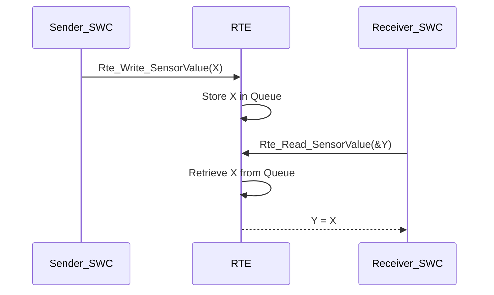
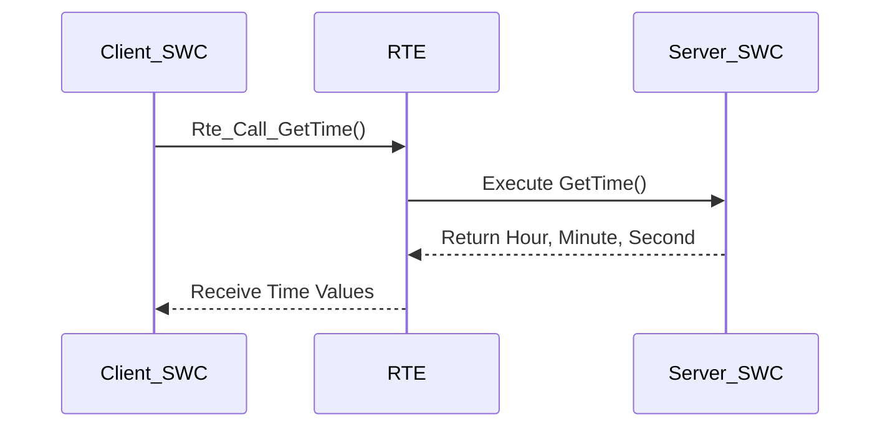

# Standardized AUTOSAR Interface

In the **AUTOSAR (AUTomotive Open System ARchitecture)** framework, the **Standardized AUTOSAR Interface** serves as a pivotal component that bridges various layers of AUTOSAR-compliant software. By providing consistent and modular communication protocols, it abstracts interactions between Software Components (SWCs), the Runtime Environment (RTE), and the Basic Software (BSW). This standardization ensures interoperability, scalability, and maintainability across diverse automotive systems and Electronic Control Units (ECUs).

---
    
## 1. Overview

### **Definition and Problem Context**

The **Standardized AUTOSAR Interface** is designed to facilitate seamless communication across different software layers within the AUTOSAR architecture. It ensures that SWCs can interact with each other and with the underlying hardware without being tightly coupled to specific hardware configurations or proprietary communication protocols. This abstraction is crucial for achieving:

- **Interoperability:** Allowing SWCs from different vendors to communicate effectively.
- **Modularity:** Enabling the separation of concerns, where each component focuses on specific functionalities.
- **Scalability:** Supporting the addition of new functionalities and components without major architectural overhauls.
- **Maintainability:** Simplifying debugging, updates, and maintenance by providing clear communication protocols.

### **Key Features**

1. **Standardization Across ECUs**
   - **Universal Compatibility:** The standardized interface is designed to operate across various ECUs, ensuring that software remains consistent and functional regardless of the underlying hardware.
   - **ECU Abstraction Layers:** These layers allow the same software to run on different hardware configurations by abstracting hardware-specific details.

2. **Service Ports**
   - **Facilitated Communication:** Service Ports act as communication gateways between the RTE and BSW, abstracting lower-level implementations.
   - **Exposed Functionality:** Only the necessary functionalities are exposed to the application layer, ensuring encapsulation and security.

3. **API Functions**
   - **Clear Interaction Protocols:** Defined APIs enable structured and predictable interactions between SWCs, RTE, and BSW.
   - **Examples:**
     - `Rte_Call_<PortPrototype>_<Operation>()`: Allows SWCs to invoke service operations.
     - `SetEventStatus(In Dem_EventStatusType status)`: Manages diagnostic events.

### **Architecture Integration**

The **Standardized AUTOSAR Interface** is integral to the layered AUTOSAR architecture, ensuring that each layer communicates effectively with adjacent layers:

1. **Application Layer**
   - **Application Software Components (SWCs):** These include functional units such as actuators, sensors, and algorithms.
   - **Interaction:** SWCs interact with the RTE for data exchange or control operations, leveraging standardized interfaces to remain abstracted from hardware specifics.

2. **Runtime Environment (RTE)**
   - **Middleware Role:** Acts as the intermediary between the Application Layer and Basic Software.
   - **Functionality:**
     - **Service Communication:** Manages Sender-Receiver and Client-Server communication paradigms.
     - **Standardized APIs:** Provides consistent interfaces for SWCs to interact with BSW modules.

3. **Basic Software (BSW)**
   - **Hardware Abstraction:** Divided into modules such as Services Layer, Communication Layer, ECU Abstraction Layer, and Complex Device Drivers (CDD).
   - **Functionality:** Abstracts hardware details and provides system-wide services through standardized APIs.

4. **Microcontroller Abstraction Layer (MCAL)**
   - **Hardware Abstraction Interface:** Offers standardized access to microcontroller peripherals, ensuring that higher layers remain unaffected by hardware variations.

5. **Hardware (ECU)**
   - **Physical Components:** Comprises the microcontroller and peripherals that interface with sensors, actuators, and network communication modules.

---
    
## 2. Standardized AUTOSAR Interfaces

### **Purpose**

The **Standardized AUTOSAR Interfaces** are designed to ensure uniform communication and integration between different software layers and components within the AUTOSAR ecosystem. By defining standardized communication protocols and data formats, these interfaces eliminate the complexities associated with hardware-specific interactions and proprietary communication mechanisms.

### **Types of Interfaces**

1. **Standardized AUTOSAR Interface**
   - **Scope:** Facilitates communication between the RTE and Basic Software Modules.
   - **Functionality:** Ensures that Application Layer SWCs can interact with BSW modules without needing to understand the underlying hardware specifics.

2. **Standardized Interface**
   - **Scope:** Governs communication between Basic Software and ECU hardware.
   - **Functionality:** Provides a uniform method for BSW modules to access and control microcontroller peripherals and other hardware components.

### **Key Components**

- **Ports:** Defined communication endpoints through which SWCs interact with the RTE and other components.
- **Runnables:** Executable functions within SWCs that perform specific tasks and interact through defined interfaces.
- **Services:** System-wide functionalities provided by the BSW, accessible via standardized interfaces.

---
    
## 3. Architecture and Functionality

### **Layered Integration**

The **Standardized AUTOSAR Interfaces** operate within a layered architecture, ensuring that each layer communicates through well-defined protocols:

1. **Application Layer to RTE**
   - **Interaction:** SWCs use AUTOSAR Interfaces to communicate with the RTE.
   - **Communication Paradigms:** Utilizes Sender-Receiver for data exchange and Client-Server for operation invocation.

2. **RTE to Basic Software**
   - **Interaction:** RTE manages communication between SWCs and BSW modules via standardized interfaces.
   - **Abstraction:** Shields the Application Layer from the complexities of BSW and hardware interactions.

3. **Basic Software to Hardware**
   - **Interaction:** BSW modules interact with ECU hardware through the MCAL.
   - **Standardization:** Ensures uniform access to microcontroller peripherals, promoting portability across different hardware platforms.

### **Functionality of AUTOSAR Interfaces**

- **Data Exchange:** Facilitates the transfer of data between SWCs and between SWCs and BSW modules.
- **Operation Invocation:** Enables SWCs to invoke operations provided by other SWCs or BSW services.
- **Service Access:** Allows SWCs to access system-wide services like diagnostics, memory management, and communication protocols.
- **Hardware Abstraction:** Provides a layer of abstraction, allowing Application Layer SWCs to remain agnostic of hardware specifics.

---
    
## 4. API Examples

### **Sender/Receiver Communication**

Facilitates data exchange between SWCs where one SWC (Sender) provides data to another SWC (Receiver) without expecting an immediate response.

- **RTE APIs:**
  - **Rte_Write:** Used by the Sender SWC to send data.
    ```c
    Std_ReturnType Rte_Write_<Port>_<Data>(<DataType> data);
    ```
  - **Rte_Read:** Used by the Receiver SWC to read data.
    ```c
    Std_ReturnType Rte_Read_<Port>_<Data>(<DataType> *data);
    ```

- **Example:**
  ```c
  // Sender SWC: Writing sensor data
  void SendSensorData(int32_t sensorValue) {
      Std_ReturnType status = Rte_Write_SensorData_SensorValue(sensorValue);
      if (status != E_OK) {
          // Handle write failure
          LogError("Failed to send sensor data.");
      }
  }

  // Receiver SWC: Reading sensor data
  void ReceiveSensorData(void) {
      int32_t receivedValue;
      Std_ReturnType status = Rte_Read_SensorData_SensorValue(&receivedValue);
      if (status == E_OK) {
          // Process receivedValue
          ProcessSensorData(receivedValue);
      } else {
          // Handle read failure
          HandleReadError();
      }
  }
  ```

### **Client/Server Communication**

Enables one SWC (Client) to request services or operations from another SWC (Server), allowing for more complex interactions such as operation invocation and result retrieval.

#### **Synchronous Communication**

- **Description:**
  - The client SWC is blocked until the server SWC completes the requested operation.
  - Immediate response is returned via `OUT` parameters.

- **RTE API:**
  ```c
  Std_ReturnType Rte_Call_<PortPrototype>_<Operation>(
      IN <ParamType1> param1,
      IN/OUT <ParamType2> param2,
      OUT <ParamType3> param3
  );
  ```

- **Example:**
  ```c
  // Server Runnable Implementation
  Std_ReturnType GetTime(uint32 *hour, uint32 *minute, uint32 *second) {
      if (hour == NULL || minute == NULL || second == NULL) {
          return E_NOT_OK;
      }
      *hour = SystemClock_GetHour();
      *minute = SystemClock_GetMinute();
      *second = SystemClock_GetSecond();
      return E_OK;
  }

  // Client SWC Invocation
  void RequestCurrentTime(void) {
      uint32 hour, minute, second;
      Std_ReturnType status = Rte_Call_TimeService_GetTime(&hour, &minute, &second);
      
      if (status == E_OK) {
          DisplayTime(hour, minute, second);
      } else {
          DisplayTime(0, 0, 0); // Default or error state
      }
  }
  ```

#### **Asynchronous Communication**

- **Description:**
  - The client SWC continues execution without waiting for the server to complete the operation.
  - Results are provided later, either through polling or callback mechanisms.

- **RTE APIs:**
  - **Rte_Call:** Initiates the asynchronous operation.
    ```c
    Std_ReturnType Rte_Call_<Port>_<Operation>(
        IN <ParamType1> param1,
        IN/OUT <ParamType2> param2
    );
    ```
  - **Rte_Result:** Retrieves the result of the asynchronous operation.
    ```c
    Std_ReturnType Rte_Result_<Port>_<Operation>(
        OUT <ResultType> result
    );
    ```

- **Example:**
  ```c
  // Server Runnable Implementation
  Std_ReturnType ProcessData(int32 inputData, int32 *outputData) {
      if (outputData == NULL) {
          return E_NOT_OK;
      }
      *outputData = inputData * 2; // Example processing
      return E_OK;
  }

  // Client SWC Invocation
  void RequestDataProcessing(int32 data) {
      Std_ReturnType status = Rte_Call_DataService_ProcessData(data, NULL);
      
      if (status == E_OK) {
          // Continue with other tasks
      } else {
          // Handle the error (e.g., log error, set default behavior)
      }
  }

  void RetrieveProcessedData(void) {
      int32 processedData;
      Std_ReturnType status = Rte_Result_DataService_ProcessData(&processedData);
      
      if (status == E_OK) {
          UtilizeProcessedData(processedData);
      } else {
          UtilizeProcessedData(0); // Default or error state
      }
  }
  ```

---
    
## 5. Functional Flow

Understanding the **functional flow** of the Standardized AUTOSAR Interface is essential for effective implementation. This flow delineates how data and operation calls traverse through different layers and components, ensuring seamless communication.

### **5.1 Sender/Receiver Communication Flow**

1. **Sender SWC Execution:**
   - The Sender SWC generates or updates data.
   - Invokes `Rte_Write` to send data to the Receiver SWC.

2. **RTE Processing:**
   - RTE manages the data transfer, ensuring data consistency and synchronization.
   - For queued communication, data is stored in a receive queue.

3. **Receiver SWC Execution:**
   - The Receiver SWC invokes `Rte_Read` to access the latest data.
   - Processes the received data as needed.

**Sequence Diagram:**



### **5.2 Client/Server Communication Flow**

#### **Synchronous Communication Flow**

1. **Client SWC Invocation:**
   - Client SWC calls `Rte_Call` to invoke a server operation.

2. **RTE Forwarding:**
   - RTE forwards the call to the appropriate Server SWC Runnable.

3. **Server Runnable Execution:**
   - Server SWC performs the requested operation.
   - Returns results via `OUT` parameters.

4. **RTE Response:**
   - RTE relays the response back to the Client SWC.

**Sequence Diagram:**



#### **Asynchronous Communication Flow**

1. **Client SWC Invocation:**
   - Client SWC calls `Rte_Call` to request a server operation.

2. **RTE Forwarding:**
   - RTE forwards the call to the Server SWC Runnable.

3. **Server Runnable Execution:**
   - Server SWC performs the requested operation.
   - Stores results for later retrieval.

4. **Client SWC Continues Execution:**
   - Client SWC performs other tasks without waiting.

5. **Client SWC Retrieves Results:**
   - Client SWC calls `Rte_Result` to fetch the operation results.

**Sequence Diagram:**

```plaintext
Client SWC                      RTE                       Server SWC
    |                              |                            |
    |--- Rte_Call_ProcessData() -->|                            |
    |                              |--- Execute ProcessData() --->|
    |                              |<--- Return E_OK ------------|
    |                              |                            |
    |--- Continue Execution ------>|                            |
    |                              |                            |
    |                              |                            |
    |--- Rte_Result_ProcessData() -->|                          |
    |                              |--- Retrieve Result -------->|
    |<--- Receive Processed Data ----|                            |
    |                              |                            |
```

---
    
## 6. Advantages of AUTOSAR Interfaces

Implementing standardized AUTOSAR Interfaces offers numerous benefits that enhance the development and operation of automotive software systems.

1. **Interoperability**
   - **Explanation:** Standardized interfaces allow SWCs from different vendors to communicate seamlessly.
   - **Benefit:** Facilitates integration of diverse software modules, reducing compatibility issues.

2. **Scalability**
   - **Explanation:** Supports the addition of new functionalities and components without major architectural changes.
   - **Benefit:** Enables systems to evolve and expand, accommodating new technologies and requirements.

3. **Reusability**
   - **Explanation:** Promotes the reuse of SWCs and modules across different projects through standardized APIs.
   - **Benefit:** Reduces development time and costs by leveraging existing components.

4. **Hardware Abstraction**
   - **Explanation:** Abstracts hardware-specific details, allowing SWCs to operate independently of underlying hardware.
   - **Benefit:** Enhances portability and flexibility, enabling deployment across various hardware platforms.

5. **Modularity**
   - **Explanation:** Clearly defined interfaces separate functionalities into distinct modules.
   - **Benefit:** Simplifies debugging, maintenance, and updates by isolating changes to specific components.

6. **Maintainability**
   - **Explanation:** Standardized communication protocols and interfaces make the system easier to maintain.
   - **Benefit:** Facilitates efficient troubleshooting and reduces the risk of introducing new bugs during updates.

7. **Consistency**
   - **Explanation:** Ensures uniform communication patterns and data formats across the entire system.
   - **Benefit:** Enhances system reliability and predictability, crucial for safety-critical automotive applications.

8. **Enhanced System Integrity**
   - **Explanation:** Standardized interfaces enforce consistent data handling and operation invocation.
   - **Benefit:** Prevents data corruption and ensures that SWCs interact correctly, maintaining overall system integrity.

---
    
## 7. Limitations

While the **Standardized AUTOSAR Interface** offers significant advantages, it also presents certain limitations and challenges that developers must consider during system design and implementation.

1. **Increased Complexity**
   - **Explanation:** Managing standardized interfaces and adhering to AUTOSAR specifications can introduce additional complexity.
   - **Impact:** Requires thorough understanding and careful planning to implement correctly.

2. **Resource Overhead**
   - **Explanation:** Standardization and abstraction layers can consume additional memory and processing resources.
   - **Impact:** May impact performance, especially in resource-constrained environments.

3. **Dependency on RTE**
   - **Explanation:** The RTE is central to AUTOSAR Interfaces, acting as an intermediary between SWCs and BSW.
   - **Impact:** Any issues within the RTE can disrupt communication across multiple components, necessitating robust RTE implementations.

4. **Learning Curve**
   - **Explanation:** Developers must become familiar with AUTOSAR standards, tools, and interface definitions.
   - **Impact:** Can slow down initial development efforts as teams adapt to the framework.

5. **Limited Flexibility for Custom Requirements**
   - **Explanation:** Strict adherence to AUTOSAR standards may limit customization for specific application needs.
   - **Impact:** May require workarounds or extensions to meet unique requirements, potentially increasing development time.

6. **Version Compatibility**
   - **Explanation:** Different AUTOSAR versions may introduce changes in interface definitions and functionalities.
   - **Impact:** Ensuring compatibility across different versions can be challenging, especially in long-term projects.

7. **Overhead in Communication Management**
   - **Explanation:** Managing communication through the RTE adds an additional layer that can introduce latency.
   - **Impact:** May not be suitable for ultra-low-latency applications where direct communication is preferred.

8. **Vendor-Specific Implementations**
   - **Explanation:** Some vendors may provide proprietary extensions or optimizations to standard AUTOSAR Interfaces.
   - **Impact:** Can lead to inconsistencies and reduced interoperability if not managed carefully.

---
    
## 8. Practical Use-Cases

The **Standardized AUTOSAR Interface** is versatile and caters to a wide array of application scenarios within automotive systems. Below are some prominent use-cases that demonstrate the efficacy of this communication paradigm.

### 8.1 Time Query

- **Scenario:**
  - A client SWC needs to obtain the current system time from a server SWC responsible for maintaining the real-time clock.

- **Communication Mode:**
  - **Synchronous:** When the client requires the time immediately to proceed with critical operations.
  - **Asynchronous:** When the client can continue executing other tasks and retrieve the time later.

- **Example:**
  ```c
  // Server Runnable Implementation
  Std_ReturnType GetTime(uint32 *hour, uint32 *minute, uint32 *second) {
      if (hour == NULL || minute == NULL || second == NULL) {
          return E_NOT_OK;
      }
      *hour = SystemClock_GetHour();
      *minute = SystemClock_GetMinute();
      *second = SystemClock_GetSecond();
      return E_OK;
  }

  // Client SWC: Synchronous time request
  void DisplayCurrentTime(void) {
      uint32 hour, minute, second;
      Std_ReturnType status = Rte_Call_TimeService_GetTime(&hour, &minute, &second);
      
      if (status == E_OK) {
          DisplayTime(hour, minute, second);
      } else {
          DisplayTime(0, 0, 0); // Default or error state
      }
  }

  // Client SWC: Asynchronous time request
  void RequestCurrentTimeAsync(void) {
      Std_ReturnType status = Rte_Call_TimeService_GetTime(NULL, NULL, NULL);
      if (status == E_OK) {
          // Continue with other tasks
      } else {
          // Handle error
      }
  }

  void RetrieveTimeAsync(void) {
      uint32 hour, minute, second;
      Std_ReturnType status = Rte_Result_TimeService_GetTime(&hour, &minute, &second);
      if (status == E_OK) {
          DisplayTime(hour, minute, second);
      } else {
          DisplayTime(0, 0, 0); // Default or error state
      }
  }
  ```

### 8.2 Sensor-Actuator Coordination

- **Scenario:**
  - An actuator SWC needs to perform actions based on processed data provided by a sensor SWC.

- **Communication Mode:**
  - **Asynchronous:** Ensures that the actuator can continue its operations without being blocked by data processing tasks.

- **Example:**
  ```c
  // Server Runnable Implementation
  Std_ReturnType ProcessSensorData(int32 inputData, int32 *outputData) {
      if (outputData == NULL) {
          return E_NOT_OK;
      }
      *outputData = inputData * 2; // Example processing
      return E_OK;
  }

  // Client SWC: Actuator requesting processed sensor data asynchronously
  void ActivateActuator(int32 rawData) {
      Std_ReturnType status = Rte_Call_SensorService_ProcessSensorData(rawData, NULL);
      
      if (status == E_OK) {
          // Continue with other tasks while processing
      } else {
          // Handle error (e.g., log error, set default behavior)
      }
  }

  void RetrieveActuatorData(void) {
      int32 processedData;
      Std_ReturnType status = Rte_Result_SensorService_ProcessSensorData(&processedData);
      
      if (status == E_OK) {
          ControlActuator(processedData);
      } else {
          ControlActuator(DEFAULT_VALUE);
      }
  }
  ```

### 8.3 Diagnostic Services

- **Scenario:**
  - A diagnostic SWC needs to retrieve system status or fault codes from a server SWC responsible for monitoring vehicle health.

- **Communication Mode:**
  - **Synchronous:** Ensures that diagnostic information is retrieved promptly for immediate analysis or reporting.

- **Example:**
  ```c
  // Server Runnable Implementation
  Std_ReturnType GetFaultCodes(FaultCodeType *faultCodes) {
      if (faultCodes == NULL) {
          return E_NOT_OK;
      }
      // Retrieve fault codes from the system
      SystemDiagnostics_GetFaultCodes(faultCodes);
      return E_OK;
  }

  // Client SWC: Diagnostic SWC requesting fault codes synchronously
  void RetrieveFaultCodes(void) {
      FaultCodeType faultCodes[MAX_FAULTS];
      Std_ReturnType status = Rte_Call_DiagnosticService_GetFaultCodes(faultCodes);
      
      if (status == E_OK) {
          ProcessFaultCodes(faultCodes);
      } else {
          // Handle error (e.g., log, notify)
      }
  }
  ```

### 8.4 Configuration Management

- **Scenario:**
  - A configuration SWC needs to retrieve or update system parameters managed by a configuration server SWC.

- **Communication Mode:**
  - **Both Synchronous and Asynchronous:** Depending on whether immediate confirmation is required.

- **Example:**
  ```c
  // Server Runnable Implementation
  Std_ReturnType UpdateParameters(ParameterType newParams, ConfirmationType *confirmation) {
      if (confirmation == NULL) {
          return E_NOT_OK;
      }
      // Update system parameters
      SystemConfig_Update(newParams);
      confirmation->success = TRUE;
      return E_OK;
  }

  // Client SWC: Configuration SWC updating system parameters asynchronously
  void UpdateSystemParameters(ParameterType newParams) {
      Std_ReturnType status = Rte_Call_ConfigService_UpdateParameters(newParams, NULL);
      
      if (status == E_OK) {
          // Continue with other tasks
      } else {
          // Handle error (e.g., retry, log)
      }
      
      // Optionally, retrieve confirmation
      ConfirmationType confirmation;
      status = Rte_Result_ConfigService_UpdateParameters(&confirmation);
      
      if (status == E_OK && confirmation.success) {
          // Acknowledge successful update
      } else {
          // Handle failed update
      }
  }
  ```

### 8.5 User Interface Interaction

- **Scenario:**
  - A user interface SWC (e.g., infotainment system) requests the current status or configuration from a server SWC (e.g., climate control system).

- **Communication Mode:**
  - **Synchronous:** When the interface needs to display current status immediately upon user request.

- **Example:**
  ```c
  // Server Runnable Implementation
  Std_ReturnType GetClimateStatus(ClimateStatusType *status) {
      if (status == NULL) {
          return E_NOT_OK;
      }
      *status = ClimateControl_GetStatus();
      return E_OK;
  }

  // Client SWC: Infotainment SWC requesting climate control status synchronously
  void ShowClimateControlStatus(void) {
      ClimateStatusType status;
      Std_ReturnType result = Rte_Call_ClimateService_GetClimateStatus(&status);
      
      if (result == E_OK) {
          DisplayClimateStatus(status);
      } else {
          DisplayClimateStatus(DEFAULT_STATUS);
      }
  }
  ```

---
    
## 9. Implementation Guidelines

Implementing the **Standardized AUTOSAR Interface** effectively requires a structured approach, ensuring that both client and server SWCs are correctly configured and that the RTE facilitates seamless interactions. Below are key guidelines and best practices to consider during implementation.

### 9.1 Defining Operation Interfaces

- **Service Interfaces:**
  - Clearly define the operations provided by server SWCs, including input and output parameters.
  - Utilize AUTOSAR's tooling to create operation descriptors that outline the communication interfaces between clients and servers.

- **Operation Descriptors:**
  - Define operation interfaces in the SWC's Software Component Description (SWC-SD) using AUTOSAR's XML-based description language.
  - Specify details such as operation names, parameter types, and communication semantics.

### 9.2 Configuring RTE Ports

- **Ports and Interfaces:**
  - Configure RTE ports for both client and server SWCs, specifying whether they are client or server ports.
  - Use required ports for client SWCs and provided ports for server SWCs.

- **Port Types:**
  - **Required Ports:** Define the services or data a SWC needs from others.
  - **Provided Ports:** Define the services or data a SWC offers to others.

### 9.3 Handling Synchronous Operations

- **Blocking Calls:**
  - Design client SWCs to handle blocking behavior appropriately, ensuring that critical operations are not hindered by unnecessary delays.
  - Implement timeouts or watchdog mechanisms if supported by the RTE to prevent indefinite blocking.

- **Error Handling:**
  - Implement robust error handling within client SWCs to manage scenarios where server operations fail or return error codes.
  - Use default values or fallback mechanisms to maintain system stability.

### 9.4 Handling Asynchronous Operations

- **Result Retrieval Strategies:**
  - Decide between polling and callback-based mechanisms for retrieving asynchronous results based on application requirements.
  - **Polling:** Periodically check for results using `Rte_Result` APIs.
  - **Callbacks:** Configure RTE to activate specific Runnables when results are available.

- **Timeout Management:**
  - Configure appropriate timeout values to prevent clients from waiting indefinitely for server responses.
  - Implement timeout handlers to manage scenarios where the server takes too long to respond or becomes unresponsive.

- **Concurrency Considerations:**
  - Ensure that asynchronous operations are thread-safe and do not lead to race conditions or data inconsistencies.
  - Use synchronization mechanisms provided by AUTOSAR, such as Exclusive Areas, to protect shared resources.

### 9.5 Optimizing Server Runnable Execution

- **Task Contexts:**
  - Define appropriate task contexts for server Runnables to optimize execution timing and resource allocation.
  - Assign higher priorities to critical server operations to ensure timely responses.

- **Resource Management:**
  - Allocate sufficient resources (e.g., memory, processing power) to server SWCs to handle incoming operation requests efficiently.
  - Monitor resource usage and optimize server Runnables to minimize overhead.

### 9.6 Security and Integrity

- **Data Validation:**
  - Validate input parameters on the server side to prevent processing of malformed or malicious data.
  - Implement sanity checks and range validations to ensure data integrity.

- **Access Control:**
  - Implement access control mechanisms to ensure that only authorized client SWCs can invoke sensitive server operations.
  - Use authentication and authorization protocols if supported by the AUTOSAR platform.

### 9.7 Testing and Validation

- **Unit Testing:**
  - Perform thorough unit testing of both client and server SWCs to ensure correct operation implementations.
  - Test individual operations and data exchanges in isolation.

- **Integration Testing:**
  - Conduct integration testing to verify the seamless interaction between clients, servers, and the RTE.
  - Test communication flows, data consistency, and error handling mechanisms.

- **Fault Injection:**
  - Simulate fault conditions (e.g., server failures, timeouts) to test the robustness of error handling and recovery mechanisms.
  - Ensure that the system behaves predictably under adverse conditions.

### 9.8 Documentation and Maintenance

- **Comprehensive Documentation:**
  - Maintain detailed documentation of all operation interfaces, communication flows, and error handling strategies.
  - Include descriptions of RTE configurations, port mappings, and SWC-SD specifications.

- **Version Control:**
  - Use version control systems to manage changes to operation interfaces and SWC implementations, ensuring backward compatibility where necessary.
  - Track changes in interface definitions and manage dependencies between different SWCs.

---
    
## 10. Best Practices

Adhering to best practices during the implementation of **Standardized AUTOSAR Interfaces** can significantly enhance system performance, reliability, and maintainability. Below are recommended practices to maximize the benefits of Sender/Receiver and Client/Server Communication paradigms.

1. **Clear Interface Definitions**
   - **Practice:** Define clear and concise operation interfaces with well-documented input and output parameters.
   - **Benefit:** Facilitates easier integration and reduces the likelihood of communication errors.

2. **Consistent Naming Conventions**
   - **Practice:** Use consistent naming conventions for operations, ports, and SWCs.
   - **Benefit:** Enhances code readability and maintainability, making it easier for teams to collaborate.

3. **Robust Error Handling**
   - **Practice:** Implement comprehensive error handling in both client and server SWCs to manage unexpected scenarios gracefully.
   - **Benefit:** Increases system resilience and prevents cascading failures that could impact overall system stability.

4. **Efficient Resource Management**
   - **Practice:** Allocate resources judiciously, avoiding over-provisioning while ensuring sufficient capacity to handle peak loads.
   - **Benefit:** Optimizes system performance and prevents resource-related bottlenecks that could degrade system responsiveness.

5. **Decoupled Design**
   - **Practice:** Design SWCs to be as decoupled as possible, minimizing dependencies and promoting modularity.
   - **Benefit:** Simplifies maintenance and allows for easier scalability and reusability of SWCs across different projects.

6. **Security Considerations**
   - **Practice:** Incorporate security measures to protect against unauthorized access and data tampering.
   - **Benefit:** Safeguards system integrity and prevents potential vulnerabilities that could compromise automotive safety and functionality.

7. **Performance Optimization**
   - **Practice:** Optimize server Runnable implementations for efficiency, ensuring that operations complete promptly.
   - **Benefit:** Reduces latency and enhances overall system responsiveness, crucial for real-time automotive applications.

8. **Comprehensive Testing**
   - **Practice:** Conduct extensive testing, including unit, integration, stress, and fault injection tests, to validate communication flows and system behavior.
   - **Benefit:** Identifies and resolves issues early in the development cycle, ensuring reliable system performance under various conditions.

9. **Documentation and Training**
   - **Practice:** Maintain up-to-date documentation and provide training for developers on AUTOSAR Interfaces and communication paradigms.
   - **Benefit:** Ensures that team members are well-informed and can effectively implement and manage communication interfaces.

10. **Versioning and Compatibility**
    - **Practice:** Manage versioning of operations and interfaces to maintain compatibility across different system components.
    - **Benefit:** Facilitates seamless updates and integration of new functionalities without disrupting existing communications.

---
    
## 11. Practical Example: Sensor-to-Actuator Workflow

To illustrate the functionality and benefits of the **Standardized AUTOSAR Interface**, consider a practical example involving a Sensor SWC and an Actuator SWC interacting through the RTE.

### **11.1 Scenario**

- **Sensor SWC:** Captures raw temperature data from an engine sensor.
- **Actuator SWC:** Adjusts the cooling system based on processed temperature data.

### **11.2 Communication Mode**

- **Synchronous:** For immediate adjustments when critical temperature changes are detected.
- **Asynchronous:** For periodic adjustments where immediate response is not critical.

### **11.3 Implementation Steps**

#### **11.3.1 Sensor SWC: Sending Temperature Data (Sender/Receiver Communication)**

```c
// Sender SWC: TemperatureSensor.c
void TemperatureSensor_ReadAndSend(void) {
    int32_t rawTemperature = ReadRawTemperature();
    Std_ReturnType status = Rte_Write_TemperatureService_Temperature(rawTemperature);
    
    if (status != E_OK) {
        // Handle write failure (e.g., log error, set default behavior)
        LogError("Failed to send temperature data.");
    }
}
```

#### **11.3.2 Actuator SWC: Receiving Temperature Data**

```c
// Receiver SWC: CoolingSystem.c
void CoolingSystem_AdjustTemperature(void) {
    int32_t receivedTemperature;
    Std_ReturnType status = Rte_Read_TemperatureService_Temperature(&receivedTemperature);
    
    if (status == E_OK) {
        AdjustCoolingMechanism(receivedTemperature);
    } else {
        // Handle read failure (e.g., set default cooling level, log error)
        AdjustCoolingMechanism(DEFAULT_TEMPERATURE);
    }
}
```

#### **11.3.3 Actuator SWC: Requesting Detailed Status (Client/Server Communication - Synchronous)**

```c
// Server SWC: CoolingSystem.c
Std_ReturnType GetCoolingStatus(CoolingStatusType *status) {
    if (status == NULL) {
        return E_NOT_OK;
    }
    *status = CurrentCoolingStatus();
    return E_OK;
}

// Client SWC: Dashboard.c
void DisplayCoolingStatus(void) {
    CoolingStatusType status;
    Std_ReturnType result = Rte_Call_CoolingService_GetCoolingStatus(&status);
    
    if (result == E_OK) {
        UpdateDashboardDisplay(status);
    } else {
        // Handle error (e.g., display default status, notify user)
        UpdateDashboardDisplay(DEFAULT_STATUS);
    }
}
```

### **11.4 Sequence Diagram**

```plaintext
Sensor SWC                      RTE                       Actuator SWC
    |                              |                            |
    |--- Rte_Write_Temperature(X) -->|                            |
    |                              |--- Store X in Queue ------->|
    |                              |                            |
    |                              |                            |
Actuator SWC                     RTE                       Actuator SWC
    |                              |                            |
    |--- Rte_Read_Temperature(&Y) -->|                            |
    |                              |--- Retrieve X from Queue ----|
    |<--- Receive Y = X ----------|                            |
    |                              |                            |
    |--- AdjustCooling(Y) -------->|                            |
    |                              |                            |
```

**Explanation:**

1. **Sensor SWC** reads the raw temperature and sends it to the **RTE** using `Rte_Write_Temperature`.
2. The **RTE** stores the temperature data in a receive queue.
3. **Actuator SWC** invokes `Rte_Read_Temperature` to retrieve the latest temperature data.
4. The **RTE** retrieves the temperature data from the queue and provides it to the **Actuator SWC**.
5. The **Actuator SWC** processes the temperature data to adjust the cooling system accordingly.

### **11.5 Benefits Illustrated**

- **Modularity:** Sensor and actuator functionalities are encapsulated within separate SWCs, promoting separation of concerns.
- **Scalability:** Additional sensors or actuators can be integrated without altering existing communication flows.
- **Reusability:** The cooling system SWC can be reused in different vehicle models with minimal modifications.
- **Data Consistency:** RTE ensures that the actuator receives accurate and up-to-date temperature data, preventing erroneous cooling adjustments.

---
    
## 12. Comparison

Understanding the distinctions between different **AUTOSAR Interfaces** and communication paradigms is essential for selecting the appropriate model based on application requirements. Below is a comparison between **Sender/Receiver Communication** and **Client/Server Communication**.

| **Feature**               | **Sender/Receiver Communication**         | **Client/Server Communication**                     |
|---------------------------|-------------------------------------------|-----------------------------------------------------|
| **Communication Paradigm** | Data exchange without immediate response  | Operation invocation with optional response         |
| **Blocking Behavior**    | Non-blocking (Receiver fetches data as needed) | Can be synchronous (blocking) or asynchronous (non-blocking) |
| **Use Case Suitability** | Suitable for continuous data streams, such as sensor data | Suitable for service requests, configuration updates, and operations requiring responses |
| **RTE APIs**              | `Rte_Write` and `Rte_Read`                 | `Rte_Call` and `Rte_Result`                           |
| **Data Flow**             | One-way data flow from Sender to Receiver | Two-way interaction: Client invokes operations on Server |
| **Scalability**           | Easily scalable for multiple receivers     | Scalable for multiple clients invoking server operations |
| **Latency Considerations** | Typically lower latency for data exchange | Synchronous calls can introduce higher latency; asynchronous calls mitigate this |
| **Complexity**            | Simpler communication model                | More complex due to handling of operation invocations and responses |
| **Example Use-Cases**     | Sensor data transmission, status updates    | Time queries, diagnostic services, configuration management |

**Key Takeaways:**

- **Sender/Receiver Communication** is ideal for scenarios requiring continuous or periodic data exchange without the need for immediate responses.
- **Client/Server Communication** is suited for scenarios where clients need to perform specific operations on servers, potentially requiring immediate or deferred responses.

---
    
## 13. Conclusion

The **Standardized AUTOSAR Interface** is a cornerstone of the AUTOSAR framework, enabling efficient, standardized, and hardware-independent communication between Application Software Components (SWCs), the Runtime Environment (RTE), and Basic Software (BSW) modules. By abstracting complex hardware interactions and providing clear communication protocols, it empowers developers to design modular, scalable, and maintainable automotive software systems.

### **Key Highlights:**

- **Layered Architecture:** Understanding the interaction between the Application Layer, RTE, BSW, and hardware is crucial for leveraging AUTOSAR Interfaces effectively.
  
- **Standardized Communication Models:** Differentiating between Sender/Receiver and Client/Server communication paradigms allows for informed decision-making based on application requirements.
  
- **RTE APIs:** Utilizing `Rte_Write`, `Rte_Read`, `Rte_Call`, and `Rte_Result` APIs ensures standardized and reliable data exchanges between SWCs.
  
- **Practical Use-Cases:** Real-world examples demonstrate how AUTOSAR Interfaces facilitate critical functionalities such as sensor data transmission, actuator control, diagnostic services, and configuration management.
  
- **Advantages and Limitations:** Recognizing the benefits and potential challenges of AUTOSAR Interfaces enables developers to optimize their system designs for performance, scalability, and reliability.
  
- **Best Practices:** Adhering to best practices in interface definition, error handling, resource management, and testing ensures the robustness and reliability of automotive software systems.

### **Final Thoughts:**

Mastering the **Standardized AUTOSAR Interface** is essential for developers aiming to design sophisticated, scalable, and reliable automotive systems. By leveraging standardized communication protocols and adhering to established best practices, developers can ensure that their software components interact seamlessly, maintain data integrity, and meet the stringent performance and safety requirements of modern vehicles.

Whether embarking on a new AUTOSAR project or enhancing existing systems, a deep understanding of the Standardized AUTOSAR Interface will empower you to build robust automotive applications that align with industry standards and evolving technological advancements.

---

# Additional Resources

To further enhance your understanding of the **Standardized AUTOSAR Interface** and its implementation, consider exploring the following resources:

1. **AUTOSAR Official Documentation**
   - Comprehensive guides and specifications: [www.autosar.org](https://www.autosar.org)

2. **AUTOSAR Training and Tutorials**
   - Vendor-provided training modules and online tutorials for hands-on learning.

3. **Tool Documentation**
   - User manuals for AUTOSAR-compliant tools like Vector DaVinci Developer and Elektrobit EB tresos.

4. **Academic Journals and Papers**
   - Research articles on AUTOSAR Interface optimization, case studies, and implementation strategies.

5. **Industry Workshops and Webinars**
   - Sessions conducted by leading automotive software providers discussing best practices and real-world applications of AUTOSAR Interfaces.

By leveraging these resources, developers can deepen their expertise in **Standardized AUTOSAR Interfaces**, ensuring the creation of robust, efficient, and scalable automotive software systems.