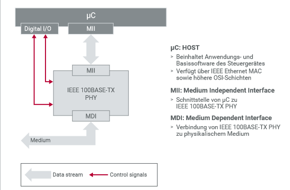

# 2. Physikalische Schichten

## IEEE 100BASE-T1 (ehem. OABR)

### Standard

IEEE 100BASE-T1, ursprünglich unter dem Namen Open Alliance BroadR-Reach (OABR) von Broadcom entwickelt, ist eine physikalische Übertragungstechnik für Ethernet in Automobilanwendungen. Der Standardisierungsprozess dieser Technologie wurde von der Open Alliance Special Interest Group (SIG) durchgeführt und führte zur Annahme als IEEE-Standard, speziell IEEE 802.3bw.

### Physikalische Anbindung

Die physikalische Schicht von 100BASE-T1 verwendet ein verdrilltes Paar von Drähten, das Daten durch symmetrische Differenzspannungen überträgt. Diese Spannungen entsprechen den vom Sender gemäß dem gewünschten Bitstrom erzeugten Symbolen, die dann über das Medium gesendet werden. Am Empfängerende werden diese Symbole wieder in den ursprünglichen Bitstrom dekodiert.

### Kodierung und Dekodierung

Die Kodierung und Dekodierung in 100BASE-T1 werden durch eine Kombination mehrerer Kodierungsschemata erreicht:

1. **4B3B (Vier Binär Drei Ternär) Kodierung** : Wandelt 4-Bit-Binärdaten in einen 3-Symbol-Ternärcode um, wodurch die benötigte Bandbreite für die Übertragung reduziert wird.
2. **3B2T (Drei Binär Zwei Ternär) Kodierung** : Komprimiert die Daten weiter in ein formatgerechtes Übertragungsformat.
3. **PAM3 (Pulsamplitudenmodulation mit 3 Pegeln)** : Verwendet drei Spannungspegel zur Darstellung der Datensymbole.

Diese Kodierungsschemata sind im 100BASE-T1 PHY (Physical Layer Transceiver) implementiert, einem integralen Bestandteil der elektronischen Steuergeräte (ECU). Der PHY dient als Brücke zwischen dem physikalischen Medium und dem Ethernet-Controller und sorgt für eine effiziente Datenübertragung.

### Topologie

In einem 100BASE-T1-Netzwerk können nur zwei Knoten direkt über eine Punkt-zu-Punkt-Verbindung verbunden werden. Um das Netzwerk zu erweitern und mehrere Knoten zu verbinden, wird ein Switch verwendet. Dieser Switch, der als Layer-2-Gerät fungiert, ermöglicht die Verbindung mehrerer physikalischer Links und verwaltet den Datenverkehr zwischen den verschiedenen Zweigen des Netzwerks.

### Full Duplex

Ein wesentlicher Vorteil von 100BASE-T1 ist seine Fähigkeit, Vollduplex-Kommunikation zu unterstützen, die gleichzeitige bidirektionale Datenübertragung mit einer Rate von 100 Mbps auf einem einzigen verdrillten Paar ermöglicht. Jeder Knoten, der sowohl als Sender als auch als Empfänger fungiert, addiert seine eigene Differenzspannung zum Paar und subtrahiert gleichzeitig seine Spannung, um das Signal vom anderen Knoten zu isolieren. Dieser Prozess, bekannt als Echokompensation, ist entscheidend für den Vollduplex-Betrieb und wird auch in anderen Ethernet-Technologien eingesetzt.

### Synchronisation

Für eine erfolgreiche Datenübertragung müssen beide Knoten ihre Operationen synchronisieren, um sicherzustellen, dass sie sich darüber einig sind, wann ein neues Symbol beginnt. Diese Synchronisation wird durch eine Master-Slave-Konfiguration erreicht, bei der der Master-Knoten einen kontinuierlichen Symbolstrom erzeugt, mit dem sich der Slave-Knoten synchronisiert. Die Rolle des Masters oder Slaves wird über die Basisoftware des Mikrocontrollers konfiguriert, der den PHY verwaltet.

Zusammenfassend lässt sich sagen, dass IEEE 100BASE-T1 ein robuster und effizienter Standard für Automotive Ethernet ist, der Hochgeschwindigkeits-Vollduplex-Kommunikation über ein einfaches verdrilltes Paar ermöglicht und somit bestens für die anspruchsvollen Umgebungen moderner Fahrzeugnetzwerke geeignet ist

## IEEE 100BASE-TX

Physikalische Anbindung
Für die physikalische Anbindung benötigt IEEE 100BASE-TX typischerweise zwei Kanäle, die jeweils über zwei verdrillte Leiter verfügen. Es ist zwar möglich, diese Ethernet-Variante auch mit einem Kanal zu betreiben, in der Praxis ist das allerdings nur selten der Fall, da diese Netzwerke nur Simplex oder Half Duplex unterstützen.

### Kodierung und Dekodierung

Die Leiterpaare dienen der Übertragung von symmetrischen Differenzspannungen, die zuvor kodierte Symbole repräsentieren. Ähnlich wie bei IEEE 100BASE-T1 kodiert ein Sender die Symbole basierend auf dem gewünschten Bitstrom. Ein Empfänger dekodiert den Symbolstrom und gewinnt so die gesendeten Bits zurück.

Im Gegensatz zu IEEE 100BASE-T1 verwendet IEEE 100BASE-TX für die Kodierung und Dekodierung sowie für die Erzeugung der Differenzspannungen eine Kombination aus NRZI-, 4B5B- und MLT-3-Verfahren. Diese Verfahren sind im IEEE 100BASE-TX PHY implementiert, der als eigener Baustein im Steuergerät (ECU) eingebaut wird. Der PHY stellt die Verbindung zwischen physikalischem Medium und Ethernet Controller her.

### Leitungen und Stecker

Für IEEE 100BASE-TX kommen typischerweise normierte Cat5- oder Cat5e-Leitungen zum Einsatz. Von den acht verfügbaren Leitern werden vier für die Anbindung der beiden Kanäle benötigt. Die Belegung der Leiterpaare ist in den beiden Standards EIA/TIA-568A sowie EIA/TIA-568B festgelegt. Diese Standards beinhalten auch die Pin-Belegung für die üblicherweise verwendeten RJ45-Stecker und -Buchsen.

### Topologie

An einer Leitung sind immer nur zwei Knoten angeschlossen. Als Topologie steht somit nur die Punkt-zu-Punkt-Verbindung zur Verfügung. Mehr als zwei Knoten können mit Hilfe eines Koppelelements verbunden werden. Hier kommt üblicherweise ein Switch zum Einsatz, der als Layer-2-Koppelelement die Anbindung an mehrere physikalische Verbindungen erlaubt und selbständig Botschaften von Zweig zu Zweig weiterleiten kann.

### Dual Simplex

Wird IEEE 100BASE-TX mit zwei Kanälen betrieben, können Informationen bidirektional mit 100 Mbit/s übertragen werden. Hierzu verwendet ein Knoten einen Kanal zum Senden und den zweiten Kanal zum Empfangen. Unterstützt ein PHY nur festgelegte Kanalzuweisungen, muss für eine Verbindung zwischen zwei Knoten ein Crossover-Kabel verwendet werden. Allerdings verfügen moderne PHYs heute mehrheitlich über einen Autonegotiation-Mechanismus, mit dessen Hilfe ein Knoten die Kanalverwendung automatisch erkennt. Mit Autonegotiation ist der Einsatz von Crossover-Kabeln nicht mehr erforderlich.

## IEEE 1000BASE-T

Physikalische Anbindung
Das IEEE 1000BASE-T benötigt für die physikalische Anbindung vier Kanäle, die jeweils über zwei verdrillte Leiter verfügen. Die Leiterpaare dienen der Übertragung von symmetrischen Differenzspannungen, die zuvor kodierte Symbole repräsentieren.

### Kodierung und Dekodierung

Ein Sender kodiert die Symbole entsprechend dem gewünschten Bitstrom. Ein Empfänger dekodiert den Symbolstrom und gewinnt so die gesendeten Bits zurück. Im Gegensatz zu IEEE 100BASE-T1 oder IEEE 100BASE-TX verwendet das IEEE 1000BASE-T für die Kodierung und Dekodierung sowie für die Erzeugung der Differenzspannungen eine Kombination aus 8B1Q4-, Trellis-, Viterbi- und PAM5-Verfahren. Diese Verfahren sind im IEEE 1000BASE-T PHY implementiert, der als eigener Baustein im Steuergerät (ECU) eingebaut wird. Der PHY stellt die Verbindung zwischen physikalischem Medium und Ethernet Controller her.

### Leitungen und Stecker

Für IEEE 1000BASE-T kommen typischerweise normierte Cat5e-Leitungen zum Einsatz. Alle acht Leiter werden für die Anbindung der vier Kanäle benötigt. Die Belegung der Leiterpaare ist in den beiden Standards EIA/TIA-568A sowie EIA/TIA-568B festgelegt. Diese Standards beinhalten auch die Pin-Belegung für die üblicherweise verwendeten RJ45-Stecker und -Buchsen.

### Topologie

An einer Leitung sind immer nur zwei Knoten angeschlossen. Als Topologie steht somit nur die Punkt-zu-Punkt-Verbindung zur Verfügung. Mehr als zwei Knoten können mit Hilfe eines Koppelelements verbunden werden. Hier kommt üblicherweise ein Switch zum Einsatz, der als Layer-2-Koppelelement die Anbindung an mehrere physikalische Verbindungen erlaubt und selbständig Botschaften von Zweig zu Zweig weiterleiten kann.

### Full Duplex

Auf Grund des PAM5-Verfahrens können zwei miteinander verbundene Knoten auf vier Kanälen gleichzeitig senden und empfangen (Full Duplex). Als Sender addiert ein Knoten seine eigenen Differenzspannungen auf die Leiter, während er als Empfänger seine eigenen Spannungen von den anliegenden Gesamtspannungen subtrahiert. Das Ergebnis der Subtraktionen entspricht den Spannungen, die von der Gegenseite gesendet wurden. Dieser Mechanismus ist Bestandteil des Echo-Cancellation-Verfahrens, das auch bei anderen Ethernet-Techniken zum Einsatz kommt.

### Synchronisation

Damit Differenzspannungen addiert bzw. subtrahiert werden können, müssen die beiden Knoten wissen, wann ein neues Symbol beginnt. Das bedeutet, dass beide Knoten auf den Symbolstrom synchronisiert sein müssen. Dies erfolgt mit Hilfe eines Master- und eines Slave-Knotens. Der Master erzeugt einen kontinuierlichen Symbolstrom, auf den sich der Slave synchronisiert. Im Gegensatz zu IEEE 100BASE-T1 werden die Rollen nicht fest konfiguriert, sondern mit Hilfe eines Autonegotiation-Mechanismus ausgehandelt.
