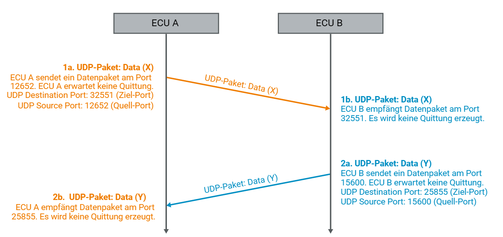
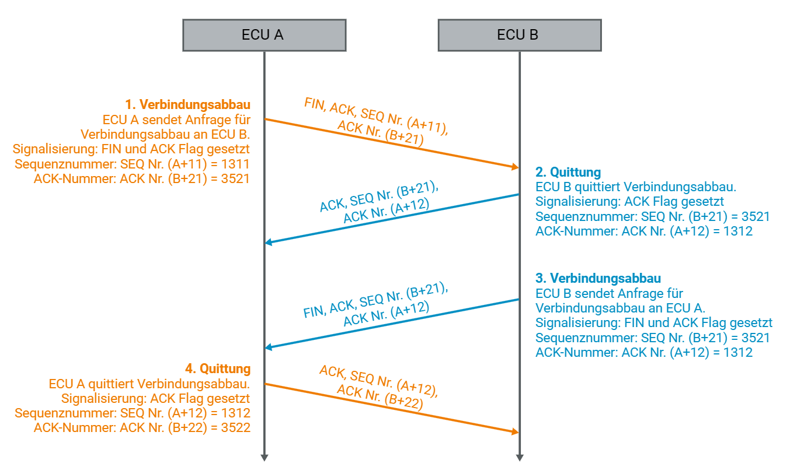

## 5. TCP und UDP

### Eigenschaften - TCP & UDP

Transportschicht
In Schicht 4 des OSI-Schichtenmodells existieren zwei Transportprotokolle: TCP und UDP. Das TCP-Protokoll stellt dabei eine verbindungsorientierte Übertragung dar, während UDP eine verbindungslose Übertragung realisiert. Beide Protokolle teilen die Daten, die übertragen werden sollen in kleinere Teile auf. Bei TCP werden diese aufgeteilten Daten Segmente genannt, bei UDP spricht man von Paketen.

Da die Transportprotokolle Daten entweder verbindungsorientiert oder verbindungslos übertragen, sind diese für unterschiedliche Einsatzgebiete geeignet. Je nach Anforderung an Sicherheit oder Geschwindigkeit der Übertragung, kommt daher entweder nur TCP, nur UDP oder eine Kombination aus beiden Protokollen zum Einsatz.

Adressierung
Um den gewünschten Zielknoten zu erreichen, erfolgt die Übertragung von Daten über das Internet Protocol (IP) auf der darunter liegenden Schicht 3. Die Anbindung an die höheren Schichten erfolgt mit Hilfe von Ports, die das Adressieren von Funktionen und Anwendungen erlauben. Wird ein Port geöffnet, so können Daten mit der zugehörigen Funktion oder Anwendung ausgetauscht werden.

### UDP: User Datagram Protocol

Verbindungslos
UDP ist ein verbindungsloses Transportprotokoll, das eine einfache Übertragung von Paketen ermöglicht. Im Gegensatz zu TCP stellt es keine Mechanismen zur Verfügung, die eine garantierte Datenübertragung gewährleisten können. Sowohl Verlust als auch Störung eines Pakets werden dem Sender nicht mitgeteilt. Daher gibt es auch keinen Mechanismus der das Neusenden bzw. erneute Anfordern von Datenpaketen gestattet. Bei Bedarf können diese Funktionen allerdings problemlos in Protokollen auf höheren Schichten implementiert werden.

Vorteile
Die verbindungslose Übertragung mittels UDP bietet den Vorteil von geringeren Übertragungsschwankungen. Anders als bei TCP muss der Sender nicht auf eine Rückmeldung des Empfängers warten. So entstehen keine zusätzlichen Wartezeiten, durch die das Versenden eines Pakets verzögert werden könnte.

Ein weiterer Vorteil ist die Möglichkeit, Pakete als Multicast oder Broadcast zu senden. Das bedeutet, dass UDP-Pakete an mehrere oder alle Knoten im Netzwerk gesendet werden können. So reduziert eine Übertragung per UDP die Buslast, falls eine Information an mehrere Empfänger gleichzeitig gesendet werden muss.

UDP-Pakete
UDP-Pakete werden in IP-Pakete gekapselt und mittels Internet Protocol gesendet. Das IP-Paket enthält in diesem Fall im Header eine Kennzeichnung, dass es sich bei den enthaltenen Daten um ein UDP-Paket handelt. Da ein UDP-Paket größere Datenmengen (65.535 Bytes) als ein IP-Paket (1.480 Bytes) enthalten kann, sind UDP-Pakete durch Fragmentierung auf mehrere IP-Pakete aufteilbar.

Fragmentierung
Bei der Fragmentierung eines UDP-Pakets enthalten die entsprechenden IP-Pakete jeweils eine Kennung für die eindeutige Identifizierung des UDP-Pakets und eine Kennung für die Position des Fragments innerhalb des vollständigen UDP-Pakets. Dadurch kann der Empfänger alle Fragmente wieder zu einem UDP-Paket zusammensetzen. Fehlt ein IP-Paket, so kann das UDP-Paket vom Empfänger nicht mehr zusammengesetzt werden. Da bei Fehlern keine erneute Anforderung der Daten erfolgt, werden alle IP-Pakete des unvollständigen UDP-Pakets verworfen.

### TCP: Transmission Control Protocol

Verbindungsorientiert
Im Gegensatz zu UDP stellt TCP eine verbindungsorientierte Übertragung dar. Das bedeutet, dass vor der eigentlichen Übermittlung von Daten eine eindeutige Verbindung zwischen zwei Teilnehmern aufgebaut werden muss. Die Identifikation von beiden Teilnehmern erfolgt dabei jeweils über IP-Adresse und Portnummer.

Verbindungsaufbau
Der Verbindungsaufbau findet mittels Three-Way-Handshake statt, das heißt in drei Schritten. Der Teilnehmer, der einen Verbindungsaufbau möchte, überträgt hierzu zunächst ein Segment, das ein gesetztes SYN-Flag enthält. Das SYN-Flag signalisiert den Wunsch des Senders zu einem Verbindungsaufbau mit dem Empfänger.

Neben dem SYN-Flag werden im ersten Segment eine eigene Sequenznummer, das Window-Feld sowie optional weitere Parameter übertragen. Die Sequenznummer setzt sich aus einer zufallsgenerierten Zahl, der ISN (Initial Sequence Number), und einer fortlaufenden Nummer zusammen. Die zusätzliche fortlaufende Nummer des Segments gibt die Position der gerade gesendeten Bytes im gesamten Datenstrom an. Dadurch ist die Reihenfolge aller Segmente bekannt und der Datenstrom lässt sich vom Empfänger später wieder zusammensetzen.

Das Window-Feld gibt Auskunft über den freien verfügbaren Speicher des Teilnehmers. Dies garantiert, dass ein Sender nie mehr Daten an den Empfänger sendet, als dessen freier Speicher zulässt. Da die Kommunikation bidirektional sein kann, teilen beide Teilnehmer der jeweiligen Gegenstelle ihren verfügbaren Speicher mit.

Im zweiten Schritt sendet der ursprüngliche Empfänger ein SYN ACK. Das Segment hat sowohl ein gesetztes SYN-Flag als auch ein gesetzte ACK-Flag. Dadurch signalisiert dieser Teilnehmer dem ursprünglichen Sender, dass er die Anfrage für den Verbindungsaufbau erhalten hat und positiv quittiert. Ergänzend sendet er eine eigene Sequenznummer mit. Beiden Teilnehmern ist nun die Gegenstelle eindeutig bekannt und alle zukünftig ausgetauschten Segmente können dem entsprechenden Sender zugeordnet werden.

Der dritte und letzte Schritt für den Verbindungsaufbau beinhaltet ein Acknowledgement, das der ursprüngliche Sender überträgt. Dadurch signalisiert er der Gegenstelle, dass die Verbindung erfolgreich aufgebaut wurde. Ab jetzt können Daten zwischen den beiden Teilnehmern ausgetauscht werden.

Datenübertragung
Da TCP immer eine eindeutige Verbindung zwischen zwei Teilnehmern erfordert, ist das Senden von Broadcast- oder Multicast-Nachrichten ins Netzwerk ohne spezifischen Empfänger nicht möglich. Nur durch die eindeutige Verbindung kann allerdings eine zuverlässige Datenübertragung stattfinden. Verschiedene Mechanismen stellen dabei sicher, dass die Daten beim Empfänger ankommen und auch nicht verfälscht wurden.

Die CRC-Prüfsumme sichert die Daten des Pakets vor Verfälschungen während der Übertragung. Die schon erwähnte Sequenznummer stellt sicher, dass die Reihenfolge des Segments bekannt ist, selbst wenn frühere Pakete erst später beim Empfänger eintreffen.

Jedes empfangene Segment wird dem Sender per ACK-Nummer quittiert, sofern kein Fehler erkannt wurde. Das Acknowledgement erfolgt durch das Senden eines Segments mit gesetztem ACK-Flag. Dies signalisiert, dass es sich um ein Segment mit einer gültigen Acknowledgement-Nummer handelt. Der Sender interpretiert daraufhin die ACK-Nummer in diesem Segment. Diese gibt Auskunft über das Paket, dessen Erhalt nun positiv quittiert wird. Jedes Segment enthält zusätzlich eine aktualisierte Information über den verfügbaren freien Speicher im Window-Feld, so dass ein Sender stets informiert ist, wie viele Daten er momentan an den Empfänger senden kann.

Erhält der Sender innerhalb eines bestimmten Zeitfensters keine positive Quittierung, so wird das Segment erneut gesendet, da dies bedeutet, dass das Segment fehlerhaft ist oder es den Empfänger nicht erreicht hat. Das Zeitfenster wird als Retransmission Timer bezeichnet, der für jedes Segment existiert und individuell heruntergezählt wird. Nach Erhalt einer positiven Quittierung wird der entsprechende Timer für dieses Segment gelöscht.

Verbindungsabbau
Wurden alle Daten ausgetauscht und positiv quittiert, kann eine Verbindung geschlossen werden. Dazu sendet ein Teilnehmer ein Segment mit gesetztem FIN-Flag, das den Verbindungsabbau signalisiert. Der Empfänger dieses FIN-Segments muss mit einem Acknowledgement quittiert, sodass die Verbindung halb geschlossen ist. Möchte dieser Teilnehmer ebenfalls den Verbindungsabbau durchführen, so sendet dieser ein Segment mit einem gesetzten FIN-Flag an den ursprünglichen Sender zurück. Wird dies ebenfalls durch eine Acknowledgement quittiert, so ist der Verbindungsabbau abgeschlossen. Es können keinen Daten mehr übertragen werden.
