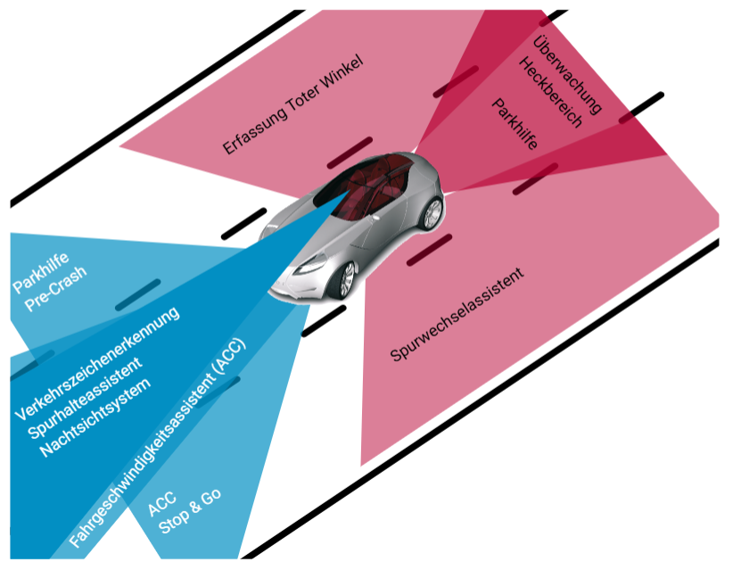
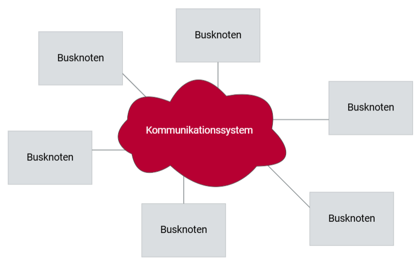

# Elektronische Assistenten

## Steigender Funktionsumfang in modernen Fahrzeugen

Moderne Fahrzeuge sind zunehmend auf elektronische Systeme angewiesen, um steigende Anforderungen an Verbrauch, Komfort und Sicherheit zu erfüllen. Beispiele hierfür sind der Komfortzugang, der den elektronischen Schlüssel erkennt und das Fahrzeug ohne Schlüsselberührung öffnet und startet, sowie die Geschwindigkeitsregelung, die Fahrgeschwindigkeiten ab 30 km/h konstant hält und damit den Komfort auf langen Strecken erhöht.

Auch versteckte Funktionen wie die elektronische Dämpferkontrolle spielen eine wichtige Rolle. Diese reduziert Radlastschwankungen und sorgt für eine optimale Verbindung zwischen Fahrbahn und Reifen, unabhängig vom Straßenzustand und der Beladung des Fahrzeugs.

Anfänglich wurden elektronische Sicherheitssysteme wie ABS und ESP skeptisch betrachtet, jedoch haben sie sich mittlerweile durchgesetzt. Diese Systeme haben wesentlich dazu beigetragen, dass trotz des steigenden Fahrzeugbestands und der Anzahl an Autofahrten die Zahl der Unfälle gesunken ist. Die Automobilindustrie arbeitet kontinuierlich an der Weiterentwicklung und Einführung neuer aktiver Sicherheits- und Fahrerassistenzsysteme, um das Autofahren noch sicherer zu machen.

## Verteilte Systeme und ihre Bedeutung

Hinter modernen aktiven Sicherheits- und Fahrerassistenzsystemen stehen hochdynamische Regelungsapplikationen, die sich nicht mehr auf einzelne Steuergeräte beschränken. Stattdessen sind verteilte Systeme, die über ein Kommunikationssystem mehrere Steuergeräte verbinden, das Rückgrat dieser Anwendungen.

Ein verteiltes System muss trotz der Nutzung eines Kommunikationssystems eine streng festgelegte zeitliche Wirkungskette einhalten. Daher gewinnen Kommunikationssysteme an Bedeutung, die eine buslastunabhängige, deterministische Datenkommunikation gewährleisten. Hierbei handelt es sich um Echtzeitkommunikationssysteme mit einem zeitgesteuerten Ansatz, die eine äquidistante Signalübertragung garantieren.

## FlexRay: Ein Überblick

FlexRay ist ein solches Echtzeitkommunikationssystem, das speziell für die Anforderungen in der Fahrzeugelektronik entwickelt wurde. Es bietet eine hohe Datenrate und eine deterministische Kommunikation, die für sicherheitskritische Anwendungen unerlässlich ist. FlexRay ist in der Lage, die Synchronisation von Steuergeräten in einem verteilten System zu gewährleisten, wodurch eine zuverlässige und zeitgenaue Datenübertragung möglich ist.

## Funktionsweise von FlexRay

FlexRay arbeitet mit einem zeitgesteuerten Kommunikationsschema, das deterministische Übertragungszeiten sicherstellt. Es nutzt ein Dual-Channel-Design, das eine redundante Datenübertragung ermöglicht und somit die Ausfallsicherheit erhöht. Jeder Kanal kann eine Datenrate von bis zu 10 Mbit/s erreichen, was FlexRay zu einem der schnellsten Bussysteme in der Fahrzeugelektronik macht.

Ein typisches FlexRay-Netzwerk besteht aus mehreren Busknoten, die über das Kommunikationssystem miteinander verbunden sind. Diese Knoten kommunizieren in einem zeitlichen Rahmen, der in feste Zeitfenster unterteilt ist. Dadurch wird sichergestellt, dass die Datenübertragung zu vorhersehbaren Zeiten erfolgt, was besonders für sicherheitskritische Anwendungen wichtig ist.

## Vorteile von FlexRay

- **Hohe Datenrate:** Mit bis zu 20 Mbit/s (bei Nutzung beider Kanäle) bietet FlexRay eine deutlich höhere Datenrate als ältere Bussysteme wie CAN.
- **Deterministische Kommunikation:** FlexRay garantiert eine zeitgesteuerte und damit vorhersagbare Kommunikation, was für sicherheitskritische Anwendungen unerlässlich ist.
- **Redundanz:** Durch das Dual-Channel-Design bietet FlexRay eine erhöhte Ausfallsicherheit, da bei einem Kanalfehler der zweite Kanal weiterhin funktionsfähig ist.
- **Skalierbarkeit:** FlexRay kann in verschiedenen Fahrzeugarchitekturen implementiert werden und unterstützt sowohl kleine als auch große Netzwerke.
