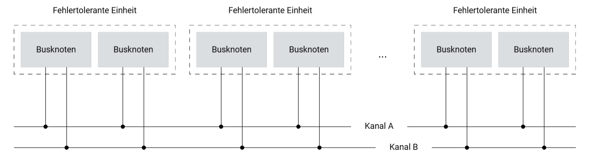
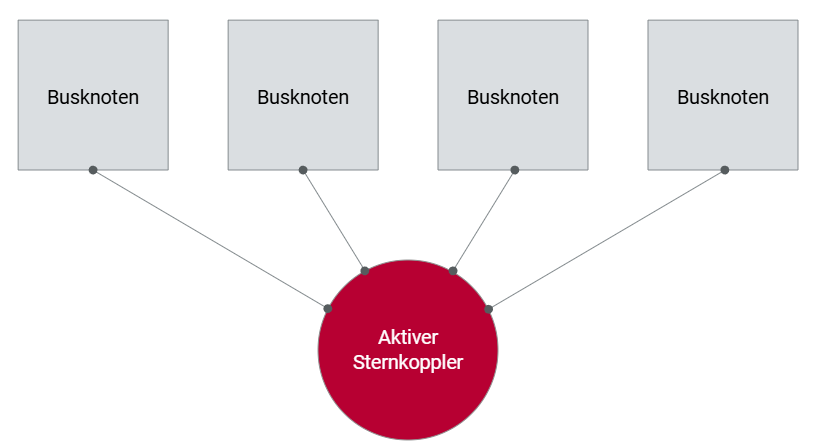

# Sicherheit und Fehlertoleranz

## Sicherheitsrisiko bei elektronischen Systemen

Moderne Fahrzeuge sind zunehmend mit aktiven Sicherheits- und Fahrerassistenzfunktionen ausgestattet, die eine entscheidende Rolle für die Fahrzeugsicherheit spielen. Diese Systeme, insbesondere solche mit elektronischen Schnittstellen zum Fahrwerk, bergen jedoch ein erhebliches Sicherheitsrisiko. Bereits eine Störung oder ein Ausfall einzelner Systemkomponenten kann schwerwiegende Folgen haben. Um die Sicherheit von "by-Wire"-Systemen zu gewährleisten, ist es daher unerlässlich, die Systemkomponenten so zu perfektionieren, dass Fehler möglichst vermieden werden.

## Fehlertoleranzkonzepte

Trotz aller Vorsichtsmaßnahmen lassen sich Fehler nicht vollständig ausschließen. Daher wird das Konzept der Fehlertoleranz angewendet, um die spezifizierte Funktion des Gesamtsystems aufrechtzuerhalten. Fehlertoleranz erfordert zusätzliche Mittel, um aufgetretene Fehler tolerieren zu können. Es wird zwischen Informationsredundanz und struktureller Redundanz unterschieden.

- **Informationsredundanz**: Diese entsteht durch die Ergänzung der Nutzinformation mit zusätzlicher Information zur Fehlererkennung und -korrektur.
- **Strukturelle Redundanz**: Diese wird erreicht, indem das Kommunikationssystem um zusätzliche, für den Nutzbetrieb nicht notwendige Komponenten erweitert wird.

## Redundanztypen und deren Aktivierung

Es gibt zwei grundlegende Arten der Redundanzaktivierung:

- **Statische Redundanz**: Diese ist ständig aktiv und wird in sicherheitskritischen Systemen bevorzugt, da sie hohe Echtzeitfähigkeit bietet.
- **Dynamische Redundanz**: Diese wird erst bei Auftreten eines Fehlers aktiviert.

Aufgrund der hohen Anforderungen an die Echtzeitfähigkeit von verteilten, sicherheitskritischen Systemen kommt für dort eingesetzte Kommunikationssysteme nur das Prinzip der statischen Redundanz in Frage.

## Redundanter Kommunikationskanal

Ein redundanter Kommunikationskanal ist besonders im Kontext von "by-Wire"-Systemen wichtig, um das Sicherheitsrisiko zu minimieren. Dabei müssen auf beiden Kommunikationskanälen stets die gleichen Informationen übertragen werden, um den Ausfall eines Kanals tolerieren zu können. Die Grafik „Strukturelle Redundanz“ zeigt ein Beispiel für die redundante Auslegung der Busknoten und des Kommunikationskanals eines Kommunikationssystems unter Verwendung einer physikalischen Linientopologie.

## Aktiver Sternkoppler

Die Wahl der physikalischen Topologie beeinflusst ebenfalls die Fehlertoleranz eines Kommunikationssystems. Entscheidet sich der Systemdesigner beispielsweise für eine aktive Sterntopologie, bietet dies die Möglichkeit, die Ausbreitung von Fehlern zu vermeiden, indem fehlerhafte Kommunikationszweige vom aktiven Sternkoppler abgeschaltet werden. Die Grafik „Aktive Sterntopologie“ illustriert dieses Konzept, bei dem mehrere Busknoten mit einem aktiven Sternkoppler verbunden sind, der im Fehlerfall defekte Zweige isolieren kann.

