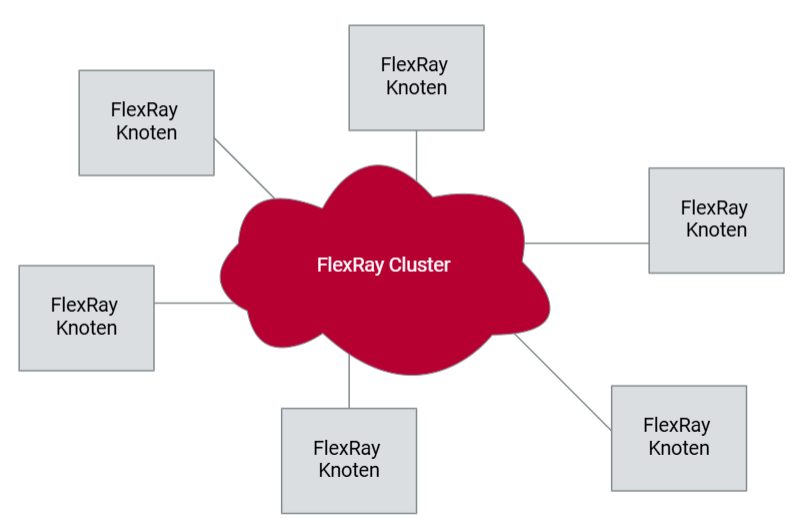
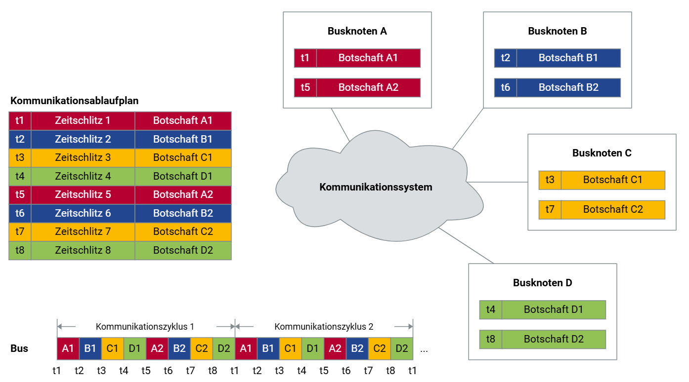

# Kommunikationsarchitektur

FlexRay ist ein leistungsstarkes Kommunikationsprotokoll für sicherheitskritische Anwendungen, das durch seine deterministische Struktur und hohe Flexibilität überzeugt. Diese Dokumentation erläutert die grundlegenden Elemente, darunter Topologien, Redundanzmechanismen, das TDMA-Verfahren und die Organisation des Kommunikationsablaufs.

## Netzwerk-Topologien

Ein FlexRay-Cluster besteht aus mehreren Knoten, die über ein physikalisches Medium miteinander verbunden sind. Verschiedene Topologien bieten flexible Anpassungsmöglichkeiten:

- **Punkt-zu-Punkt**: Direkte Verbindung zweier Knoten für einfache Anforderungen.
- **Linientopologie**: Serielle Verbindung mehrerer Knoten, kosteneffizient für größere Netzwerke.
- **Passive Sterntopologie**: Knoten sind sternförmig über einen passiven Hub verbunden, mit minimaler Signalverstärkung.
- **Aktive Sterntopologie**: Aktiver Hub verstärkt Signale und erhöht die Fehlertoleranz.

### Beispiel eines Clusters

## Redundanz und Datenrate

FlexRay bietet zwei unabhängige Kommunikationskanäle (Channel A und B), die flexibel konfiguriert werden können:

- **Redundante Übertragung**: Daten werden auf beiden Kanälen gespiegelt, um Fehlertoleranz zu maximieren.
- **Erhöhte Bandbreite**: Beide Kanäle arbeiten unabhängig, wodurch eine kombinierte Datenrate von bis zu 20 MBit/s erreicht wird.

## Zeitgesteuerte Kommunikation

FlexRay verwendet ein zeitgesteuertes Kommunikationsmodell, das deterministische Übertragungen sicherstellt. Alle Knoten synchronisieren ihre Aktionen auf einen gemeinsamen Zeitplan, wodurch Kollisionen vermieden werden.

### Vorteile:
- **Determinismus**: Fest definierte Zeitfenster garantieren eine verlässliche Datenübertragung.
- **Synchronisation**: Alle Knoten sind zeitlich exakt aufeinander abgestimmt.
- **Echtzeitfähigkeit**: Kritische Anwendungen profitieren von minimalen und voraussagbaren Latenzen.

## TDMA-Verfahren

Das **Time Division Multiple Access (TDMA)** ist das zentrale Verfahren in FlexRay. Es teilt den Kommunikationszyklus in Zeitschlitze, die fest bestimmten Knoten zugeordnet sind. 

### Bestandteile:
1. **Statisches Segment**:
   - Nachrichten werden in festen Zeitschlitzen gesendet.
   - Eignet sich für priorisierte und zeitkritische Daten.
2. **Dynamisches Segment**:
   - Flexiblere Übertragungen für variierende Datenlasten.

## Kommunikationsablaufplan

Der FlexRay-Kommunikationszyklus ist in wiederkehrende Segmente unterteilt, die die Übertragung effizient und planbar gestalten:

1. **Statisches Segment**:
   - Nachrichten sind festen Zeitfenstern zugeordnet.
2. **Dynamisches Segment**:
   - Nachrichtenübertragung erfolgt nach Priorität.

### Beispielhafter Plan:
| Zeitschlitz | Sender  |
|-|-|
| 1           | Knoten A |
| 2           | Knoten B |
| 3           | Knoten C |
| 4           | Knoten D |

Die strikte Organisation garantiert, dass keine Datenkollisionen auftreten und alle Botschaften innerhalb der vorgesehenen Zeit übertragen werden.
