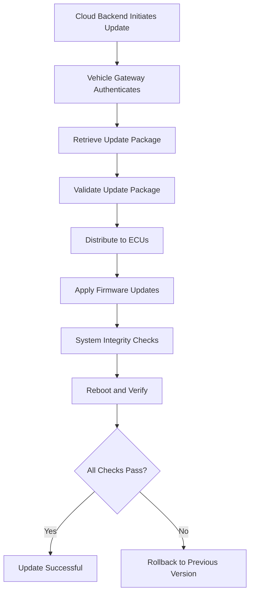

# Over-the-Air 

OTA technology is integral to contemporary automotive systems, facilitating remote updates, diagnostics, and feature enhancements without necessitating physical access to the vehicle. This documentation delves into the technical intricacies of OTA, encompassing its architecture, protocols, security measures, implementation challenges, and best practices. It is tailored for advanced users with expertise in automotive electronics, embedded systems, and cybersecurity.

## What is Over-the-Air (OTA) Technology?

Over-the-Air (OTA) technology enables the remote updating of vehicle software and firmware through wireless communication channels. This encompasses updates for Electronic Control Units (ECUs), infotainment systems, telematics modules, and other essential vehicle components. By leveraging OTA, manufacturers can:

- **Reduce Operational Costs**: Eliminate the need for customers to visit service centers for updates.
- **Enhance Customer Experience**: Provide seamless and timely updates, improving vehicle functionality and safety.
- **Increase Flexibility**: Rapidly deploy feature enhancements and security patches as needed.

OTA is pivotal in modern vehicles, underpinning advancements in safety, security, and functionality.

## Key Components of OTA Architecture

A robust OTA architecture integrates several components to ensure secure, efficient, and reliable updates. The primary components include:

### 1. Cloud Backend

The cloud backend serves as the central hub for managing software updates. Its responsibilities include:

- **Software Distribution**: Manages the deployment of update packages to vehicles.
- **Versioning and Metadata Storage**: Maintains records of software versions, dependencies, and update metadata.
- **Authentication and Authorization**: Ensures that only authorized updates are distributed and applied.

*Example Configuration for Cloud Backend Authentication:*

```json
{
  "auth": {
    "type": "OAuth2",
    "token_endpoint": "https://api.automanufacturer.com/oauth/token",
    "client_id": "ota_service_client",
    "client_secret": "secure_client_secret"
  },
  "update_distribution": {
    "regions": ["NA", "EU", "APAC"],
    "rollout_strategy": "gradual",
    "max_concurrent_updates": 1000
  }
}
```

### 2. Vehicle Gateway (Telematics Control Unit - TCU)

The TCU acts as an intermediary between the cloud backend and the vehicle's ECUs. Key functions include:

- **Wireless Connectivity**: Supports cellular, Wi-Fi, and Bluetooth connections for data transmission.
- **Data Encryption**: Implements encryption protocols to secure data during transmission.
- **Update Management**: Coordinates the receipt and distribution of update packages to relevant ECUs.

*Sample Code Snippet for Establishing a Secure Connection in TCU:*

```c
#include <openssl/ssl.h>
#include <openssl/err.h>

// Initialize OpenSSL
SSL_library_init();
SSL_CTX *ctx = SSL_CTX_new(TLS_client_method());

// Load trusted CA certificates
SSL_CTX_load_verify_locations(ctx, "ca_cert.pem", NULL);

// Create SSL connection
SSL *ssl = SSL_new(ctx);
int server_fd = connect_to_server("api.automanufacturer.com", 443);
SSL_set_fd(ssl, server_fd);

// Perform SSL handshake
if (SSL_connect(ssl) <= 0) {
    ERR_print_errors_fp(stderr);
    // Handle error
}
```

### 3. Electronic Control Units (ECUs)

ECUs are specialized modules responsible for various vehicle functions. They receive and apply updates securely, ensuring minimal disruption to vehicle operations.

*Example ECU Update Handler Function:*

```c
#include <stdint.h>
#include <stdbool.h>
#include "secure_storage.h"
#include "crypto.h"

bool apply_firmware_update(uint8_t *update_data, size_t size) {
    // Verify update signature
    if (!verify_signature(update_data, size, PUBLIC_KEY)) {
        return false;
    }

    // Write update to secure storage
    if (!write_secure_storage("firmware", update_data, size)) {
        return false;
    }

    // Reboot ECU to apply update
    reboot_ecu();

    return true;
}
```

### 4. Security Infrastructure

Security is paramount in OTA implementations. The security infrastructure encompasses:

- **Encrypted Data Transmission**: Ensures all data exchanges are secure.
- **Secure Boot and Code Signing**: Verifies the integrity and authenticity of software before execution.
- **Rollback Mechanisms**: Provides the ability to revert to a previous stable state in case of update failures.

*Secure Boot Verification Example:*

```c
#include "secure_boot.h"

bool verify_secure_boot() {
    // Load the bootloader signature
    uint8_t bootloader_sig[SIGNATURE_SIZE];
    load_signature("bootloader.sig", bootloader_sig);

    // Verify the bootloader integrity
    return verify_signature(BOOTLOADER_HASH, bootloader_sig, PUBLIC_KEY);
}
```

## OTA Update Types

OTA updates can be categorized into two primary types, each serving distinct purposes within the vehicle's ecosystem:

### 1. Firmware Over-the-Air (FOTA)

FOTA pertains to updates of the embedded software running on vehicle ECUs. These updates are critical for:

- **Performance Enhancements**: Optimizing ECU operations for better vehicle performance.
- **Bug Fixes**: Addressing and resolving software defects.
- **Security Patches**: Mitigating vulnerabilities to safeguard vehicle systems.

*Example FOTA Update Process:*

```c
void perform_fota_update() {
    uint8_t *firmware = download_update("firmware_v2.bin");
    size_t firmware_size = get_update_size("firmware_v2.bin");

    if (apply_firmware_update(firmware, firmware_size)) {
        log_update_status("FOTA Update Successful");
    } else {
        log_update_status("FOTA Update Failed");
        rollback_firmware();
    }
}
```

### 2. Software Over-the-Air (SOTA)

SOTA involves updating applications and non-critical vehicle software, primarily within the infotainment and telematics systems. Benefits include:

- **Feature Additions**: Introducing new functionalities to infotainment systems.
- **User Interface Enhancements**: Improving the usability and aesthetics of software interfaces.
- **Non-Critical Bug Fixes**: Addressing minor software issues that do not impact vehicle safety.

*Sample SOTA Update Function:*

```python
import requests
import hashlib
import cryptography

def perform_sota_update(app_name, version):
    update_url = f"https://api.automanufacturer.com/updates/{app_name}/{version}"
    response = requests.get(update_url, verify='ca_cert.pem')

    if response.status_code == 200:
        update_data = response.content
        if verify_signature(update_data, response.headers['Signature']):
            with open(f"/apps/{app_name}.bin", "wb") as f:
                f.write(update_data)
            reboot_application(app_name)
            log_update_status(f"SOTA Update for {app_name} Successful")
        else:
            log_update_status(f"SOTA Update for {app_name} Failed: Signature Mismatch")
    else:
        log_update_status(f"SOTA Update for {app_name} Failed: HTTP {response.status_code}")
```

## OTA Protocols and Communication Mechanisms

Efficient and secure data transmission is facilitated by various communication protocols tailored for OTA updates. Key protocols include:

### HTTP(S) & MQTT

- **HTTP(S)**: Utilized for reliable cloud-to-vehicle communication, enabling the transfer of update packages and metadata.
- **MQTT**: A lightweight messaging protocol ideal for telemetry data and status updates due to its low bandwidth requirements.

*Example MQTT Subscription for OTA Updates:*

```python
import paho.mqtt.client as mqtt

def on_connect(client, userdata, flags, rc):
    client.subscribe("vehicle/updates/#")

def on_message(client, userdata, msg):
    process_update_message(msg.payload)

client = mqtt.Client()
client.on_connect = on_connect
client.on_message = on_message

client.connect("mqtt.automanufacturer.com", 1883, 60)
client.loop_forever()
```

### TLS (Transport Layer Security)

TLS ensures that all data transmitted between the cloud backend and the vehicle is encrypted, safeguarding against eavesdropping and tampering.

*TLS Configuration Example in TCU:*

```c
#include <openssl/ssl.h>
#include <openssl/err.h>

SSL_CTX* initialize_tls_context() {
    SSL_library_init();
    SSL_load_error_strings();
    const SSL_METHOD *method = TLS_client_method();
    SSL_CTX *ctx = SSL_CTX_new(method);

    if (!ctx) {
        ERR_print_errors_fp(stderr);
        exit(EXIT_FAILURE);
    }

    // Enforce TLS 1.2 and above
    SSL_CTX_set_min_proto_version(ctx, TLS1_2_VERSION);

    return ctx;
}
```

### Uptane

Uptane is a security framework specifically designed for automotive OTA updates. It provides mechanisms for secure bootstrapping, update distribution, and verification, ensuring that only authenticated and authorized updates are applied.

*Uptane Metadata Verification Example:*

```python
from uptane import Metadata, Director, ImageRepository

def verify_uptane_metadata(metadata_json):
    metadata = Metadata.from_json(metadata_json)
    director = Director()
    image_repo = ImageRepository()

    if director.verify_metadata(metadata) and image_repo.verify_images(metadata.images):
        return True
    return False
```

### ISO 26262 & ISO 21434

These standards ensure that OTA implementations comply with functional safety (ISO 26262) and cybersecurity (ISO 21434) requirements, providing guidelines for risk assessment, secure development, and validation processes.

*Compliance Checklist Example:*

```markdown
# ISO 26262 & ISO 21434 Compliance Checklist

## ISO 26262 - Functional Safety
- [x] Hazard analysis and risk assessment completed
- [x] Safety requirements defined for OTA updates
- [x] Safety mechanisms implemented (e.g., rollback, integrity checks)
- [x] Safety validation and verification performed

## ISO 21434 - Cybersecurity
- [x] Threat analysis and risk assessment conducted
- [x] Security requirements established for OTA communication
- [x] Encryption and authentication mechanisms implemented
- [x] Incident response plan in place
```

## Security Considerations in OTA

Given the critical nature of vehicle systems, security is paramount in OTA implementations. Key security measures include:

### End-to-End Encryption (E2EE)

E2EE ensures that data remains encrypted from the cloud backend to the ECUs, preventing unauthorized access during transmission.

*E2EE Implementation Example:*

```c
#include <openssl/evp.h>

bool encrypt_data(uint8_t *plaintext, size_t plaintext_len, uint8_t *ciphertext, size_t *ciphertext_len) {
    EVP_CIPHER_CTX *ctx = EVP_CIPHER_CTX_new();
    if (!ctx) return false;

    if (EVP_EncryptInit_ex(ctx, EVP_aes_256_cbc(), NULL, AES_KEY, AES_IV) != 1) {
        EVP_CIPHER_CTX_free(ctx);
        return false;
    }

    if (EVP_EncryptUpdate(ctx, ciphertext, (int*)ciphertext_len, plaintext, plaintext_len) != 1) {
        EVP_CIPHER_CTX_free(ctx);
        return false;
    }

    int len;
    if (EVP_EncryptFinal_ex(ctx, ciphertext + *ciphertext_len, &len) != 1) {
        EVP_CIPHER_CTX_free(ctx);
        return false;
    }

    *ciphertext_len += len;
    EVP_CIPHER_CTX_free(ctx);
    return true;
}
```

### Authentication & Authorization

Ensuring that only legitimate updates are applied involves robust authentication and authorization mechanisms, verifying the identity of update sources and users.

*Authentication Token Verification Example:*

```python
import jwt

def verify_auth_token(token, public_key):
    try:
        decoded = jwt.decode(token, public_key, algorithms=["RS256"])
        return decoded['iss'] == "automanufacturer.com"
    except jwt.InvalidTokenError:
        return False
```

### Secure Boot

Secure boot ensures that only trusted software is executed during the vehicle's startup process, preventing the execution of unauthorized or malicious code.

*Secure Boot Sequence Example:*

```c
void secure_boot_sequence() {
    if (!verify_secure_boot()) {
        halt_system("Secure boot verification failed.");
    }

    // Proceed with normal boot
    initialize_system();
}
```

### Rollback Mechanism

A rollback mechanism allows the system to revert to a previous stable state in the event of an update failure, maintaining system integrity and functionality.

*Rollback Procedure Example:*

```c
bool rollback_firmware() {
    uint8_t *backup_firmware = load_backup_firmware();
    size_t firmware_size = get_firmware_size("backup_firmware.bin");

    if (apply_firmware_update(backup_firmware, firmware_size)) {
        log_update_status("Rollback Successful");
        return true;
    } else {
        log_update_status("Rollback Failed");
        return false;
    }
}
```

## Challenges in OTA Implementation

Implementing OTA technology in automotive systems presents several challenges that must be meticulously addressed to ensure successful deployment:

### Bandwidth Limitations

- **Issue**: Large update packages can strain available bandwidth, leading to prolonged update times.
- **Solutions**:
  - **Efficient Compression**: Utilize compression algorithms to reduce update size.
  - **Scheduling**: Schedule updates during off-peak hours to optimize bandwidth usage.

*Compression Example Using zlib:*

```c
#include <zlib.h>

bool compress_update_data(uint8_t *input, size_t input_size, uint8_t *output, size_t *output_size) {
    z_stream strm = {0};
    strm.total_in = strm.avail_in = input_size;
    strm.total_out = strm.avail_out = *output_size;
    strm.next_in = input;
    strm.next_out = output;

    if (deflateInit(&strm, Z_BEST_COMPRESSION) != Z_OK)
        return false;

    if (deflate(&strm, Z_FINISH) != Z_STREAM_END) {
        deflateEnd(&strm);
        return false;
    }

    *output_size = strm.total_out;
    deflateEnd(&strm);
    return true;
}
```

### Update Failures

- **Issue**: Incomplete or corrupted updates can render vehicle systems inoperative.
- **Solutions**:
  - **Integrity Checks**: Implement checksums and cryptographic signatures to verify update integrity.
  - **Redundant Storage**: Maintain backup copies of previous firmware versions.

*Integrity Check Example:*

```c
#include <sha256.h>

bool verify_update_integrity(uint8_t *update_data, size_t size, uint8_t *expected_hash) {
    uint8_t computed_hash[32];
    sha256(update_data, size, computed_hash);
    return memcmp(computed_hash, expected_hash, 32) == 0;
}
```

### Regulatory Compliance

- **Issue**: OTA implementations must comply with stringent automotive safety and security standards.
- **Solutions**:
  - **Adherence to Standards**: Follow ISO 26262 for functional safety and ISO 21434 for cybersecurity.
  - **Regular Audits**: Conduct periodic security and safety audits to ensure compliance.

### Integration with Legacy Systems

- **Issue**: Older vehicles may lack the necessary hardware and software infrastructure to support OTA updates.
- **Solutions**:
  - **Hardware Upgrades**: Retrofit older vehicles with necessary hardware components.
  - **Software Emulation**: Use lightweight protocols and software emulation to facilitate updates on legacy systems.

*Legacy System Integration Example:*

```c
// Example function to initialize legacy ECU for OTA updates
bool initialize_legacy_ecu_ota() {
    if (!legacy_ecu_supports_secure_boot()) {
        // Implement software-based security measures
        enable_secure_communication();
    }
    return true;
}
```

## OTA Implementation Best Practices

To achieve a robust and reliable OTA implementation, adhere to the following best practices:

### 1. Incremental Updates

- **Description**: Utilize delta or delta-compressed updates to minimize bandwidth usage by transmitting only the changes rather than the entire software image.
- **Benefits**:
  - Reduces update size and transmission time.
  - Lowers data consumption, beneficial for vehicles with limited connectivity.

*Delta Update Example Using Bsdiff:*

```bash
# Generate a delta patch
bsdiff old_version.bin new_version.bin update_patch.bsdiff

# Apply a delta patch
bspatch old_version.bin updated_version.bin update_patch.bsdiff
```

### 2. Testing and Validation

- **Description**: Conduct extensive testing and validation to ensure update reliability and system stability.
- **Approaches**:
  - **Simulation Environments**: Use virtual environments to simulate OTA update scenarios.
  - **Hardware-in-the-Loop (HiL) Testing**: Integrate physical hardware components into the testing process to validate real-world performance.

*HiL Testing Workflow Example:*

```markdown
# HiL Testing Workflow

1. **Setup HiL Environment**: Connect ECUs to the HiL simulator.
2. **Deploy Update**: Initiate OTA update through the simulator.
3. **Monitor Responses**: Observe ECU behavior and communication logs.
4. **Validate Integrity**: Ensure update integrity and system stability post-update.
5. **Report Findings**: Document any anomalies or failures for further analysis.
```

### 3. Version Management and Rollback

- **Description**: Implement strict version control and rollback mechanisms to manage update states and recover from failures.
- **Strategies**:
  - **Version Control Systems**: Track and manage software versions systematically.
  - **Rollback Procedures**: Define clear steps to revert to previous versions in case of update issues.

*Version Management Example Using Git:*

```bash
# Tagging a stable firmware version
git tag -a v1.0.0 -m "Stable release version 1.0.0"

# Pushing tags to remote repository
git push origin --tags
```

### 4. User Consent and Update Scheduling

- **Description**: Ensure that users have control over when updates are applied, enhancing user experience and reducing disruption.
- **Implementation**:
  - **User Notifications**: Inform users about available updates and their benefits.
  - **Flexible Scheduling**: Allow users to schedule updates at convenient times, such as during vehicle downtime.

*User Consent Workflow Example:*

```markdown
# User Consent Workflow

1. **Update Availability Notification**: Notify user of available OTA update with details.
2. **User Consent Request**: Prompt user to accept or defer the update.
3. **Schedule Update**: If accepted, allow user to choose preferred update time.
4. **Execute Update**: Apply update as per the scheduled time.
5. **Post-Update Confirmation**: Confirm successful update completion to the user.
```

### 5. Logging and Monitoring

- **Description**: Maintain comprehensive logs and monitoring systems to track update processes and detect anomalies.
- **Benefits**:
  - Facilitates troubleshooting and issue resolution.
  - Enhances transparency and accountability in the update process.

*Logging Example Using Syslog:*

```c
#include <syslog.h>

void log_update_status(const char *status_message) {
    openlog("OTA_Update", LOG_PID|LOG_CONS, LOG_USER);
    syslog(LOG_INFO, "%s", status_message);
    closelog();
}
```

### 6. Secure Storage

- **Description**: Store update packages and critical data in secure memory areas to prevent unauthorized access and tampering.
- **Techniques**:
  - **Encrypted Storage**: Encrypt sensitive data stored on the vehicle's memory.
  - **Access Controls**: Restrict access to update files to authorized processes only.

*Secure Storage Example Using Flash Encryption:*

```c
#include "flash_encryption.h"

bool store_update_securely(uint8_t *data, size_t size) {
    uint8_t encrypted_data[size];
    if (!encrypt_data(data, size, encrypted_data, &size)) {
        return false;
    }
    return write_flash_secure("update_package", encrypted_data, size);
}
```

### 7. Redundancy and Fail-Safes

- **Description**: Incorporate redundancy and fail-safe mechanisms to ensure system resilience during updates.
- **Measures**:
  - **Dual Firmware Slots**: Maintain two firmware slots, allowing seamless switching in case of update failures.
  - **Power Failure Handling**: Implement safeguards to prevent system corruption during unexpected power losses.

*Dual Firmware Slot Management Example:*

```c
#define SLOT_A 0
#define SLOT_B 1

bool switch_firmware_slot(int current_slot) {
    int new_slot = (current_slot == SLOT_A) ? SLOT_B : SLOT_A;
    set_active_slot(new_slot);
    return true;
}
```

## OTA Update Workflow Example

A typical OTA update workflow involves several coordinated steps to ensure a secure and successful update process:

### Step-by-Step Workflow

1. **Update Initiation**
   - The cloud backend identifies vehicles eligible for an update based on criteria such as current software version and vehicle configuration.
   - The update deployment process is initiated, specifying the target ECUs and update packages.

2. **Authentication and Retrieval**
   - The vehicle's TCU authenticates the update request using secure credentials.
   - Upon successful authentication, the TCU retrieves the update package from the cloud backend.

3. **Package Validation**
   - The update package is verified using cryptographic signatures to ensure authenticity and integrity.
   - Metadata such as version information and dependencies are checked for compatibility.

4. **Firmware Update Application**
   - The validated update is distributed to the relevant ECUs.
   - Each ECU applies the update, performing integrity checks post-installation.

5. **System Integrity Verification**
   - After all ECUs have been updated, the system performs comprehensive integrity checks to ensure all components are functioning correctly.
   - If all checks pass, the update is marked as successful.

6. **Reboot and Final Verification**
   - The vehicle system reboots to apply the updates.
   - Upon reboot, the system verifies the new software versions and operational status.

7. **Rollback if Necessary**
   - If any step fails, the system triggers rollback procedures to revert to the previous stable state, ensuring continued vehicle functionality.

*Visual Workflow Diagram:*



## Conclusion

OTA technology is transforming the automotive industry by enabling remote updates, enhancing security, and expanding vehicle functionalities without the need for physical interventions. While the implementation of OTA systems introduces challenges such as bandwidth constraints, update failures, regulatory compliance, and integration with legacy systems, these can be effectively managed through strategic best practices and robust security measures.

For automotive manufacturers and stakeholders, integrating OTA capabilities is imperative to remain competitive and meet the evolving demands of connected and autonomous vehicles. By adhering to the outlined architecture, protocols, and best practices, a secure, efficient, and reliable OTA system can be established, ensuring sustained vehicle performance and customer satisfaction.

# References

- **ISO 26262**: Road Vehicles – Functional Safety
- **ISO 21434**: Road Vehicles – Cybersecurity Engineering
- **Uptane Framework**: https://uptane.github.io/
