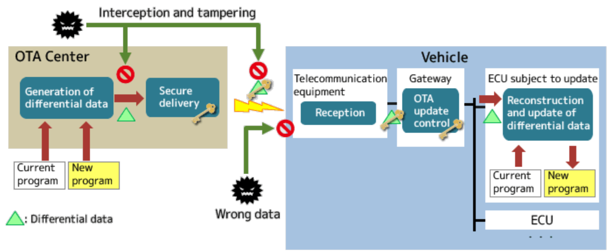

# Challenges in Implementing OTA Updates

Over-the-Air updates have revolutionized the automotive industry by enabling remote software enhancements, reducing the need for physical recalls, and ensuring vehicles remain up-to-date with the latest features and security patches. However, implementing OTA updates in vehicles presents a unique set of challenges that manufacturers must address to ensure safety, security, and reliability.

## 1. Bandwidth and Update Package Optimization

**Challenge:** Automotive systems often have limited bandwidth for data transmission. Sending large update packages can lead to prolonged download times, increased data costs, and potential disruptions in service.

**Solution:** To mitigate this, manufacturers should employ differential update strategies, transmitting only the changes between the current and new software versions rather than the entire package. This approach minimizes data usage and accelerates the update process.

## 2. Security Vulnerabilities

**Challenge:** OTA updates introduce potential entry points for cyberattacks. Unauthorized access can lead to firmware alterations, malware installation, or control over vehicle systems, posing significant safety risks.

**Solution:** Implement robust security measures, including:

- **Authentication and Encryption:** Ensure that updates are securely transmitted and can only be installed if they originate from a trusted source.

- **Secure Boot Mechanisms:** Verify the integrity and authenticity of the software before execution to prevent malicious code from running.

- **Regular Security Audits:** Conduct ongoing assessments to identify and address vulnerabilities promptly.

Adhering to standards such as the UNECE Regulation No. 156, which mandates the establishment of a Software Update Management System (SUMS), can guide manufacturers in implementing these security protocols. ([unece.org](https://unece.org/transport/documents/2021/03/standards/un-regulation-no-156-software-update-and-software-update))

## 3. User Consent and Control

**Challenge:** Users may be hesitant to accept updates due to concerns about data privacy, potential changes in vehicle behavior, or mistrust in the update process.

**Solution:** Manufacturers should provide clear communication regarding the purpose and benefits of each update, allowing users to make informed decisions. Offering options to schedule updates at convenient times can also enhance user acceptance.

## 4. Compatibility and Variant Management

**Challenge:** Vehicles often come in various models and configurations, each requiring specific software versions. Ensuring that the correct update is delivered to each vehicle variant is complex.

**Solution:** Maintain a comprehensive database of vehicle configurations and implement a robust version control system. This ensures that each vehicle receives the appropriate update, maintaining compatibility and functionality.

## 5. Regulatory Compliance

**Challenge:** Navigating diverse regulatory standards across regions and countries while ensuring seamless OTA updates for vehicles poses a significant challenge for automakers. ([acldigital.com](https://www.acldigital.com/blogs/ota-updates-in-automotive))

**Solution:** Manufacturers must stay informed about regional regulations and design their OTA systems to comply with varying standards. This may involve customizing update processes to meet local requirements.

## 6. Ensuring Vehicle Availability and Power Stability

**Challenge:** OTA updates require the vehicle to be stationary and have a stable power supply. Interruptions during the update process can lead to incomplete installations, potentially compromising vehicle functionality.

**Solution:** Design the update process to check for necessary preconditions, such as sufficient battery charge and vehicle immobility, before initiating the update. Implementing fail-safe mechanisms and the ability to resume interrupted updates can further enhance reliability.

## 7. Managing Aftermarket Modifications

**Challenge:** Vehicles may have aftermarket modifications that can interfere with OTA updates, leading to compatibility issues or system malfunctions.

**Solution:** Develop detection mechanisms to identify significant aftermarket modifications. Provide warnings to users about potential compatibility issues and, where possible, design updates to accommodate common modifications.

## Conclusion

Implementing OTA updates in the automotive sector offers significant benefits but also presents complex challenges. By addressing these challenges through strategic planning, robust security measures, and adherence to regulatory standards, manufacturers can ensure that OTA updates enhance vehicle performance, safety, and user satisfaction. 

