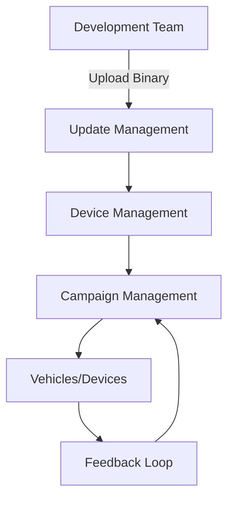

# OEM Backend 

The OEM (Original Equipment Manufacturer) Backend is a critical component in the vehicle ecosystem, facilitating the seamless management of software updates, device configurations, and campaign executions. It serves as the central hub where development teams upload binaries, manage device-specific parameters, and oversee the deployment of updates across the vehicle fleet. This documentation provides an in-depth exploration of the three primary elements of the OEM Backend: Update Management, Device Management, and Campaign Management. Each section delves into the functionalities, processes, and technical considerations essential for advanced users aiming to optimize and maintain robust backend operations.

## Update Management

### Overview

Update Management is responsible for orchestrating the entire lifecycle of software updates within the vehicle architecture. This includes the uploading of binary files from the development and engineering teams to the cloud server, configuring update parameters, and ensuring that updates are communicated effectively to the relevant devices.

### Key Responsibilities

1. **Binary Uploading:**
   - **Source:** Binaries are sourced from the development and engineering teams, representing the latest software versions deemed suitable for deployment.
   - **Process:** The binaries, often in the form of HEX files or firmware packages, are uploaded to the cloud server through a secure interface.
   
2. **Configuration:**
   - **Issue Identification:** Define the specific issues or enhancements that the update addresses.
   - **Communication Protocols:** Determine how updates are communicated to the vehicles, ensuring compatibility with existing communication frameworks.
   - **File Management:** Organize and store the relevant files in the cloud, categorizing them based on device compatibility, software version, and deployment priority.

### Workflow

```python
import boto3
from botocore.exceptions import NoCredentialsError

def upload_binary(file_path, bucket_name, object_name=None):
    """
    Uploads a binary file to the specified S3 bucket.

    :param file_path: Path to the binary file.
    :param bucket_name: Name of the S3 bucket.
    :param object_name: S3 object name. If not specified, file_path is used.
    :return: True if file was uploaded, else False.
    """
    s3_client = boto3.client('s3')
    if object_name is None:
        object_name = file_path.split('/')[-1]
    
    try:
        s3_client.upload_file(file_path, bucket_name, object_name)
        print(f"Upload Successful: {object_name}")
        return True
    except FileNotFoundError:
        print("The file was not found.")
        return False
    except NoCredentialsError:
        print("Credentials not available.")
        return False

# Example usage
upload_binary('path/to/firmware.hex', 'oem-backend-bucket', 'firmwares/firmware_v1.2.hex')
```

### Best Practices

- **Version Control:** Implement a robust versioning system to track changes and facilitate rollback if necessary.
- **Security:** Ensure that binaries are encrypted during transit and at rest to prevent unauthorized access or tampering.
- **Integrity Checks:** Utilize checksums or digital signatures to verify the integrity of the uploaded binaries.

## Device Management

### Overview

Device Management handles the organization and preparation of vehicles (devices) for receiving updates. It involves sorting and arranging the issues that need to be flashed, managing ECU (Electronic Control Unit) variances, and handling software versions.

### Key Responsibilities

1. **Issue Sorting:**
   - **Prioritization:** Determine which issues or enhancements take precedence based on severity, impact, and urgency.
   - **Categorization:** Group issues by device type, ECU, or software module to streamline the update process.

2. **ECU and Software Version Management:**
   - **ECU Identification:** Catalog each ECU's specifications, dependencies, and current software version.
   - **Version Handling:** Track software versions across different ECUs to ensure compatibility and prevent conflicts during updates.

3. **Flashing Preparation:**
   - **File Association:** Link the appropriate binary files to their respective ECUs and software versions.
   - **Update Sequencing:** Define the order in which updates should be applied to minimize downtime and ensure system stability.

### Workflow

```yaml
# device_management_config.yaml

ecus:
  - id: ECU_01
    name: Powertrain Controller
    current_version: 1.0.3
    target_version: 1.1.0
    binaries:
      - firmware: powertrain_v1.1.hex
        issue: Enhances engine efficiency
  - id: ECU_02
    name: Infotainment System
    current_version: 2.3.4
    target_version: 2.4.0
    binaries:
      - firmware: infotainment_v2.4.hex
        issue: Adds new navigation features

update_priorities:
  high:
    - ECU_01
  medium:
    - ECU_02
```

### Implementation Considerations

- **Scalability:** Ensure the device management system can handle a growing number of ECUs and software versions as vehicle architectures evolve.
- **Dependency Management:** Account for interdependencies between different ECUs and software modules to prevent update conflicts.
- **Automation:** Automate repetitive tasks such as version tracking and issue sorting to enhance efficiency and reduce human error.

## Campaign Management

### Overview

Campaign Management acts as a dashboard for tracking and overseeing the deployment of software updates. It enables OEMs to manage multiple update campaigns, monitor their progress, handle notifications and alerts, and schedule updates based on specific criteria.

### Key Responsibilities

1. **Campaign Creation and Tracking:**
   - **Dashboard Interface:** Provide a user-friendly interface for creating, monitoring, and managing update campaigns.
   - **Multiple Campaigns:** Support the simultaneous management of multiple campaigns, each targeting different issues, device groups, or geographic regions.

2. **Notifications and Alerts:**
   - **Status Updates:** Notify stakeholders about the progress, successes, and failures of update campaigns.
   - **Failure Handling:** Trigger alerts in case of update failures, enabling quick intervention and resolution.

3. **Scheduling:**
   - **Immediate Updates:** Deploy critical updates that need to be applied without delay.
   - **Batch Updates:** Schedule updates during off-peak hours or in batches to minimize disruption.
   - **Region-Specific Scheduling:** Tailor update schedules based on geographic regions to account for varying network conditions and operational requirements.

4. **Pipeline Management:**
   - **Issue Tracking:** Monitor the pipeline for ongoing updates, tracking the number of binaries being deployed and their respective statuses.
   - **Performance Metrics:** Analyze update performance metrics to identify bottlenecks and optimize future campaigns.

### Workflow

```javascript
// campaign_management.js

const axios = require('axios');

const createCampaign = async (campaignData) => {
    try {
        const response = await axios.post('https://api.oembackend.com/campaigns', campaignData);
        console.log('Campaign Created:', response.data);
        return response.data;
    } catch (error) {
        console.error('Error creating campaign:', error);
    }
};

const monitorCampaign = async (campaignId) => {
    try {
        const response = await axios.get(`https://api.oembackend.com/campaigns/${campaignId}`);
        console.log('Campaign Status:', response.data.status);
        return response.data.status;
    } catch (error) {
        console.error('Error monitoring campaign:', error);
    }
};

// Example usage
const newCampaign = {
    name: 'Powertrain Update Rollout',
    binaries: ['powertrain_v1.1.hex'],
    target_devices: ['ECU_01'],
    schedule: 'immediate',
    notifications: {
        onSuccess: 'admin@oem.com',
        onFailure: 'support@oem.com'
    }
};

createCampaign(newCampaign).then(campaign => {
    monitorCampaign(campaign.id);
});
```

### Best Practices

- **Comprehensive Monitoring:** Implement detailed monitoring to track the status and performance of each campaign in real-time.
- **Flexible Scheduling:** Allow for dynamic scheduling options to accommodate urgent updates and minimize operational disruptions.
- **Robust Alerting Mechanisms:** Ensure that alerts are timely and informative, providing sufficient data for troubleshooting and resolution.
- **User Access Control:** Restrict campaign management functionalities to authorized personnel to maintain security and integrity.

## Integration of Backend Elements

### Coordinated Workflow

The seamless integration of Update Management, Device Management, and Campaign Management is essential for the efficient operation of the OEM Backend. The coordinated workflow ensures that software updates are accurately prepared, appropriately deployed, and effectively monitored.

1. **Initiation:**
   - The development team uploads a new binary via Update Management.
   - Update Management configures the update parameters and stores the binary in the cloud.

2. **Preparation:**
   - Device Management sorts the update based on ECUs and software versions.
   - It associates the binary with the relevant devices and prepares the flashing sequence.

3. **Deployment:**
   - Campaign Management creates a new campaign, selecting the target devices and scheduling the update.
   - The campaign tracks the deployment progress, handling notifications and alerts.

4. **Monitoring and Feedback:**
   - Campaign Management monitors the update's success, logging performance metrics.
   - Any failures trigger alerts, prompting Device Management to address issues and potentially rollback updates if necessary.

### Example Integration Flow



## Security Considerations

### Data Protection

- **Encryption:** All data transmissions between the OEM Backend and vehicles must be encrypted using industry-standard protocols such as TLS to prevent interception and tampering.
- **Access Control:** Implement strict access controls and authentication mechanisms to ensure that only authorized personnel can initiate updates or access sensitive data.

### Integrity Assurance

- **Digital Signatures:** Apply digital signatures to binaries to verify their authenticity and integrity before deployment.
- **Checksum Verification:** Use checksums to detect any corruption or unauthorized modifications to the binaries during transmission.

### Incident Response

- **Intrusion Detection Systems (IDS):** Deploy IDS to monitor backend systems for any suspicious activities or potential breaches.
- **Audit Trails:** Maintain comprehensive logs of all update activities, including who initiated the update, which binaries were deployed, and the outcome of each campaign.
- **Rapid Response:** Establish protocols for responding to security incidents, including isolating affected systems, mitigating vulnerabilities, and communicating with stakeholders.

## Scalability and Performance

### Handling Increased Load

- **Cloud Infrastructure:** Utilize scalable cloud services to accommodate the growing number of vehicles and the increasing frequency of updates.
- **Load Balancing:** Implement load balancing to distribute update requests evenly across servers, preventing bottlenecks and ensuring high availability.

### Optimizing Performance

- **Efficient Data Storage:** Organize binaries and related data in a manner that facilitates quick retrieval and deployment.
- **Parallel Processing:** Leverage parallel processing techniques in Campaign Management to handle multiple update campaigns concurrently, reducing overall deployment time.

## Conclusion

The OEM Backend is an indispensable component in modern vehicle ecosystems, enabling the efficient management of software updates, device configurations, and campaign executions. By meticulously orchestrating Update Management, Device Management, and Campaign Management, OEMs can ensure that vehicles remain up-to-date, secure, and performant. Advanced users can leverage the detailed processes, workflows, and best practices outlined in this documentation to optimize backend operations, enhance scalability, and maintain robust security measures. As vehicle architectures continue to evolve, the OEM Backend must adapt accordingly, ensuring seamless integration and reliable performance in an increasingly connected automotive landscape.