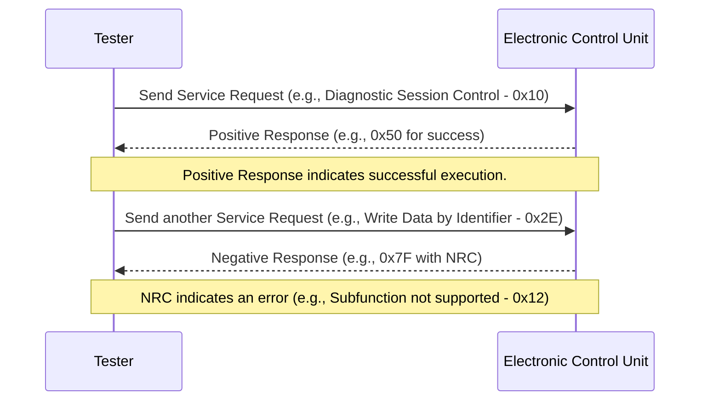

# Response Parsing (Service Responses)

## Overview

Response parsing in UDS is the process of handling and interpreting responses from an ECU (Electronic Control Unit). These responses could either confirm the success of a request (Positive Response) or indicate an error (Negative Response). 

The CAPL script processes these responses by listening for specific message IDs and interpreting the data contained in the payload.

---

## Implementation Details

### 1. Positive Response
A Positive Response has the following characteristics:
- Service ID: The response includes the original service ID with a value offset of `0x40`.
- Structure:
  - Byte 0: PCI (Protocol Control Information).
  - Byte 1: Service ID (original ID + 0x40).
  - Byte 2+: Additional response data.

### 2. Negative Response
A Negative Response (NRC - Negative Response Code) has the following characteristics:
- Service ID: Always `0x7F`, indicating an error response.
- Structure:
  - Byte 0: PCI.
  - Byte 1: Original Service ID.
  - Byte 2: NRC (provides the error type).

### 3. Example Response IDs
- Positive Response for Diagnostic Session Control: `0x50` (Service ID: `0x10 + 0x40`).
- Negative Response: `0x7F` with an NRC.

---

## CAPL Script

### CAPL Implementation:
```capl
on message 0x1E8 { // Example ECU response message ID
  if (this.byte(1) == 0x50) {
    write("Positive Response received: Diagnostic Session Control.");
  } else if (this.byte(1) == 0x7F) {
    // Negative Response
    int nrc = this.byte(2); // Negative Response Code
    switch (nrc) {
      case 0x12:
        write("NRC: Subfunction not supported.");
        break;
      case 0x13:
        write("NRC: Incorrect message length or invalid format.");
        break;
      default:
        writef("NRC: 0x%X received.", nrc);
    }
  }
}
```

---

## Sequence Diagram

The following sequence diagram illustrates the interaction between the Tester and the ECU during the response parsing process:



---

## Common NRC Codes

| NRC Code | Description                               |
|--------------|-----------------------------------------------|
| `0x12`       | Subfunction not supported                    |
| `0x13`       | Incorrect message length or invalid format   |
| `0x22`       | Conditions not correct                      |
| `0x31`       | Request out of range                        |

---

## How to Use

1. Listen for ECU Responses: Use the `on message` event to capture incoming responses.
2. Parse the Response:
   - Check Byte 1 for the Service ID.
   - If `0x7F`, handle the NRC in Byte 2.
3. Log Responses: Log details to the trace window or a log file for debugging.

---

## Example Log Output

```
Positive Response received: Diagnostic Session Control.
NRC: Subfunction not supported.
NRC: Incorrect message length or invalid format.
```
